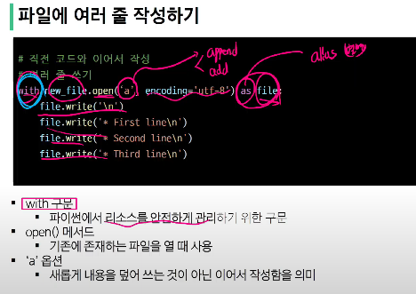

- # 관통 프로젝트 및 복습

## git
## 파일 시스템
    pathlib
## JSON
## 생성형 AI 활용

### git
    * 분산 버전 관리 시스템
    * 변경 이력 기록, 협업 원활하게 하는 도구
    * 깃 3가지 영역
        * working directory
            * 실제 작업 중일 파일들이 위치하는 영역
        * staging Area
            * 다음 버전에 포할시킬 파일들을 준비하는 영역
        * repository
            버전 이력과 파일들이 영구적으로 저장
    * commit
        * 버전, staging한 파일들을 저장하는 행위
    * git init
        * 로컬 저장소 설정
    * git add
        * 변경사항이 있는 파일을 staging area에 추가
        * git add -A : 어떤 폴더인지 신경 안쓰고 빨간 폴더 다 올림
    * git commit
- reomte repository
    * 원격 저장소
    * 로컬 먼저 만들고 원격폴더 만들경우
        * git remote add origin (추가하는 원격 저장소 주소)
    * git push origin master
        * 원격 저장소에 commit 목록 업로드
    * git pull
    * git clone
    * .gitignore
        * 추적하지 않을 파일
    * git init
        * git 로컬 저장소 내에 또다른 git 로컬 저장소를 만들지 말것
    * -f push
        * force -> 강압적으로 저장
    * git add -p
        * 수정사항을 확인하고 add할 지 말지 선택가능
        * 습관화하면 좋음
        * 현직에서 진짜 많이 쓰임
    * git stash
        * 창고
        * 현재 내가 작성하고 저장안한 코드들이 임시저장됨
        * 다른 브렌치 넘어갈 때 저장해야 되는데 임시저장하면 안해도 됨

### 파일 시스템
    * pahtlib
        * 파일 시스템 경로(C:/user.ssafy)를 객체 지향적으로 다룰 수 있게 해주는 파이썬 표준 라이브러리
        * 파일 생성, 쓰기, 읽기 간단히 할 수 있게 해줌
        * Path 클래스
            * 
            * 클래스, 메서드 이용해서 경로 바로 가져옴
            * 디렉토리 위치, 특정 경로, 경로 결합 하기, 파일명 가져오기, 확장자 가져오기 확장자 제외한 이름 가져오기 가능
    * 폴더 및 파일 생성
        * 디렉토리 생성
            * path('새로운 디렉토리').mkdir(exist_ ok =True) -> 있어도 에러 안남 False -> 있으면 에러
            * 파일 생성은 .write_text(적을 내용)
              이미 있으면 생성하면서 덮어쓰기 가능
        * encoding
            * 다른 컴퓨터,시스템에 맞게 기존 
           데이터를 다른 형식으로 바꾸는 것
            * 문자 관리하는 체계 = 유니코드 표준 : utf-8
        * with
            * 리소스를 안전하게 관리하기 위한 구문
             
    * 폴더 및 파일 목록 가져오기
        * iterdir
            * generator - 이터레이터의 한 종류
            * 한번에 load x, 게으른 평가
            * 사용할 때 가져온다
            * 속도, 메모리 상승
        * is_file
            * 파일면 트루
        * if_dir
            * 폴더면 트루
        * glob(.glob) 메서드
            * global object - 전역 패턴 매칭
            * 해당 폴더에서 특정 패턴을 가진 파일 혹은 폴더를 검색한 결과를 반환
            * 애스터리스크 -> 와일드 카드- 아무 글자, 개수 ok
    * 파일 내용을 읽어 가져오기
        * read_text(encoding-'utf-8')
        * read_text
            * 파일을 열어 전체 내용을 문자열로 반환
            * 파일 크면 느림
            * read()
                * open으로 열때 쓸 수 있음
                    * realines
                        * open해야 사용가능
                        * 모든 텍스트를 라인 별로 구분해서 리스트에 담아 반환
### json
- json
    * 형태는 딕셔너리인데 문자열 타입임 a[0] = { 이거임ㅋㅋㅋ
    * 사용하기 위해선 형변환 필요
    * loads(string)
        * 문자열 형태일 때
        * 작은 데티어셋에서 더 빠를 수 있음
    * load
        * 파일 형태(파일을 직접 open)할 때
    * dumps(string)
        * 
    * dump

    * generator
        * 데이터를 하나씩 생성해주는 특별한 함수
### 생성형 AI
- til 파일
    * AI에 전달하기 위한 순서
        * 프롬프트와 ITL 취합된 데이터를 가져옴
        * 가져온 데이터를 프롬프트화
        * 데이터 전달
        * 결과를 마크다운 저장
        * 리스트 x -> 문자열로 보내야 됨(join(리스트를 문자열로))
    * __name__
        * 특별한 내장 변수
        * 내가 직접(main == name) 실행한건지, 다른 애가 나를(모듈로써) 호출한건지 확인 가능

### 가상환경
- 가상환경
    * 각 프로젝트마다 독립적인 개발 환경을 갖게 하는 것
    * 한 개의 컴퓨터에 공존 할 수 없는 패키지, 버전을 사용 해야 될 경우 사용함
    * 각 프로젝트에 가상환경을 두어 같이 실행 가능
    * python -m venv venv 보통 .venv한다(이그노어파일)
    * source venv/Scripts/activate
    * 깃 허브 올릴 땐 venv 빼고 해야됨 (용량 커서)
- 의존성    
    * 하나의 소프트웨어가 동작하기 위해 필요로 하는 다른 소프트웨어나 라이브러리
    * 의존성 패키지
        * 프로젝트가 실행되기 위해 꼭 필요한 패키지(각각)
        * pip list(설치된 패키지 확인)
        * pip freeze(내 가상환경에만 다운되어 있기 때문에 문서화해서 저장해야됨)
        * pip install -r requirements.txt(문서화 돼 있는 걸 다운 받는 명령어)
            현재 가상환경
        * load.dotenv()
            * env파일을 불러옴 본 파일에 변수에 맞는 키를 가져옴