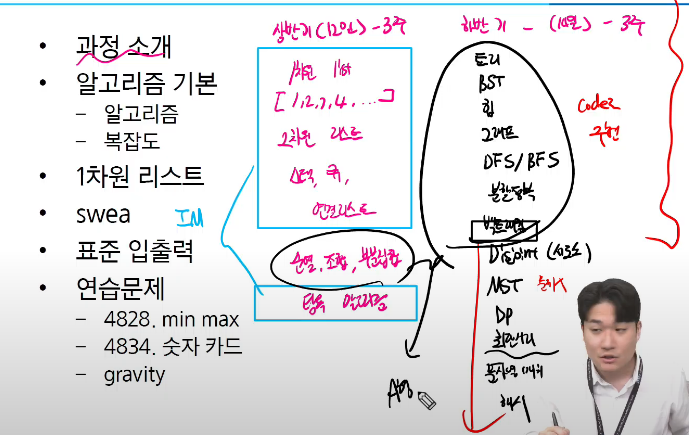
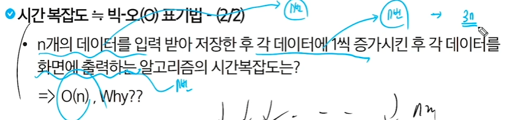

# 알고리즘

im = 조건, 반복, 인덱스 연산
A형 = 트리, bst, 힙, 그래프, dfs/bfs, 분할반복, APS응용, 컴퓨팅 사고력
B형 = 최단거리, 문자열 매치, 해시

## 학습 이유
- 
    * 문제해결능력 상승
    * 논리적 사고 상승
    * 코딩 테스트
        * 언어 이해도
        * 논리적 사고
        * 코딩 스타일
        * 에러 처리
        * 최적화
        * 커뮤니케이션 #주석

## 알고리즘이란?
- 
    * *문제를 해결하기 위한 절차나 방법*
    * 1) 다 더하기
    * 2) 가우스의 합
        *  3) 맨앞고 맨 뒤를 묶어 표현
  
---------------------------------------------------------------
- *무엇이 좋은 알고리즘인가*
    * 정확성
        * 얼마나 정확하게 동작하는가
    * 작업량
        * 얼마나 적은 연산으로 원하는 결과를 얻어내는가
    * 메모리 사용량
        메모리 사용량 : 얼마나 적은 메모리를 사용하는가
    * 단순성
        얼마나 단순한가(유지보수 쉬운가)
    * 최적성
        더 이상 개선할 여지없이 최적화되었는가
---------------------------------------------------------------

- 알고리즘 성능 분석 필요
    * 성능 분석의 기준으로 알고리즘의 작업량을 비교 (수치화) 

---------------------------------------------------------------

## 복잡도
- *시간복잡도(작업량 표현)* (*****)
    * 실제 걸리는 시간을 측정
    * 실행되는 명령문의 개수를 계산
    * *빅-오 표기법(big-O Notation)* (그 중에 특히 중요)(*****)
        * 의미 : 알고리즘이 가장 느리게 실행될 때의 성능
            * 제일 최악의 성능
        * *함수 중에 가장 큰 영향력을 주는 n에 대한 항만을 표시*(*****)
        * 계수는 생략하여 표시(*****)
          * 기본 결과 값에 큰 영향 없음, 간단하게 비교하기 위해
          * 
    * 빅 오메가 표현법
        * 최선의 경우 (잘 안씀)
    * 빅 세타 표기법 (최악 상황 별로 안나올때)
        * 일반적인 알고리즘의 성능, 평균적인 경우
- 공간 복잡도 : 메모리 사용량(시간과 공간 트레이드 오프)
  
---------------------------------------------------------------

## 1차원 리스트 
- 리스트란
    * 다양한 자료형의 요소들을 순서대로 저장
    * 리스트의 필요성
        * 일일이 다른 변수명을 사용 안해도 됨
        * 하나의 선언을 통해 둘 이상의 변수를 선언
    
    * 인풋 맵 등