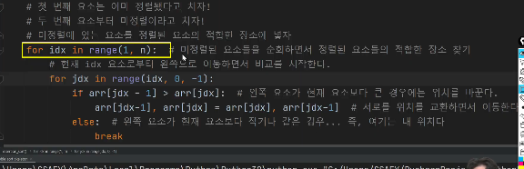
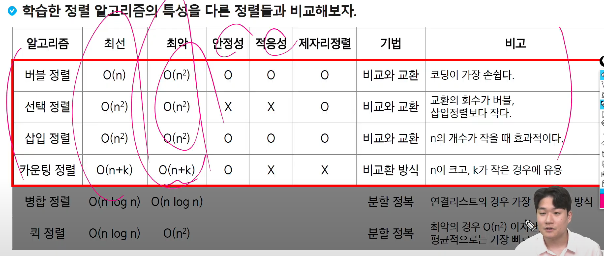
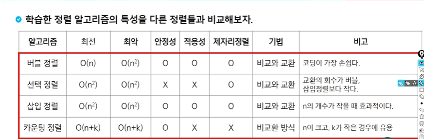
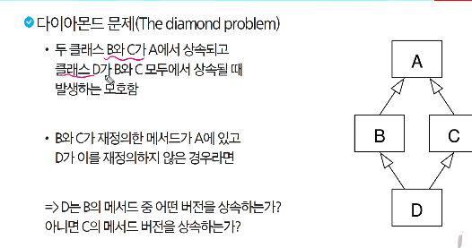

# OOP

## 정렬
총 5개

버블, 선택, 삽입, 카운팅

- 정렬 소개
    * 버블 정렬
        * 인접한 두 개의 원소를 비교하며 자리를 계속 교환하는 방식
        * 첫번째 원소부터 인접한 원소끼리 계속 자리를 교환하면서 맨 마지막 자리까지 이동
        * 0N**2
        * 인접과 비교
        * 교환 횟수 많다
        * 개념
          * 최악 시간 : O(n2)
          * 최선 시간 : 오메가(n)
          * *안정성 o (동일한 키 값을 가지는 요소의 상대적 순서 보존)*
          * 적응성 o (초기 정렬에 따라 속도 다른가)
          * 제자리 정렬 o (외부 메모리 안쓰는 지)

    * 선택 정렬
        * 교환 횟수 적다
        * 주어진 자료들 중 가장 작은 값의 원소부터 차례대로 선택하여 위치 교환 하는 방식
        * 주어진 리스트 중에서 최소값 찾고 교환
        * 그 값을 리스트의 맨 앞에 위치한 값과 교환
        * 맨 처음 위치를 제외한 나머지 리스트를 대상으로 위의 과정 반복
        * 최악,최선 0(N**2)
        * 최소값을 인덱스 첫번째 자리에 두고
        * 반복돌면서 현재까지의 최소값보다 작은 값이 발견되면
        * 최소값 인덱스를 갱신한다
            if arr[j] < arr[min_idx]
                min_idx = j
            arr[i], arr[min_idx] = arr[min_idx], arr[i]
        * 최악/최선 시간복잡도 0(n**2)
        * 안정성 X
        * 적응성 X
        * 제자리 정렬 O

    * *삽입 정렬* (자주 쓰임)
        * timsort = 삽입 + 병합 정렬
        * 정렬되지 않은 부분집합 U의 원소를 하나씩 꺼내서 이미 정렬 되어있는 부분집합 S의 마지막 원소부터 비교하면서 위치를 찾아 삽입한다
        * 첫번째 요소는 이미 정렬됐다고 치자, 두번째 요소부터 미정렬이라 치자
        * 
        * 최악 : 0(n**2)
        * 최선 : 오메가(n) -> 엄청난 메리트
        * 안정성 : O
        * 적응성 : O 이미 정렬된 경우 급격히 빨리짐
        * 제자리 정렬 : O

    * 카운팅 정렬()
        * 비교 기반 x
        * 집합에 각 항목 갯수 센 후 선형 시간(0(N))에 정렬하는 효율적인 알고리즘
        * 안정성 떨어질 수 있는데 안정성 확보한 카운팅 정렬도 있음(난이도 올라감)
        * 정수 or 정수로 표현할 수 있는 자료만 적용 가능
        * 조건 : 가장 큰 정수를 알아야 됨
        * *시간 복잡도 O(n+k) : n= 리스트 길이 k = 최댓값*
            * *최대값 찾기*(max_value로 파라미터 제공) 
            * *최대값으로 초기화 하기* (인덱스 에러 안날라고)(cnt_arr = [0]*(max+1))
            * *요소 갯수 확인하기*(주어진 arr 순회, 해당 값을 인덱스로 활용 바로 값 추가)
                -> cnt_arr[num]+=1
            * *안정성을 위해 누적합 배열 만들기*(for i in range(1, len(cnt_arr)):)
            * *이전 값은 이미 이전 값들을 누적*한 상태이므로 스스로 갱신 가능한 로직
              ->cnt_arr[i] += cnt_arr[i-1]
            * *결과를 저장하기 위한 결과 배열*
                ->for i in range(n-1,-1,-1):
                -> result = [0]*n
            * *주어진 배열 거꾸로 순회하며 누적, 합 배열의 값을 이용해 값 추가*
                -> val = arr[i]
            * cnt_arr[val] -> *값을 인덱스로 활용해서 들어갈 위치 찾음*
            * cnt_arr[val] -1-> *찾은 위치에서 1 빼줌*
            * *이 값을 다시 인덱스로 활용, result에 val값을 넣어줌*
                -> result[cnt_arr[val] -1] = val
                -> cnt_arr[val] -= 1
                return result
        * 최대값 차직 -> 시간 N
        * 최대값만큼 카운트 배열 초기화 -> K
        * 카운트로 저장 -> N
        * 누적합 계산 -> K
        * 결과 생성 -> N
        * *O(3N+2K) 인데 제외 -> O(N+K)*
        * 안정성 O
        * 적응성 X
        * 제자리 정렬 X -> 외부 메모리 O (카운트,결과 등)
        * K가 적을 때 굉장히 빠름
        * 단점 : 정수이어야 된다
        
    * 퀵 정렬

    * 병합 정렬

    * 기초 정렬 알고리즘
        * 최악 시간복잡도 ex) 0(N**2)
        * 최선 시간복잡도오메가ex) (N)
        * 안정성 : 순서보존
        * 적응성 : 초기 정렬 상태에 따라 속도가 바뀌는가 있으면 적응성 있다
        * 제자리 정렬 : 외부 메모리를 쓰냐 안쓰면 제자리 정렬이다

        

# OOP2

- 객체지향

- *상속*
    * 한 클래스(부모)의 속성과 메서드를 다른 클래스(자식)가 물려받는 것

    * 상속 필요한 이유
        * 코드 재사용
            * 기존 클래스의 속성과 메서드 재사용
            * 수정하지 않고도 확장 가능
        
        * 계층 구조
            * 클래스들 간의 계층 구조 형성 가능

        * 유지 보수의 용이성
            * 상속을 통해 기존 클래스의 수정이 필요한 경우, 해당 클래스만 수정하면 되므로 유지 보수가 용이해짐
            * 코드의 일관성을 유지하고, 수정이 필요한 범위를 최소화
        * 상속 없이 구현할 경우 공통점, 중복 정의될 수 있음
    
    * *메서드 오버라이딩*
        * 자식 클래스가 부모 클래스의 메서드를 재정의
        * 덮어쓴다

    * *메서드 오버로딩(파이썬 안됨)*
        * 이름을 동일하게, 차이는 매개변수 (ex 갯수)
            -> 다른 변수로 봄
    
    * 다중 상속
        * 둘 이상의 상위 클래스로부터 여러 행동이나 특징을 상속받음
        * 중복된 속성,메서드 있으면 상속 순서에 의해 결정(앞에꺼)
        * 다이아몬드 문제
            
            * 파이썬에서의 해결책
                * *MRO*(이거 중요)
                    * 파이썬이 메서드를 찾는 순서에 대한 규칙(메서드 결정 순서)
                    * 깊이 우선-왼쪽에서 오른쪽으로, 계층 구조에서 겹치는 같은 클래스를 두번 검색x
                    * 부모 우선순위에 영향을 주지 않고 서브 클래스를 만드는 단조적인 구조 형성
                    * 신뢰성,
    * super()
        * 부모 클래스메서드를 호출하기 위해 사용하는 내장 함수
        * 다중 상속 상황에서 유용, MRO를 따르기 때문에 다음에 호출해야 할 부모 메서드를 순서대로 호출
        * 단일 상속 구조
            * 이름 지정하지 않고, 부모 클래스 참조가능
                -> 유지 관리하기 쉽게 만들 수 있음
        * 다중 상속 구조
            * MRO를 따른 메서드 호출
            * 복잡하게 발생할 수 있는 문제 방지        

*에러*

- 예외 처리
    * try

- 참고
    예외 객체

- 에러와 예외
    * 디버깅
        * 버그를 찾아내고 수치내는 과정
    * 문법 에러
        * 
        
    * 예외