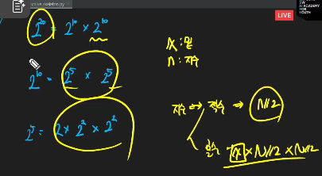
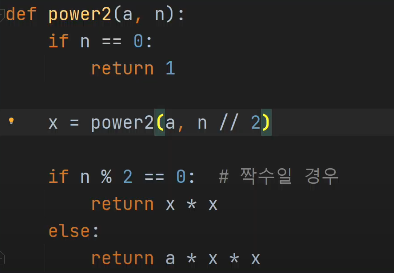

# 스택 2

- 스택 1 복습
  - 선형 자료구조 ( 순서 : O, 1:1)
  - 후입선출
  - top 포인터( -> 항상 맨 위 요소 가리킴)
    - 마지막의 원소에 쉽게 접근
  - push(데이터 맨 위 삽입, 꽉 찼는지 확인, 마지막 : top == -1)
  - pop(맨 뒤 추출, 비었는 지 확인, top == -1)
  - _괄호 검사_
    1. 여는 괄호 개수 같을 것
    2. 여는 괄호 먼저
    3. 짝이 맞을 것
    - 여는 괄호 -> stack 삽입
    - 닫힌 괄호 -> stack pop -> 짝 비교
    - 꺼낼 때 -1
    - 비었으면 -1

## 계산기1(중위, 후위 표기법)

- - 문자열 수식 계산의 일반적 방법

    - 중위 표기법의 수식을 후위 표기법으로 변경한다. (스택 이용)

      - 중위표기법
        - 연산자를 피연산자의 _가운데_ 표기하는 방법
        - 예) A+B \*> 사람이 인식하기 좋음
      - 후위표기법
        - 연산자를 피연산자 뒤에 표기하는 방법
        - 예) AB+ \*> 컴퓨터가 인식하기 좋음
      - 중위표기식의 후위표기식 변환 방법

      - 예) ((A*B)*(C/D)) *> AB*CD/\* 괄호도 제거

      - 중위 \*> 후위 변환 알고리즘
      - 토큰을 하나씩 읽고
      - 토큰이 피연산자이면 토큰 출력
      - 토큰이 연산자(괄호포함)일 때

        - 우선순위 : 토큰 > 스택의 top에 저장되어 있는 연산자
          - > 스택에 push
        - 우선순위 : 토큰 <= 스택의 top에 저장되어 있는 연산자
          - > 스택 top의 연산자의 운선순위가 토큰의 우선순위보다 작을 때까지 스택에서 pop한 후 토큰의 연산자를 push
        - 만약 top에 연산자가 없으면 push

      - 토큰이 닫는 괄호 이면 스택 top에 여는 괄호가 올 때까지 스택에 pop하여 출력

        - 스택 밖의 왼쪽 괄호는 우선 순위 가장 높음
        - 스택 안의 왼쪽 괄호는 우선 순위 가장 낮음

      - 후위 계산식 계산

## 재귀

- 재귀 호출

  - 재귀함수

    - 함수 내부에서 자기 자신을 호출하는 함수
    - 기본 부분(종료 조건), 유도 부분(작아지는 부분)으로 구성
    - 간결하고 이해하기 쉬움
    - 특징
      - 이뮤터블 타입을 인자로 전달하면 값만 복사 (pass by value)
      - 뮤터블 타입을 인자로 전달하면 원본 객체도 함께 변경 (pass by reference)
        - 함수가 끝나면 main -> X, 해당 함수를 호출한 곳으로 이동

    * 피보나치
      -> 이전의 두 수 합을 다음 항으로 하는 수열

    * 거듭제곱
      - 
      - 
