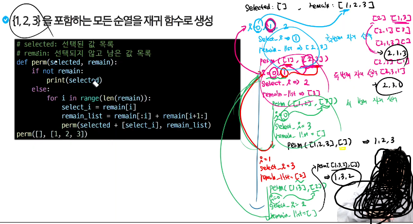

# 완전탐색, 순열

## 완전탐색
- baby-gin game
    * 

- 문제 해결방법: 완전탐색
    * 완전탐색
        * 답이 될 수 있는 모든 경우를 시도해보는 알고리즘
        * 순열(순서o), 조합(순서x), 부분집합 같은 조합적 문제들과 연관
        * 장점
            * 반드시 정답 도출
        * 단점
            * 경우의 수 비례 시간복잡도
            * 최적화 아쉽
        
    * 탐욕 알고리즘
        * 각 순간에 최적이라고 생각되는 것을 선택해 나가는 방식
    * 분할 정복
        * 복잡한 문제를 더 작은 하위 문제들로 나누어 해결
    * 다이나믹 프로그래밍(DP, 점화식)
        * 과거의 데이터를 이용하여 현재의 데이터를 만들어내는 방식
        

- 조합적 문제

## 순열
- 개요(Permutation)
    * N!/(N-r)! -> r개를 뽑는다 했을 때 경우의 수
    * 서로 다른 것 중 몇 개를 뽑아서 순서대로 나열하는 것
        * 줄 세우기, 대회에서 순위
    * 서로 다른 n개 중 r 개를 택하는 순열은
        * nPr 로 표현
    * nPr은 다음과 같은 식이 성립
        * nPr = n*(n-1)*(n-2)...*(n-r+1)
    * nPn = n! = n*(N-1)*(n-2)
 
    * 순서화된 요소들의 집합에서 최선의 방법을 찾는 것과 관련 있음
        * N개가 12개 이상이다? 그럼 순열 쓰면 안됨 (시간복잡도 12!)

- 구현 : 반복문
    * for i (1,4):
        * for j (1, 4):
            if i != j
                for k (1, 4)
                    if i != k
                        print(i,j,k)

- 구현 : 재귀
    * 하나를 고르고 남은 목록에서 고르는 경우의 수
    

## 참고
- 순열 활용

    * 중복 순열
        * 순서를 고려하여 여러 번 선택할 수 있게 나열하는 모든 가능한 방법
        * 예) 비밀번호 생성할 때, 문자 중복가능, 순서 고려해야됨
    * itertools 순열, 중복 순열 사용하는 메서드(재귀)
        * permutations -> 순열
