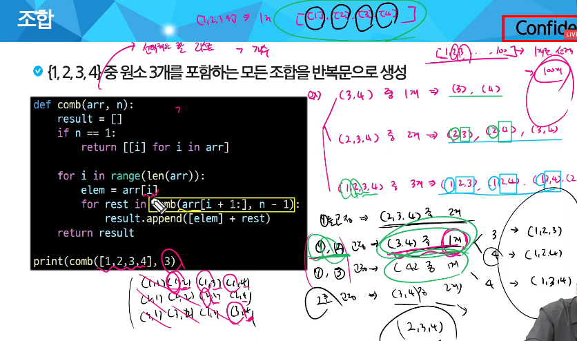
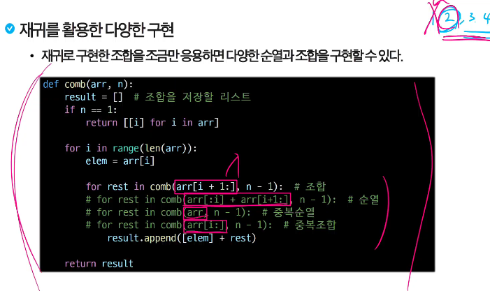
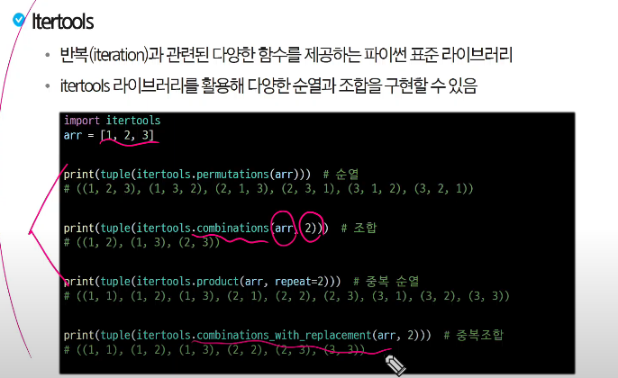

# 조합

## 조합
- 완탐을 조사할 때
    * 선형
        * 순서가 있는 거
        * 1:1, 스택, 큐, 1차,2차원 리스트 등
            * 순열, 조합, 부분집합
    * 비선형
        * 순서가 없음
        * N:M -> 인스타 친구마냥 얼켜있는 것들(비선형)
            * A-B-C-D 이런 느낌
            * 트리, 그래프
        * 완전탐색하기 까다로움
            * DFS -> 깊이 우선
            * BFS -> 무게 우선
    * 순서를 고려하지 않고 아이템을 선택하는 방법
    * 서로 다른 n 개의 원소 중 r 개를 순서 없이 골라낸 것
        * nCr = n!/(n-r)!r!
        * nCr = (n-1)C(r-1) + (n-1)Cr -> 되게 중요함,
          * 요소 하나를 선택했을 때 경우의 수 + 선택안했을 때 경우의 수
        * nC0 = 1 -> 아무것도 선택 안함이라는 경우
            * 1. n-1개 중 r-1개를 고르는 거
            * 2. n-1개 중 r개를 고르는 거
                             
                 -> 외워도 된다
        
        
         * itertools.combinations( a, b)
            * a중에 b개를 고르는 조합
    
         