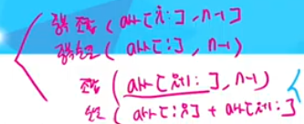
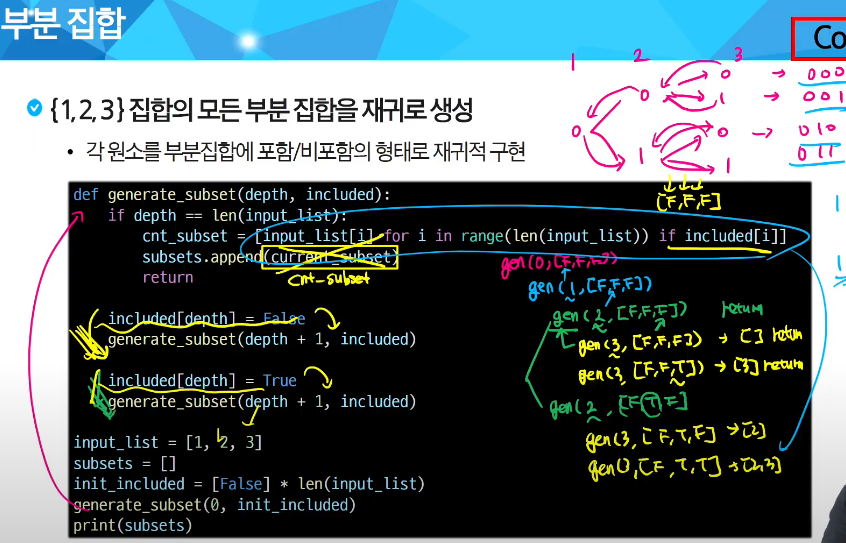
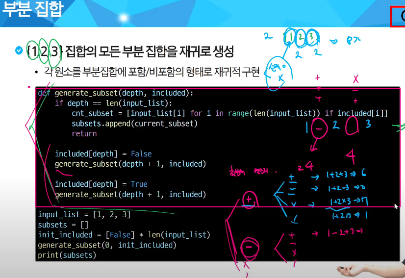

# 부분 집합

## 부분 집합
### 부분 집합
- 부분 집합
    * 집합에 포함된 원소들을 선택
    * 많은 중요 알고리즘들이 원소들의 그룹에서 최적의 부분 집합을 찾는데 사용
        * 배낭 짐싸기 문제 중요
    
- 부분 집합의 수
    * N개의 원소 -> 공집합을 포함한 부분집합의 개수는 2**n개
    * 각 원소를 부분집합에 2가지 경우(포함, 미포함)를 모든 원소에 적용
        * ex) 원소 4가지의 경우의 수 = 16
    
### 재귀
- 재귀
    * depth가 원소의 리스트 길이와 같다면 모든 원소 선택완료 혹은 모든 원소 미선택(종료조건)
    
    
      

- 바이너리 카운팅
    * n번 비트값이 1이면 n번 원소가 포함되었음을 의미
    
- 비트 연산
    * 컴퓨터가 지원하는 가장 기본적인 연산으로 매우 빠르고 효율적으로 동작
    