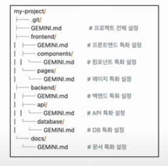

# MCP

프로젝트 커지면 이렇게 하자

## Model Context Protocol
- 모델이 다양한 문맥을 받아 활용할 수 있도록 약속된 규칙

- 도구를 이용한 컨텍스트 생성
    * AI 기반 챗봇 서비스의 메시지 종류
        * System message: 
        * heman message: 
        * ai message :
    1. 도구와 도구 스키마 작성
        * 도구 이름
        * 도구 역할
        * 입력 파라미터
    2. AI모델 - 도구 연결
        * 서비스 시작 시 도구 스키마가 System Message와 함께 전달
    3. 사용자 입력 및 도구 호출
        * 사용자 입력(쿼리) 입력
        * 도구 스키마 기반 AI Message 생성 - 도구 호출
        * 도구가 계산한 결과 반환 (Tool Message -> 도구가 생성한 문맥)

- mcp
    * 다양한 도구를 다양한 AI 서비스에서 쉽게 연결해 사용할 수 있다
    * mcp 프로토콜 기반 도구화
        * 입력 파라미터, 반환 값의 타입을 명시(타입 힌팅)
        * 함수 첫 번째 줄에 문자열로 해당 도구 역할 묘사
        * 함수 로직 작성 후 @mcp.tool 데코레이터 작성

    * mcp host
        * llm 기반 서비스(클로드, 제미나이)
    * mcp server
        * 도구 모음(지메일, 노션, 깃허브)
    * mcp client
        * host와 server를 연결하는 다리

- 코딩 특화 mcp
    * playwright : 브라우저 자동화 및 테스트
    * Sequential Thinking: 단계별 사고 및 구조화된 문제 해결
    * Context7: 최신 라이브러리 정보 제공
    * Magic-mcp: 프런트엔드 템플릿 코드 제공
    * GitHub: 코드, 이슈, PR 관리
    * Figma: 디자인 - 개발 연동 및 UI 구현
    * Notion: 노션 워크스페이스 연동
    * Jira: 프로젝트 관리 및 이슈 트래킹

- playwright MCP