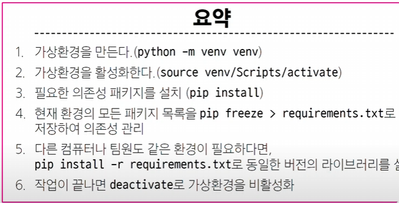

# Django
- *요청과 응답 매우 중요*

- Web application 개발
    * client
    * server
- 웹 페이지를 보게 되는 과정
    * 메인 홈페이지.html 파일을 불러옴
    * 면접질문으로 좋음
    * 3way handShake
- web framgework

### 인기있는 백엔드 프레임워크
- 
    * express.js(Node.js)
    * Django(python)
    * Spring Boot(java)
    * Laravel(PHP)
    * ASP.NET core(C#)

### flask
- 
    * 어려움, 안만들어져있음
    * 자유도 높음, 숙련자 필요

- django
    * python 기반 백엔드 웹 프레임워크
    * *커뮤니티 지원*

- 가상환경
    * 패키지 충돌 방지

- pip freeze > requirements.txt
    * 중요

- 의존성 패키지
    * 패키지 설치할 때마다 최신화 할 것 pip install -r requirements.txt
    *  중요
- venv 폴더는 용량이 매우 크기 때문에
    * .gitignore 파일에 작성해서 원격 저장소에 공유x
        * 대신 pip install -r requirements.txt 이건 ignore 하면 안됨
            * 배포되야하기 때문
    * 저장소 크기를 줄여 효율적인 협업과 배포를 가능하게 하기 위함

*집중해서 볼 것*

### 프로젝트 제작
- 
    * 프로젝트 생성
        * django-admin startproject firstpjt .
    * 서버 실행
        * python manage.py runserver
            * runserver 뒤에 숫자 넣으면 다른 서버로 제작

### 디자인 패턴
- 패턴
    * 아키텍쳐 디자인 패턴
        * 각 로직을 분리해서 구조화하는 패턴
        * 서로 영향 없이, 독립적이고 쉽게 유지보수할 수 있음
        * MTC(파이썬 프레임워크(장고))
            * model(데이터), template(사용자 인터페이스), view(비즈니스 로직)
        * MVC(자바 프레임워크(스프링))
            * model(데이터), view(사용자 인터페이스), controller(비즈니스 로직)
    * 디자인 패턴
        * 싱글톤

### 프로젝트와 앱
- django project(카페)
    * DB연결, URL연결

- django application(카페 게시글, 댓글, 회원 관리 등)
    * 독립적으로 작동하는 기능 단위 모듈

### 앱 사용하기 위한 순서
- 앱 생성
    * python manage.py startapp articles
    
- 앱 등록
    * 프로젝트랑 앱이랑 같은 선상에 있으므로 프로젝트가 앱을 인지 못함
    * 그래서 프로젝트 안에 installed_apps에 파일명 등록 해야됨

- 총 정리
    * 가상환경 생성 venv, django install
    * django-admin startproject firstpjt .
    * python manage.py startapp articles
    * articles 프로젝트 폴더 안에 등록

### 프로젝트 구조
- settings.py
    * 프로젝트의 모든 설정 관리
- urls.py
    * 들어오는 URL에 따라 적절한 views 연결
- __init__.py
    * 해당 폴더를 패키지로 인식하도록 설정
- asgi.py
    * 웹 서버와 연결 관련 설정
- wsgi.py
    * 웹 서버와 연결 관련 설정
- manage.py
    * django 프로젝트와 다양한 방법으로 상호작용하는 커맨드라인 유틸리티

### 앱 구조
- admin.py
    * 관리자용 페이지 설정(거인)
- models.py
    * DB와 관련된 model 정의
    * MTV 패턴의 M
- views.py
    * HTTP 요청을 처리하고 해당 요청에 대한 응답을 반환
    (URL, MODEL, TEMPLATE과 연계)
    * MTV의 V
- apps.py
    * 앱의 정보
- tests.py
    * 프로젝트 테스트 코드 작성하는 곳

*중요*

    *가상환경 만드는 거, 프로젝트 생성, 실행 등등까지*

    URL 집중
    요청과 응답
    articles 패키지에서 views 모듈을 가져오는 것
    url 경로는 반드시 '/'(slash)로 끝나야함 (관례)
    http~요청이 왔을 때 request 객체를 views 모듈의 index view 함수에게 전달해 호출

    2. view
    특정 경로에 있는 template와 request 객첼ㄹ 결합해 응답 객체를 반환
    모든 view 함수는 첫번째 인자로 요청 객체를 필수적으로 받음
    django에서 template를 인식하는 경로가 templates 지점까지 기본 경로로 인식함
    template지점 이후의 경로를 작성해야함

    *요청과 응답 과정 정리*

    데이터 흐름에 따른 코드 작성하기
    요청 들어오고 ->
    URLs ->
        path('articles/', views.indenx),
    View ->
        def index(request):
            return render(request, 'articles/index.html')
    Template
        articles/templates/articles/index/html

    - 총 정리
    * 가상환경 생성 venv, django install
    * django 프로젝트 생성 django-admin startproject firstpjt .
    * 프로젝트 실행 python manage.py startapp articles
    * articles 프로젝트 폴더 안에 등록

    *MTC 디자인 패턴 정리*
        다시보기
    
    * django 규칙
        * urls.py 경로는 반드시 '/'로 끝낼 것
        * views.py에서 모든 함수 첫번째 인자로 요청 객체 받음
            * 매개변수 이름 반드시 request
        * django는 특정 경로에 template 파일만 읽어올 수 있음
    
    * 프레임워크는 개발자에게 도움을 주는 도구와 환경을 제공하기 위해 규칙을 정해 놓은 것

### LTS
- 안정적인 버전을 의미할 때 사용
    * 뭔가 다운 받을때 LTS버전으로 ㄱㄱ

### django 풀스택?
- 풀스택이긴하지만 프론트가 다른 프레임워크에 비해 너무 미흡함

### render
- request
    * 응답을 생성하는 데 사용되는 요청 객체
- template_name
    * 템플릿 이름의 경로
- context
    * 템플릿에서 사용할 데이터 (딕셔너리 타입)

### Trailing Comma(후행 쉼표)
- 사용 이유
    * 시간이 지남에 따라 확장될 것으로 예상되는 경우에 주로 사용
    * 코드의 가독성이나 유지보수 유용
