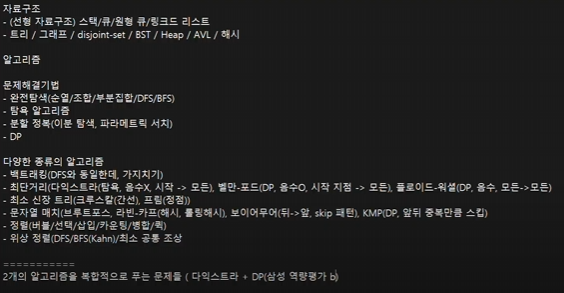

#

- 해시 함수

  - 입력값을 고정된 크기의 해시 값으로 변환하는 함수
  - 결정론적 특성: 동일한 입력은 항상 동일한 해시값을 생성
  - 균등한 분포: 해시 값이 균등하게 분포되어야 좋은 해시함수
  - 충돌 최소화: 다른 입력값이 동일한 해시값을 생성하는 경우가 낮아야 좋은 해시함수

- 해시 테이블

  - 해시 값을 인덱스로 사용하여 데이터를 저장하고 검색하는 자료구조
  - 대부분의 경우 상수 시간(O(1)) 내에 데이터 검색/삽입/삭제
  - 캐싱, 보안 등 다양하게 응용
  - 해시 함수의 성능에 큰 영향 -> 충돌 처리 필요

- 특징

  - 속도를 얻고, 공간 손해
  - 빠른 데이터 검색
  - 데이터 무결성 검증
  - 암호화(단방향 변환)
  - 중복 제거: 동일한 데이터는 같은 해시값
  - 해시 충돌
  - 메모리 사용량: 배열보다 더 많은 메모리 차지, 충돌 해결을 위한 추가 공간 필요
  - 순서 보존 불가: 순서 보존x, 정렬된 데이터가 필요한 경우에는 적합x(단 python-dict 예외)

- 좋은 해시 함수란?
  - 결정론적 특성: 동일 입력 -> 동일 해시값 생성
  - 균등한 분포
  - 충돌 최소화
  - 눈사태 효과: 유사한 입력들이 다른 해시 값을 가지게 하여 클러스터링 방지
  - 효율성
  - 저항성

## Division Hash Function(나머지 연산 해시 함수)

- 가장 기본적인 해시 함수
- 키를 해시 테이블의 크기로 나눈 나머지를 해시 값으로 사용
- 구현이 매우 간단, 이해 쉬움
- 계산 속도 빠름(효율성)
- h(k)=k mod m (k = 해시할 값, m = 해시 테이블 크기)
- 장점
  - 정수 키에 대해 효과적
  - 해시 테이블의 크기를 적절히 선택하면 좋은 성능
- 단점
  - 테이블 크기 선택에 민감
  * 특정 패턴의 키에 대해 성능 저하될 수 있음
  * 문자열이나 복잡한 키는 추가적인 처리가 필요
- 테이블 크기 선택 중요(소수(공약수 낮음), 2의 거듭제곱x(클러스터링이 세게 옴))
- 보조 해시 사용, MAD(Multiply-Add-divide) 등을 사용하여 성능을 개선시킬 수 있음

## Multiplication Hash Function(곱셈 해시 함수)

- 나머지 연산 해시 함수보다 더 균일한 분포를 제공
- 키를 0과 1 사이의 실수로 변환한 후, 이를 해시 테이블의 크기와 곱하여 해시 값을 생성
- 해시 테이블의 크기에 덜 민감함
- h(k)=m(kAmod1)(k=해시할 키 값, m=해시 테이블 크기, A는 0과 1사이의 실수(황금비 있음))
- A 값의 선택이 성능에 큰 영향을 미침
- 장점
  - 키의 분포에 덜 민감함
  - 나머지 연산 해시 함수에 비해 더 균일한 분포를 제공
- 단점
  - 구현이 조금 더 복잡함
  - 부동 소수점 연산을 사용하므로 정밀도 문제가 발생할 수 있음
- 특징
  - A 값의 선택이 매우 중요함(황금비:((루트5)-1/2)-> 0.618)

## Folding Hash Function(폴딩 해시 함수)

- 키를 여러 부분으로 나누고, 이 부분들을 조합하여 최종 해시 값을 생성
- 주로 긴 숫자나 문자열 키에 사용
- 작동 원리
  - 키를 일정 크기의 부분으로 나눔
  - 나눈 부분들을 모두 더함
  - 최종 합을 해시 테이블 크기로 나눈 나머지를 해시 값으로 사용
- 키의 모든 부분을 사용하므로 비교적 균일한 분포를 보이며, 폴딩 크기를 조절하여 다양하게 사용 가능
- 장점
  - 긴 키나 문자열에 효과적
  - 키의 모든 부분이 최종 해시 값에 기여 -> 균일한 분포
  - 구현이 간단
- 단점
  - 짧은 키에 대해서는 오버헤드가 있을 수 있음
  - 폴딩 크기가 성능에 영향을 미침
- 특징
  - 가중치 부여, 덧셈 대신 다른 방식(XOR), 순환 시프트 등의 방법을 사용하여 성능을 개선시킬 수 있음

## Polynomial Hash Function(다항식 해시 함수)

- 문자열을 다항식으로 표현하여 해시 값을 계산

- **문자열 처리에 유용**
  - (문자열 매치 다시보기)
- 문자열의 순서가 해시 값에 영향을 미침
- 장점
  - 문자열 비교에 효과적
  - **문자열 패턴 매칭 알고리즘에 유용(라빈-카프)** (롤링 해시)
  * 간단, 효과적인 해시 분포 제공
- 단점
  - 긴 문자열에 대해서는 오버 플로우 있을 수 있음
  - P와 m 값의 선택이 성능에 큰 영향을 미침
- 특징
  - 라빈-카프 알고리즘 등 다양한 분야해서 활용됨

## SHA-256(실질적 많이 쓰임)

- 임의의 길이의 입력 데이터를 고정된 크기의 256비트(32바이트) 해시 값으로 변환하는 함수
- 현대적이고 널리 사용되는 암호학적 해시 함수
- 입력 크기에 관계없이 항상 256비트 해시 값을 생성함
- 해시 값에서 원본 메시지를 복원하는 것이 실질적 불가능
- 입력의 작은 변화가 출력의 큰 변화를 야기함(눈사태 효과)
- 같은 해시 값을 가진 두 개의 다른 입력을 찾기가 매우 어려움(저항성)

## 해시충돌

- 충돌은 두 개 이상의 서로 다른 키가 동일한 해시 값을 생성하는 상황
- 해시 함수의 결과로 동일한 인덱스가 나오고, 서로 다른 키가 동일한 버킷에 저장되어야 하는 경우
- 해시 충돌의 원인
  - 해시 값의 범위가 제한적이기 때문에 서로 다른 입력 데이터가 동일한 해시 값을 가질 가능성이 존재(비둘기집 원리)
  - 해시 함수가 입력 데이터를 균등하게 분포시키지 못하면 충돌이 빈번하게 발생
  - 무한한 입력을 유한한 출력(한정된 해시 테이블)로 매핑하는 과정에서 발생
- 해시 충돌의 영향
  - 성능 저하: 해시 테이블의 검색, 삽입, 삭제 연산 속도가 저하
  - 보안 위험: 해시 충돌은 보안 취약점이 될 수 있음
  - 데이터 무결성 문제
- 해시 해결 방법
  - 오픈 어드레스
    - 선형 탐사
    - 이차 탐사
    - 이중 해싱
  - 체이닝, 분리 연결법

## Chaining

- 해시 테이블에서 충돌을 해결하는 가장 일반적인 방법
- 해시 테이블의 각 버킷에 연결 리스트(다른 자료구조도 가능)를 사용하여 충돌이 발생한 항목을 저장
- 작동원리
  1. 해시 함수를 통해 키의 해시 값을 계산
  2. 계산된 해시 값에 해당하는 버킷에 항목을 저장
  3. 충돌이 발생하면, 해당 버킷의 연결 리스트에 새 항목을 추가
- 체이닝 과정
  - 해시 충돌 해결(체이닝)
- 체이닝 정리
  - 장점
    - 구현 비교적 간단
    - 해시 테이블의 크기를 동적으로 조절 쉬움
    - 키의 전체 또는 일부를 저장할 수 있어 보안에 유리
  - 단점
    - 연결 리스트를 위한 추가 메모리가 필요
    - 최악의 경우에 검색 시간이 O(n)이 될 수 있음 -> 캐시 성능이 개방 주소법에 비해 떨어질 수 있음
  - 특징
    - 자료구조를 변경(AVL 사용), 더 좋은 해시 함수 사용으로 성능을 향상시킬 수 있음

## Open Addressing(주소 개방법)

- 해시 테이블에서 충돌을 해결하는 또 하나의 방법
- 모든 키-값 쌍을 해시 테이블 배열 내에 직접 저장. 충돌이 발생하면 다른 빈 슬롯을 찾아 데이터를 저장
- 특징
  - 모든 데이터가 해시 테이블 배열 내에 저장
  - 별도의 체인이나 추가 데이터 구조가 필요 없음
- 충돌이 발생했을 경우, 빈 슬롯을 찾는 여러 가지 방법이 있음

  - 선형 탐사
  - 제곱 탐사
  - 이중 해싱

- 선형탐사
  - 장점
    - 구현 간단
    - 캐시 성능 좋음(연속된 메모리를 사용하기 때문)
    - 추가 메모리가 필요 없음(정해진 테이블 내에 저장하기 때문)
  - 단점
    - 클러스터링(편향되게 저장되는 문제) 문제: 연속된 항목들이 몰리는 현상이 발생할 수 있음
    - 테이블이 거의 가득 찼을 때 성능이 크게 저하
    - 최악 경우 검색, 삽입 O(N)될 수 있음
  - 특징
    - 테이블의 효율성을 위해 로드 팩터가 특정 임계값(0.6~0.75)을 초과하면 테이블 크기를 늘리고, 모든 항목을 재삽입
      - (로드 팩터: 해시 테이블에 저장된 항목의 수를 테이블 크기로 나눈 값, 성능을 나타내는 중요한 지표)
- 제곱탐사
  - 선형 탐사의 단점을 보완하기 위해 고안된 방법
  - 충돌 발생시 원래의 해시 값에서 제곱수만큼 떨어진 위치를 순차적으로 탐색
  - 작동 원리
    1. 해시 함수로
  - 장점
    - 선형 탐사에 비해 클러스터링 문제가 덜함
    - 충돌 해결을 더 넓은 범위로 함으로 충돌 해결 능력이 조금 더 향상됨
    - 캐시 성능이 좋음(연속된 메모리)
  - 단점
    - 이차 클러스터링 발생할 수 있음(충돌 해결 과정에서 동일한 탐사 순서를 따르는 현상)
    - 테이블이 절반 이상 차면 성능이 급격히 저하될 수 있음
    - 모든 버킷을 탐색하지 못할 수도 있음(순환 패턴으로 인해) -> 테이블 크기를 소수로 선택하면 모든 버킷 탐색
  - 특징
    - **이중 해싱**과의 결합, 동적 해시를 통해 성능을 개선
- 이중 해싱
  - 두 개의 해시 함수를 사용하여 충돌을 해결
  - 첫번째 해시 함수는 초기 위치를 결정, 두번째 해시 함수는 충돌 시 탐사 간격을 결정
  - 작동 원리
    - 첫번째 해시 함수로 초기 버킷 위치를 계산
    - 해당 버킷 사용주이면 두번 째 해시 함수로 탐사 간격을 계산
    - 해당 간격으로 다음 위치를 탐색
    - 빈 버킷 찾을 때까지 반복
  - 장점
    - 클러스러링 문제를 크게 감소
    - 선형, 제곱 탐사보다 더 균일한 분포를 제공
    - 두번째 해시 함수로 인해 충돌 해결 패턴 다양함
  - 단점
    - 두 개의 해시 함수를 계산해야 하므로 약간의 추가 연산이 필요함
    - 구현이 조금 더 복잡함
    - 두 번째 해시 함수를 잘못 선택하면 성능이 저하될 수 있음

* 추가적으로 배우면 좋을 알고리즘
  - 트라이 자료구조
  - 압축(허프만)
    
