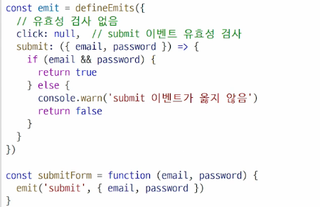

# ComponentStateFlow
- Passing Props
- Emit

## Passing Props
- 해당 페이지를 구성하는 컴포넌트가 여러개라면 공통된 부모 컴포넌트에서 관리
- 부모는 자식에게 데이터 전달 가능
  - pass **Props**(부모 -> 자식)
- Props
  - 부모 컴포넌트로부터 자식 컴포넌트로 데이터를 전달
  - 부모 컴포넌트가 업데이트될 때마다 이를 사용하는 자식 컴포넌트의 모든 props가 최신 값으로 업데이트 됨
  - 단방향(자식 -> 부모는 불가능)
  - 객체/배열 props는 자식에서 내부 값을 바꾸면 부모의 원본도 바뀜**주의**
  - One-Way Data Flow
    - 모든 props는 자식 속성과 부모 속성 사이에 하향식 단방향 바인딩을 형성(one-way-down binding)
    - 단방향인 이유
      - 하위 컴포넌트가 실수로 상위 컴포넌트의 상태를 변경하여 데이터 흐름을 이해하기 어렵게 만드는 것을 방지하기 위함(무한 루프, 디버깅 난이도 상승 등)
      - 데이터 흐름의 일관성 및 예측 가능성을 높이는 것이 목표
  - 선언
    - 부모에서 내린 props를 사용하기 위해 자식 컴포넌트에서 명시적인 props 선언이 필요
    - defineProps()를 사용하여 props 선언
      - 문자열 배열
        - HTML에서는 케밥케이스
        - defineProps 안에 문자열 넣으면 됨(카멜케이스)
      - 객체(권장)
        - 객체 속성의 값은 해당 데이터의 타입에 맞는 생성자 함수(String, Number 등)여야 함
        - 각 prop에 대해 상세한 규칙(유효성 검사)를 설정 및 컴포넌트의 안정성 향상
        - 객체 구문 = 컴포넌트의 설명서 역할, 코드를 통해 명확하게 의사소통 가능
        - 부모가 자식에게 준 props를 손자에게 줄때 자식에서 바인딩(:) 해야됨
  - Static props, Dynamic props
    - v-bind를 사용하여 동적으로 할당된 props를 사용 가능(ref)
  
## props 활용
- v-for 가능
- 자바스크립트 내부에서 쓰려면 const로 변수 할당해줘야됨

## Emit
- 동일한 데이터, 하지만 다른 컴포넌트
  - 부모는 자식에게 데이터를 전달(Pass Props)
  - 자식은 자신에게 일어난 일을 부모에게 알림(Emit event)
- $emit()
  - 자식 컴포넌트가 이벤트를 발생시켜 부모 컴포넌트로 데이터를 전달하는 메서드
  - '내려가는' 데이터 흐름인 Props와 반대로 '올라가는' 이벤트를 만들어, 컴포넌트 간의 완전한 상호작용을 가능하게 함.
- emit 메서드
  - $emit(event(이벤트명), args(값))
  - 자식 컴포넌트가 이벤트를 발생시켜 부모 컴포넌트에게 신호를 보내고 데이터를 전달하는 기능
  - event
    - 커스텀 이벤트 이름
  - args
    - 추가 인자(부모로 전달할 데이터)
  - $ 표기
    - Vue 인스턴스의 내부 변수들을 가르킴
    - Life cycle hooks, 인스턴스 메서드 등 내부 특정 속성에 접근할 때 사용

## 이벤트 발신 및 수신
- $emit을 사용하여 템플릿 표현식에서 직접 사용자 정의 이벤트를 발신
- 부모 컴포넌트에서는 v-on (또는 @)을 사용하여 이벤트 수신 가능
- 수신 후 처리할 콜백함수 호출

## emit 이벤트 선언
- defineEmits()를 사용하여 발신할 이벤트를 선언
- props와 마찬가지로 defineEmits()에 작성하는 인자의 데이터 타입에 따라 선언 방식이 나뉨
  - 배열
  - 객체(가급적 객체를 활용한 선언을 추천)
- defineEmits()는 'script setup' 내에서 이벤트를 발신하기 위한 emit 함수를 반환(템플릿의 $emit과 달리 직접 접근할 수 없기 때문)

## Props, Emit 객체 선언 문법
- Props 선언 시 '객체 선언 문법'을 권장하는 이유(defineProps)
  - 컴포넌트의 의도를 명확히 하여 가독성을 높이고, 다른 개발자가 잘못된 타입의 데이터를 전달했을 때 콘솔에 경고를 출력하여 실수를 방지
  - 추가로 props에 대한 **유효성 검사로**써 활용 가능
  - require true나 default로 추가 설정 가능
- emit 이벤트도 '객체 선언 문법'으로 작성 가능
  - emit 이벤트도 객체 구문으로 선언 된 경우 유효성을 검사할 수 있음
  - 
  - 이메일과 패스워드 없다면 이벤트 전달하지 않도록 할 수 있음