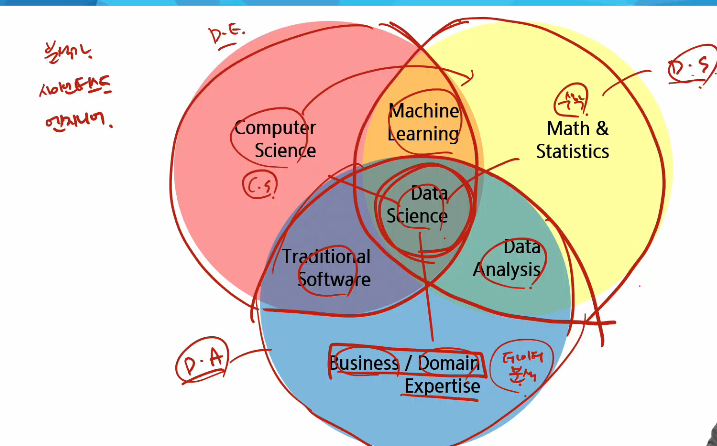

- 데이터 사이언스(분석)
    - 데이터 기초
        - pandas
- 데이터엔지니어링
    - 파이프라인
        - 실시간(스트리밍)
        - 배치
            - spark
            - airflow
            - elasticsearch(검색엔진)

- 데이터 분석 개론
    - 합리적인 의사 결정을 위해(갖고 있는 자원에서 최적의 선택)
- 데이터 분석 방법
    - 가설 설정하고 데이터 만들기(인터뷰, 리서치, 데이터 설계 후 수집)
    - 쌓인 데이터에서 필요한 데이터를 선별 및 조회(쿼리 조회, 데이터 가공, 인프라 구축)
    - 데이터 기반 가설 검증(통계 분석, 수학적 모델링)
    - 결과 공유(데이터 시각화, PPT 작성, PT)
- 데이터 분석 절차
    1. 문제 정의
    2. 데이터 기획
    3. 데이터 수집
    4. 데이터 전처리
    5. 데이터 시각화
    6. 분석 및 인사이트 도출

- 데이터 분석 업무
    - 서비스들의 현황을 수치로 표현, 인사이트 도출
    - 어느 서비스가 더 좋은 지 가설 검증을 위한 A/B 테스트 진행
    - 고객에 대한 데이터에서 의미 있는 결과를 뽑아내기 위해 보고서 작성
    - 사례
        - 마케팅 분석 / 고객 인사이트 / 비즈니스 성과 
    - 

- pandas
    - 관계형, 레이블된 데이터를 효율적으로 다루기 위해 설계된 Python 기반의 데이터 분석 라이브러리
    - 빠르고 유연하며 표현력이 풍부한 데이터 구조를 제공
    - 다양한 데이터 분석 작업을 손쉽게 처리할 수 있도록 고수준의 빌딩 블록(고 수준 메서드?) 제공
    - 오픈 소스 라이브러리이기 때문에 누구나 자유롭게 사용
    - NumPy를 기반으로 개발되었기 때문에, 과학 계산 및 머신러닝 라이브러리들과의 호환성과 통합성을 갖춤

- Pands에서 다룰 수 있는 데이터의 타입
    - SQL table, Excel spreadsheet 같이 유형이 다른 열들을 포함할 수 있는 표 형식의 데이터
    - 순서가 있거나 없는 데이터(순위 or 단순 카테고리)
    - 시계열 데이터
    - 행 및 열이 있는 임의의 행렬 데이터(행렬의 각 구성요소가 다른 유형의 데이터들도 가능)
    - 다른 유형의 관찰/ 통계 데이터셋(명시적인 레이블이 없어도 유연하게 처리 가능)

- Pandas에서 제공하는 Data structure
    - 1차원을 다루는 Series
        - 한 줄짜리 데이터 목록으로 모든 값이 같은 타입
    - 2차원을 다루는 DataFrame
        - 각 열의 데이터 타입이 다를 수 있으며 크기를 자유롭게 조절할 수 있는 형태

- Pandas의 장점
    - 결측치 처리 용이: NaN으로 결측값 표현 dropna, fillna(고 수준 메소드) 등 제공
    - 행/열 추가, 삭제 간편: append. drop 등으로 손쉽게 조작
    - 정렬 기능: 자동 또는 sort_values, sort_index로 명시적 정렬 가능
    - GroupBy 제공: SQL처럼 그룹 단위 집계 가능
    - 다양한 객체 변환: 리스트, 딕셔너리, NumPy 등에서 DataFrame 생성 가능
    - Merge/Join 지원: merge, join, concat 등으로 데이터 결합
    - 파일 입출력 지원: CSV, Excel, DB, JSON 등 다양한 포맷 읽기/쓰기 가능

- Pandas 주요 메서드
    - read_csv(): CSV 파일을 데이터프레임으로 불러옴
    - head(): 데이터프레임의 상위 몇 개 행을 출력
    - shape: 데이터프레임의 행과 열 개수를 출력
    - info(): 데이터프레임의 행과 열 개수를 출력
    - describe(): 수치형 데이터의 요약 통계를 제공
    - value_counts(): 특정 컬럼의 값 개수를 세어 제공
    - sort_values(): 특정 컬럼 기준으로 정렬
    - 생성시 테이블명["컬럼명"]=넣을 기본값
    - drop(): axis = 0 (기본 행), axis = 1 (열)

- 데이터 정제 및 전처리
    - 데이터를 모델에 넣기전에 알맞게 가공하는 과정
    - 분석 결과의 질을 높이기 위해 데이터를 변형하는 과정
    - 어떤 전처리를 적용하느냐에 따라 원본 데이터가 다르게 변형, 결과도 달라질 수 있음

- 데이터 처리 방법
    - 데이터의 형식 맞추기
    - 빈 칸 채우기(결측치)
    - 데이터 열 추가(연관 데이터 추가)
    - 데이터 열 추가(이상치 m제거)

- missing 데이터 처리
    - isna(): 데이터프레임 또는 배열에서 결측값(NaN)이 있는지 여부를 True/False로 반환
        - isna().sum(): 결측치 값 갯수
    - fillna(): 결측값(NaN)을 지정한 값으로 대체(채움)
        - fillna({'컬럼명': 채울값})
        - fillna(df['컬럼명'].median())-> 중간값
    - dropna(): 결측값(NaN)이 포함된 행 또는 열을 제거
        - dropna(subset=['컬럼명'], how='any(하나라도 null값 있으면 제거함)')

- DataFrame 인덱싱 및 필터링
    1. []
        - 컬럼 단일 선택: df['col1'] -> series 반환
        - 컬럼 여러개 선택: df[['col1, 'col2']] -> DataFrame 반환(컬럼 하나여도 DataFrame 반환)
        - Boolean Indexing과 함께 사용 가능: df[df['col1']>10] -> 조건에 맞는 행 필터링
    2. loc[] / iloc[]
        - loc(명칭(label) 기반 인덱싱): 행/열 이름으로 접근
            - 컬럼(열)을 추출하는 경우: '컬럼명' 같이 이름(label)으로 열 지정
            - 행을 추출하는 경우: 행의 인덱스 이름(label)을 사용해 지정
            - 행과 열을 함께 지정하는 경우 -> df.loc[행이름, 열이름] 형식 사용
        - iloc(위치(Position) 기반 인덱싱): 정수 위치 기반 인덱싱(숫자 인덱스 사용)
            - 레이블(이름)이 아닌 정수 위치로 데이터 지정
            - 가로축(행), 세로축(열)의 좌표를 기반으로 행과 열 추출
            - 행, 열의 위치값을 정수로 입력하여 선택(0부터 시작) 예: df.iloc[0, 1] -> 첫번째 행, 두번째 열
    3. Boolean Indexing
        - 조건식에 따른 필터링
            - 조건식을 [] 안에 넣음
            - isin: or연산임, isin([2, 3])
            - notna: notna() -> NaN이 아닌 형만 필터링
            - loc 가능: loc[titanic['age'] > 35, 'name'] -> 35세 이상인 사람의 이름만 가져옴
            - iloc 불가능