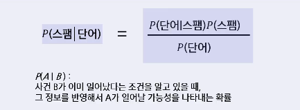

# Data Statistics_Basic1
- 기초 통계량
- 조건부 확률 및 베이즈 정리
- 표본 추출과 편향
- 분포에 대한 이해

## 데이터 접근 방법
- 데이터 분석의 첫 단계는 데이터의 크기, 분포, 중심, 퍼짐을 파악하는 것
- 수 많은 값이 있는 데이터를 일일이 보는 것은 불가능에 가까움
- 대표값(위치)과 변동성(퍼짐)을 요약하는 통계량을 활용
    - 각 변수를 대표하는 값을 구하여 데이터를 살펴봄
    - 데이터가 얼마나 퍼져 있는지를 확인

## 기초 통계량

### 기초 통계량(위치)
- 각 변수를 대표하는 값을 구하여 데이터를 살펴봄
- 위치를 추정하는 다양한 방법
    - 평균(mean): 모든 값 더해 개수로 나눈 값, 이상치에 민감
    - 절사평균(trimmed mean): 상,하위 극단값 일부를 제거해 계산한 평균, 이상치 영향을 줄이는 데 유용
    - 가중평균(weighted mean): 각 값의 중요도(가중치)를 반영해 계산하는 평균, 값의 영향력이 동일하지 않을 때 사용
    - 중간값(median): 정렬된 데이터의 중앙 위치 값으로 왜곡된 분포에서도 안정적으로 중심 나타냄
    - 가중 중간값(weighted median): 값의 가중치를 고려해 중앙 위치를 결정하는 지표로 표본 비중이 다른 조사에서 활용
    - 백분위수(percentile): 데이터를 100등분했을 때 특정 위치의 값으로 분포의 형태와 위치를 파악

### 기초 통계량(변이)
- 각 변수를 대표하는 값을 구하여 데이터를 살펴봄
- 데이터가 얼마나 퍼져 있는지를 확인
- 변이를 추정하는 다양한 방법
    - 분산(Variance): 평균으로부터 얼마나 퍼져 있는지를 나타내는 지표
    - 표준편차(Standard deviation): 데이터의 편차(각 값에서 평균을 뺀 값)의 기준이 되는 값
    - 사분할 범위(IQR) - 25 번째 백분위수와 75번째 백분위수의 차이를 보는 것

### 기초 통계량의 활용
- 이상치
    - 데이터를 분석할 때 극단적으로 **크거나 작은 값(이상치)**을 찾는 것이 중요
    - 이상치는 평균, 분산을 크게 왜곡하므로 확인해야 함
    - 예: 평균 몸무게가 60kg인데, 120kg이 포함되어 있다면 이상치 가능성
- 비교와 예측 가능
    - 두 개 이상의 그룹을 비교할 때 **어떤 차이**가 있는지 시각적으로 확인 가능
    - 평균/중앙값/표준편차를 이용해 집단 특성을 비교
    - 예: 남학생과 여학생의 키 분포 비교
- 적절한 분석 방법 선택
    - 데이터의 분포 형태에 따라 **평균, 중앙값 등을 선택**하여 분석 가능
    - 대칭형으로 데이터가 분포되어 있다면 평균을 사용, 왜곡된 분포라면 중앙값이 더 적절
    - 예: 연봉,집값처럼 오른쪽 꼬리가 긴 분포는 중앙값 사용

## 조건부 확률
- 조건부 확률
    - 어떤 정보(B)가 주어졌을 때, 그 조건 아래에서 다른 사건(A)이 일어날 확률을 의미
    - B가 일어났다는 사실을 알고 있을 때, A가 일어날 가능성은 얼마나 되는가를 계산하는 개념

- 베이즈 정리
    - 
    - 
    - B가 일어나는 확률을 모른다면
    - B를 직접 구하기 어렵기 때문에, A와 B의 관계를 뒤집어 계산할 수 있는 구조가 필요 -> 베이즈 정리
    - 예: 추천 시스템 - 사용자의 행동으로부터 취향 추론
        - 행동만 관찰 가능 -> 취향, 상태 를 추론하고 싶음 이게 베이즈 정리(관찰된 결과를 가지고 보이지 않는 원인을 추론할 수 있게 하는 것)
        - A: 사용자가 어떤 영화를 클릭했다
        - B: 사용자가 실제로 좋아하는 장르 P(행동(A) | 취향(B)) 은 모델링 쉬움
        - 행동 로그 기반, 하지만 원하는 건 P(취향(B) | 행동(A))
    - 나이브베이즈
        - 단어 1개를 여러개로 처리할 수 있음

## 표본 추출과 편향
- 모든 사람(모집단)을 조사할 수 없으므로, 일부를 뽑아서(표본) 조사한 후 이를 바탕으로 모집단의 특성을 추정
    - 모집단
        - 연구 대상이 되는 전체 집단
    - 표본
        - 모집단에서 일부를 선택한 것
- 표본 조사의 필요성
    - 인구조사 -> 모집단 조사
        - 전체 국민을 조사하는 방법
        - 가장 정확하지만, 시간과 비용이 많이 소모
    - 여론조사 -> 표본 조사
        - 모든 사람을 조사하는 것이 어렵기 때문에 일부만 조사
        - 정확한 결과를 위해 표본을 신중히 선택
        - 주의점
            - 만약 표본이 특정 지역이나 연령대에 편향된다면, 전체 국민의 의견을 제대로 반영하지 못함(표본 편향 발생: 모집단을 잘못 대표하는 표본을 의미)
- 표본 추출
    - 표본 추출: 모집단에서 일부를 선택(추출)하는 과정
    - 예시: 떡국
        - 떡국 전체: 모집단
        - 한 숟가락: 표본
        - 주의: 잘 섞인 국물을 먹어야 함(표본 편향 발생)
    - 방법
        - 단순 무작위 추출
            - 모든 사람이 동일한 확률로 뽑힘
        - 층화추출
            - 모집단을 그룹(층)으로 나눈 후, 각 층에서 표본 추출
        - 계통추출
            - 모집단을 일정 간격으로 나누어, 표본 추출
        - 군집추출
            - 모집단을 여러 그룹(군)으로 나눈 후, 몇 개의 군을 랜덤 선택
        - 편의추출
            - 쉽게 접근할 수 있는 표본을 선택(비추천) -> 편향 발생 확률 높음
- 임의 추출(무작위 추출)의 개념
    - 임의 추출(무작위 추출): 모집단에서 특정한 규칙 없이 무작위로 표본을 선택
        - 복원 추출(뽑힌 대상 다시 뽑기 가능)
        - 비복원 추출(뽑힌 대상 다시 뽑기 불가능)
    - 공정성 유지: 모든 대상이 동일한 확률로 선택될 기회 제공
    - 대표성 확보: 특정 그룹에 치우치지 않고 모집단 전체를 반영
    - 편향 방지: 의도적인 선택을 막아 객관적인 데이터 확보
    - 통계 분석의 신뢰도 증가: 모집단을 잘 반영한 표본이면, 정확한 결론을 도출할 가능성이 높아짐
- 표본 편향의 개념
    - 표본 편향: 모집단을 대표하지 못하는 잘못된 표본을 선택하여 조사 결과가 왜곡된 현상
        - 대표성을 담보하는 방법은 여러가지, 핵심은 임의 표본 추출
    - 줄이는 방법
        1. 임의 추출 강화
            - 무작위로 공정성 높이는 방법
            - 모든 개체가 동일한 확률로 선택될 기회를 가져야 함
            - 장/단점
                - 장점: 모집단을 공정하게 대표할 가능성 증가
                - 단점: 모집단이 크면 랜덤으로 뽑기 어려움
            - 방법
                - 제비 뽑기
                - 난수 생성기 활용
        2. 층화 추출 활용
            - 모집단을 그룹(층)으로 나눈 후, 각 층에서 무작위로 표본을 추출
            - 모집단 내 특정 특성(성별, 연령, 지역, 직업 등)에 따라 그룹을 나눈 후, 각 그룹에서 무작위로 표본을 추출
            - 장/단점
                - 장점: 모집단의 다양한 특성을 고려 가능하며, 과소/과대 대표되는 문제를 방지
                - 단점: 모집단을 층화하는 과정이 시간과 비용이 소요
            - 방법
                - 모집단을 비슷한 특성으로 가진 그룹으로 나눔
                - 각 그룹에서 비율에 맞게 표본 추출
        3. 계통 추출 적용
            - 일정한 간격으로 표본을 추출하는 방법
            - 처음 제품 무작위 선택 후 일정 간격 마다 검사
            - 장/단점
                - 장점: 쉽고 빠르게 표본 추출이 가능하다
                - 단점: 모집단의 특정 패턴이 있다면, 편향 발생 가능
            - 방법
                - 모집단 크기: N, 표본 크기: n, k(간격) = N/n
                - 첫 번째 표본을 무작위 선택
                - 이후 k 간격마다 표본 선택
        4. 표본 크기 확대
            - 표본 크기를 늘려 모집단을 더 정확히 반영
            - 장/단점
                - 장점: 표본이 클수록 결과의 신뢰도 증가
                - 단점: 표본이 너무 크면, 비용과 시간이 많이 소요
            - 방법
                - 가능하면 더 많은 표본을 확보
                - 비용과 시간을 고려하여 적절한 표본 크기 선정
        5. 편향을 보정하는 가중치 적용
            - 특정 그룹이 과소/과대 대표된 경우, 보정하는 방법
            - 장/단점
                - 장점: 모집단을 더 정확하게 반영 가능
                - 단점: 가중치가 잘못 설정되면 오히려 결과 왜곡될 가능성 발생
            - 방법
                - 부족한 그룹의 응답을 보정하기 위해 가중치를 적용해 결과 반영

### 표본 조사의 오류
- 표본 오차(Sampling Error)
    - 표본을 뽑는 과정에서 우연히 생기는 차이
    - 같은 방법으로 뽑아도 표본마다 값이 조금씩 달라짐
    - 자연적인 흔들림이어서 개선이 되지만 없앨 수는 없음
    - 예시: 표본평균이 49kg, 51kg 등 계속 흔들리는 현상 -> 표본 크기를 키우면 줄어듦
- 비표본오차(Non-Sampling Error)
    - 조사 절차(설계) 자체의 문제로 생기는 체계적 오류(=편향)
    - 표본의 틀 자체의 오류, 응답하지 않음, 응답 왜곡, 특정 집단만 포함되는 문제
    - 시작부터 실패한 구조적 편향이라 표본을 아무리 많이 뽑아도 해결되지 않음
    - 예: 전화 설문 -> 집전화 없는 사람 자동 배제 -> 표본 크기를 키워도 
    절대 해결되지 않음

### 선택 편향 vs 표본 편향의 차이점
- 표본 편향
    - 정의: 모집단을 대표하지 않는 표본을 선택하는 문제(표본 틀 자체가 대표성이 없음)
    - 원인: 지역, 연령, 성별 등 특정 그룹 과대표/과소대표(편향된 모집단에서 샘플 추출)
    - 예시: 20대만 대상으로 여론 조사
    - 차이: 결과문의 문제
- 선택 편향
    - 정의: 표본을 뽑는 과정 자체가 특정한 사람들만 선택하도록 설계되어 결과가 왜곡되는 문제(표본이 모이는 과정이 왜곡)
    - 원인: 자발적 참여, 특정 시간대 조사, 참여 조건 등으로 특정 그룹만 들어옴
    - 예시: 건강 관심자만 건강검진 연구에 참여함(자발적 참여)
    - 차이: 뽑는 과정의 문제

## 분포
- 분포
    - 데이터가 어떤 값 주변에 어떻게 퍼져 있는지(흩어져 있는지)를 나타내는 것
    - 필요성
        - 데이터의 패턴 파악
            - 데이터가 대체로 어디에 몰려 있는지(중심경향) 확인
        - 이상치 발견
            - 데이터를 분석할 때 극단적으로 크거나 작은 값(이상치)을 찾는 것이 중요
            - 예: 평균 몸무게가 60kg인데, 120kg이 포함되어 있다면 이상치 가능성
        - 비교와 예측 가능
            - 두 개 이상의 그룹을 비교할 때 어떤 차이가 있는지 시각적으로 확인 가능
            - 예: 남학생과 여학생의 키 분포 비교
        - 적절한 분석 방법 선택
            - 데이터의 분포 형태에 따라 평균, 중앙값 등을 선택하여 분석 가능
            - 예: 정규분포(대칭형)라면 평균을 사용, 왜곡된 분포라면 중앙값이 더 적절
    - 시각화 방법
        - 히스토그램
            - 막대 그래프로 나타냄
            - 데이터의 전체적인 분포를 쉽게 확인 가능
        - 박스플롯(Box Plot)
            - 데이터의 범위, 중앙값, 이상치를 한눈에 볼 수 있는 그래프
            - 데이터의 최소값, 최대값, 중앙값, 1사분위(25%), 3사분위(75%)를 표현
            - 데이터의 퍼짐 정도(분산)와 이상치를 확인하는 데 유용
        - 밀도 곡선(Density Plot)
            - 데이터를 연속적인 곡선 형태로 나타내어 데이터의 분포를 부드럽게 표현한 그래프
            - 히스토그램처럼 데이터를 나누지 않고 연속적인 곡선으로 표현
            - 데이터의 중심과 분포의 형태를 더 부드럽게 볼 수 있음

