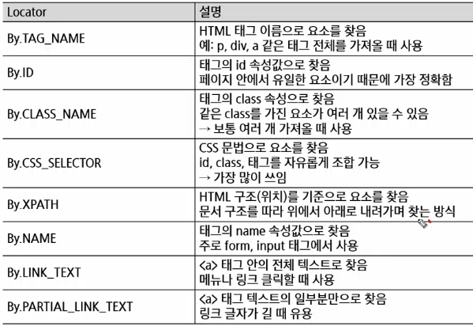
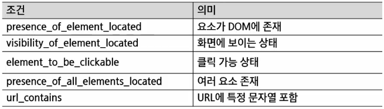

# Web Crawling
- 웹 크롤링
- Beautiful Soup의 활용(정적페이지)
- Selenium의 활용(동적페이지)
    - 브라우저 직접 조작

## Web Crawling
- 웹 크롤링이란?
    - 인터넷 상의 웹 페이지를 자동으로 탐색하고 데이터를 수집하는 기술
- 스크래핑
    특정 웹페이지에서 원하는 데이터(텍스트, 이미지, 표 등)를 추출하는 과정
- 특징
    - 자동화
    - 대량 데이터 수집
    - 구조화된 데이터 추출
- 웹 데이터 수집 방법
    - 웹 페이지를 가져와서 필요한 정보만 추출하기(스크래핑)
        - HTML, Beautiful soup
    - WebDriver를 이용해 웹 브라우저 자동화하기(스크래핑 or 크롤링)
        - Selelnium
    - 제공된 OpenAPI를 이용해 실시간으로 데이터 가져오기
- 웹 페이지에서 데이터 추출
    - 웹 페이지는 HTML(hyper text markup language)을 중심으로 이루어져 있음
    - 원하는 주소의 웹 페이지로 들어가 HTML 내용을 가져오고, 그 안에서 원하는 데이터가 어디 있는 지 가져오는 직업(parsing)
        - HTML 코드 안에서 내가 원하는 데이터 파악 -> 파싱 -> 데이터 가공
    - python에는 정적 페이지에서는 BeautifulSoup 라이브러리 주로 사용

- WebDriver로 웹 브라우저 자동화
    - 크롬, 파이어폭스, IE등의 웹 브라우저에서 클릭, 텍스트 입력 등의 행동을 코드로 제어 할 수 있게끔 만든 브라우저를 WebDriver라고 함
    - 로그인이 필요한 서비스 등 단순 URL만으로는 접속할 수 없는 세션 유지가 필요한 작업이나, 옵션이나 드롭다운 메뉴를 클릭해야함 데이터를 얻을 수 있는 작업에 필요
        - 꼭 크롤링이 아니더라도, 웹 브라우저의 행동을 자동화하는 다른 작업(게시판에 자동 글쓰기, 새 메일 자동 읽기 등)에도 사용할 수 있다.
    - python에서는 Selenium 라이브러리 사용

- 웹 페이지의 구조
    - 웹 페이지는 HTML, CSS, JavaScript의 조합으로 구성됨
    - HTML는 웹 페이지를 구성하는 필수 언어로 제목, 단락, 목록 등과 같은 본문을 위한 구조적 의미를 나타내는 것 뿐만 아니라 링크, 인용과 그 밖의 항목으로 구조적 문서를 만들 수 있는 방법을 제공
    - 웹 크롤링을 통해 얻고자 하는 데이터는 HTML의 어딘가에 들어 있음
        - 따라서 웹 페이지내의 어느 정보가 HTML의 어디에 위치하는지를 파악하기 위해, HTML의 구조를 알아야 함
        - 데이터를 뽑아내 원하는 형태로 가공하는 작업을 파싱(parsing)이라 함
    - CSS는 HTML의 요소의 외관을 디자인
- HTML 태그 구조
    - 속성: 태그의 추가적인 정보
        - 속성은 여러 개 부여 가능
        - 속성은 없어도 됨
- CSS 기본 문법
    - H1(선택자){color(스타일속성):red;(스타일 속성값)}
    - CSS 타입 선택자

- Robots.txt 란?
    - 웹사이트 소유자가 검색 엔진 크롤러에게 사이트의 특정 경로를 크롤링해도 되는지에 대한 권고 규칙을 전달하기 위해 사용하는 표준 텍스트 파일
    - 검색 엔진 크롤러를 대상으로 한 권고 규칙
    - 법적 경제력은 없으며 기술적 차단을 의미하는 것도 아님
        - 강제로 차단 하고 싶은 경우
            - IP차단, 로그인 인증(캡챠 같은 거)
    - 검색 노출(인덱싱) 범위 제어 목적
    - 스크래핑의 합법, 불법 기준은 아님
    - robots.txt 위반만으로 불법이 되지는 않지만, 약관 위반, 과도한 수집 등과 결합될 경우 고의적인 자동 수집으로 판단되는 근거로 사용될 수 있음

## BeautifulSoup의 활용
- BeautifulSoup란?
    - HTML 및 SML 문서를 구문 분석하기 위한 Python 패키지로, 데이터를 쉽게 추출할 수 있도록 도와줌
    - 웹 브라우저가 하는 일과 비슷하게, HTML 소스를 트리 형태로 해석한 뒤 접근할 수 있음
    - DOM 구조를 잘 확인하는 것이 가장 중요
- Task. 학식 정보 가져오기
    - 구글에 '서울대학교 식단'을 검색하면, 생활협동조합 식단 페이지에 접속
    - 이를 GET으로 요청한 뒤, 응답 텍스트를 BeautifulSoup의 인자로 넣고 실행
        - 구조화된 객체로 다룰 수 있게 됨

## Selenium의 활용
- Selenium(프레임워크)
    - 웹을 파싱하는 도구가 아니라 브라우저를 조종하는 도구
    - 요소를 정확히 찾고 적절한 타이밍에 행동을 주는 것
- 브라우저를 움직여서 사용
- 실제 서비스들은 대부분 자바스크립트로 화면을 그리는 형태
- 크롤링 관점에서 HTML을 가져오는 것으로는 한계가 있어 브라우저를 직접 조작해서 데이터를 가져옴
- 웹 데이터를 수집하는 것 뿐만 아니라 반복작업 자동화 및 웹 어플리케이션 테스트를 용이하게 가능
    - 주소창에 URL 입력
    - 뒤로가기 / 새로고침
    - 버튼 클릭
    - 입력창에 텍스트 입력
    - 화면 스크롤
    - 화면 캡처

- Selenium이 필요한 이유
    - BeautifulSoup 은 결국 HTML을 가져와서 파싱하는 역할
    - Selenium의 핵심은 웹 브라우저를 컨트롤할 수 있다는 것
    - 브라우저를 코드로 제어
    - 화면에서 보이는 내용이라면 모두 컨트롤 가능
    - 핵심 요소
        - WebDriver(조작)
            - 브라우저 자체(크롬, 엣지 등)
        - Element
            - 화면에 있는 버튼, 입력창, 글자 등
        - find_element
            - 화면에서 특정 요소를 찾는 역할
        - action
            - 클릭, 입력, 스크롤, 대기 등
        
- Selenium 의 동작
    - Action: 찾은 요소에 실제로 하는 행동
    - Element 대상 Action: 요소에 대한 행동
        - click(): 버튼, 링크 등 요소를 클릭
        - send_keys(): 입력창에 텍스트 입력
        - clear(): 입력창 내용 삭제
        - submit(): form 전송
        - get_attribute(): 요소의 속성값 조회
        - text: 요소에 표시된 텍스트 추출
    - Browser 대상 Action(=Navigation): 브라우저 상태 자체를 바꾸는 Action
        - get(url): 지정한 URL로 이동
        - back(): 이전 페이지로 이동
        - forward(): 다음 페이지로 이동
        - refresh(): 현재 페이지 새로고침
        - close(): 현재 브라우저 창 닫기
        - quit(): 전체 브라우저 종료
    - driver
        - driver가 브라우저를 조종하는 컨트롤러 역할
    - driver.get("https://www.naver.com")
        - 주소창에 URL을 입력하고 접속하는 것과 동이
        - 웹 페이지 로딩이 완료되면 다음 코드 실행
    - driver.refresh()
        - 브라우저의 새로고침(F5)과 동일한 동작
    - driver.back()
        - 브라우저의 뒤로 가기 버튼과 동일
    - WebDriverWait
        - 조건이 만족될 때까지 브라우저 동작을 멈추고 기다리는 도구
        - driver: 기다릴 브라우저
        - 10: 최대 대기 시간(초)
        - 10초 안에 조건이 만족되면 즉시 다음 코드 실행
        - 10초가 지나도 안 되면 TimeoutException 발생
    - Locator
        - 화면에서 특정 요소를 찾는 기준
        - HTML을 분석하는 게 아니라 이미 렌더링된 화면에서 요소를 찾음
        - 행동을 하는게 아니라, 대상을 지정
        - 
    - ExpectedConditions(EC)
        - 언제까지 기다릴 것인가를 정의하는 조건
        - WebDriverWait은 거의 ExpectedConditions와 거의 함께 사용
        - 
    