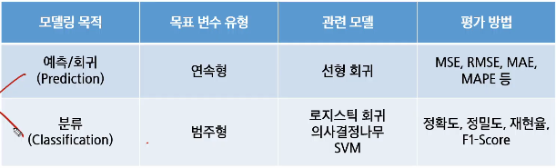
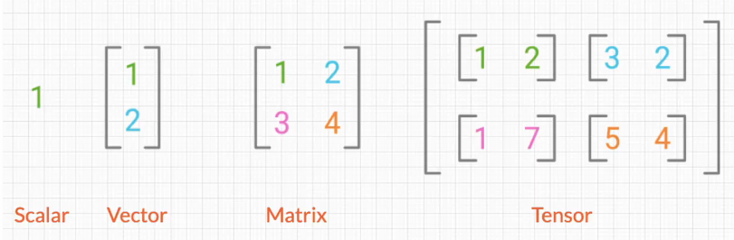

# 머신러닝 개요 및 평가지표
- 인공지능(AI)의 기본 개념
- 머신러닝(ML)과 딥러닝(DL) 소개
- 벡터의 정의와 개념

## AI(Artificial Inteligence)
- 인공지능
- 머신러닝
    - 데이터 기반 패턴 학습
- 딥러닝
    - 인공신경망
- 인간의 지능을 인공적으로 만든 것
    - 규칙 기반의 알고리즘
    - 데이터 기반의 학습(결정 트리, 선형회귀, 퍼셉트론, SVM)
    - CNN, RNN, GAN, 트랜스포머

- 머신러닝과 딥러닝
    - Perceptron 과 Deep Neural Network

## 머신러닝
- 머신러닝의 정의
    - 머신 러닝은 데이터(E)를 통해 과제(T)를 더 잘 수행하도록, 성능(P)이 향상되는 과정
    - Arthur Smauel(1959): 기계 학습(머신 러닝)은 컴퓨터가 명시적으로 프로그래밍되지 않아도 스스로 학습할 수 있는 능력을 부여하는 학문 분야
    - Tom Mitchell(1998): 컴퓨터 프로그램이 어떤 작업 집합 T와 성능 척도 P에 대해 경험 E로부터 학습한다고 할 때, 경험 E를 통해 T 작업에 대한 성능이 P로 측정한 결과 향상되는 경우를 말함
        - 경험(E): 데이터, 과거의 사례
        - 작업(T): 해결하려는 문제, 과제
        - 성능 척도(P): 얼마나 잘했는지 평가 기준
    
## 피처 엔지니어링
- 피처 엔지니어링
    - 모델이 더 좋은 예측을 할 수 있도록 데이터를 가공하는 과정
    - 데이터를 단순히 수집하는 것보다 적절한 피처(Feature, 변수)를 만드는 것이 성능 향상에 중요
- 피처 엔지니어링 필요성
    - 원본 데이터는 모델이 바로 이해하기 어려운 형태일 수 있음
    - 좋은 피처를 만들면 복잡한 모델 없이도 높은 성능을 낼 수 있음
    - 불필요한 변수를 제거하면 연산 속도가 빨라지고 해석력이 향상됨
- 피처 선택
    - 모델 성능에 중요한 변수만 선택하고 불필요한 변수 제거
    - 방법
        - 상관계수 분석 -> 상관관계가 높은 변수 제거
        - 분산 기반 선택 -> 변화가 거의 없는 변수 제거
        - Recursive Feature Elimination(RFE) -> 모델 성능에 가장 중요한 변수 선택
- 피처 생성
    - 기존 데이터를 활용하여 새로운 변수를 만드는 과정
- 피처 변환
    - 모델이 데이터를 더 잘 학습할 수 있도록 변형
    - 방법
        - 정규화: 값의 범위를 [0,1]로 조정
        - 표준화: 평균 0, 표준편차 1로 조정
        - 로그 변환: 데이터 분포를 정규분포에 가깝게 변형
- 범주형 데이터 인코딩 (Categorical Encoding)
    - 문자 데이터를 숫자로 변환하여 모델이 이해할 수 있도록 함
    - 방법
        - 원-핫 인코딩(One-Hot Encoding): 카테고리를 0과 1로 변환
        - 라벨 인코딩(Label Encoding): 카테고리를 숫자(순서에 따라 숫자 크기가 달라지는데 이게 영향을 줄 수도 있음, 순서 중요할 수도)로 변환 (예: "Red" -> 1, "Blue" -> 2)
- 결측값 처리
    - 데이터에서 비어있는 값(결측치)을 처리하는 과정
    - 방법
        - 삭제: 결측치가 적으면 해당 행 제거
        - 대체: 평균, 중앙값, 최빈값으로 채우기
        - 예측 모델 사용: 머신러닝을 활용하여 결측값 예측
- 이상치 처리
    - 극단적인 값을 감지하고 처리하는 과정
    - 방법
        - Z-score(표준 편차 기준), IQR(사분위 범위) 기반 이상치 제거
        - 로그 변환으로 이상치 영향을 줄이기
    
## 머신러닝의 분류
- 종류
    - 지도학습
    - 비지도학습
    - 강화학습
    - 외에도 준지도학습(일부 라벨 존재), 자기지도학습(스스로 학습할 수 있는 과제를 생성함) 등 있음
- 지도학습(Supervised Learning)
    - 주어진 데이터(정답)를 가지고 예측하는 것
    - 종류
        - 컴퓨터 비전에서의 지도학습
            - 이미지 분류: 라벨링(정답지) 후 잘 맞출 수 있게 처리하는 것(분류)
                - 결과: 객체
            - 객체 위치 지정 및 탐지: 특정 객체의 위치
                - 결과: 바운딩 박스(위치 좌표)
        - 자연어 처리에서 지도학습
            - 기계 번역: 원문 -> 번역문

- 비지도학습(Unsupervised Learining)
    - 데이터셋에 라벨이 없음
    - 목표(모호하게 제시됨): 데이터에서 흥미로운 구조(숨겨진 구조, 패턴 등)를 발견하는 것
    - 예시: 문서군집화, 이상탐지 등
    - 종류
        - 유전자 클러스터링

- 자기지도 학습(Self-Supervised Learning)
    - 라벨링 없지만 지도학습처럼 학습(데이터 내부구조 -> 학습셋)
    - Large Language Model
        - 대규모 언어 데이터셋을 통해 학습된 기계 학습 모델
        - 다양한 목적으로 활용 가능
        - 대규모 언어 데이터셋 스스로 학습하고 몇개의 예시(Few-Shot)만 보여줘도 자기지도학습이 충분히 가능함
    - Bert
        - 지도 학습의 단점인 정답 데이터에 대한 한계를 극복 - 정답이 없는 데이터도 자체 데이터로 학습
        - 사전 학습(Pre-training)과 미세 조정(Fine-tuning) 단계로 진행

- 강화 학습(Reinforcement Learning)
    - 순차적인 결정을 내리는 학습
        - 알고리즘은 데이터를 상호작용적으로 수집할 수 있음(행동 <-> 피드백(보상 및 벌))
        - 에이전트(행동주체) -> 행동 -> 환경(반응, 보상 등) -> 보상 -> 에이전트(행동주체)

- 모델 성능 평가
    - Overfitting vs. Underfitting
    - Overfitting(과적합)
        - 모델이 학습 데이터에 지나치게 적합하여, 복잡한 패턴까지 모두 학습
        - 학습 데이터에서는 높은 성능, 하지만 새로운 데이터에서는 성능이 저하
    - Underfitting(과소적합)
        - 모델이 충분히 학습되지 않아 중요한 패턴조차 학습하지 못함
        - 학습 데이터와 테스트 데이터 모두에서 성능 저조

- 평가(Evaluation)
    - 실제값과 모델에 의해 예측된 값을 비교하여 두 값의 차이(오차)를 구하는 것
    - (실제값 - 예측값) = 0 이면, 오차가 없는 것으로 모델이 100% 성능을 보임
    - But 성능이 100%인 모델은 현실적으로 힘들기 때문에, 오차를 구하여 어느 정도까지 오차를 허용할지 결정
        - 과적합을 방지하고 최적의 모델을 찾기 위해 실시
    - 모델링의 목적 또는 목표 변수의 유형에 따라 다른 평가지표 사용
        - 

- 회귀 모델 평가 방법
    - 하나의 목표를 가지고 다양한 회귀 모델을 만들어 테스트
    - 그 중 어떤 모델이 가장 나은 모델인지 판단할 때 모델 평가지표 사용
    - 실제 데이터와 예측 결과 데이터가 얼마나 비슷한 지에 기반하지만, 단순하게 이것만 가지고 판단하기에는 무리가 있음
        - 평균 절대 오차(MAE)
        - 평균 절대 백분율 오차(MAPE)
        - 평균 제곱 오차(MSE)
        - 평균 제곱근 오차(RMSE)
        - 결정 계수(R**2 Score)
    - 종류
        - MAE(평균 절댓값 오차)
            - 실제 정답 값과 예측 값의 차이를 절댓값으로 변환한 뒤 합산하여 평균을 구함
            - 이상치를 고려하지 않는 경우에 주로 사용
            - 값이 낮을수록 좋은 모델
            - 실제 정답보다 낮게 예측했는지, 높게 했는지 파악 어려움(방향성 모름)
            - 스케일에 의존적이기 때문에 모델마다 에러 크기가 동일해도 에러율은 동일하지 않음
        - MAPE(평균 절대 백분율 오차)
            - MAE를 상대적 오차로 변환하여 데이터의 스케일에 영향을 덜 받도록 함(MAE를 실제값 대비 백분율로 바꿈)
            - 이상치를 고려하지 않는 경우에 주로 사용
            - 값이 낮을수록 좋은 모델
            - 실제 정답보다 낮게 예측했는지, 높게 했는지 파악 어려움(방향성 모름)
            - 실제 정답이 0에 가까운 경우, 값이 발산할 수 있으므로 주의
        - MSE(평균 제곱 오차)
            - 실제 정답 값과 예측 값의 차이를 제곱한 뒤 평균을 구함(양수로 만들기 위해, 오차가 클수록 패널티 크게 주기 위해)
            - 시계열 데이터에서, 미분이 연속적이어야 할 때 주로 사용
            - 값이 낮을수록 좋은 모델
            - 이상치에 매우 민감(큰 오차에 큰 패널티)
            - 데이터에 이상치 많다면 MSE 대신 MAE를 고려
                - MAE도 이상치에 강건하진 않지만 제곱보단 나음
            - 스케일 의존적이므로 모델 비교 시 주의 필요
        - RMSE(평균 제곱근 오차)
            - MSE에 루트를 씌워서 에러를 제곱해서 생기는 값의 왜곡 줄임
            - 시계열 데이터에서, 미분이 연속적인 순간이 필요할 때 주로 사용(하루 평균 몇번 정도 예측 틀렸는지 등)
            - 값이 낮을수록 좋은 모델
            - 이상치에 대한 패널티가 여전히 존재(MSE보다는 덜 민감, 데이터의 크기가 다르면 RMSE 값도 다르게 나와서 서로 다른 스케일의 모델을 비교하기 어려움)
            - 데이터에 이상치 많다면 MSE 대신 MAE 계열 사용
        - R2 score = R squared
            - 모델이 실제 데이터의 변동성을 얼마나 잘 설명하는지를 나타내는 지표
            - 실제 값의 전체 변동성(SST) 중에서 모델이 설명할 수 있는 비율
            - 1에 가까울 수록 좋은 모델
            - SSR: 모델이 설명하는 거, SSE: 모델 오차
            - SSR/SST = 1-SSE/SST -> 1에 가까울 수록 좋음
        
- 분류 모델 평가 방법
    - 하나의 목표를 가지고 다양한 분류 모델을 만들어 테스트
    - 그 중 어떤 모델이 가장 나은 모델인지 판단할 때 모델 평가지표 사용
    - 회귀모형과 비슷하게 실제 데이터와 예측 결과 데이터가 얼마나 비슷한 지에 기반하지만, 단순하게 이것만 가지고 판단하기에는 무리가 있음
        - 종류
            - 정확도
            - 오차행렬
            - 정밀도
            - 재현율
            - F1-Score
            - ROC AUC
        - 오차행렬(혼동행렬, Confusion Matrix)
            - 분류 모델이 예측한 결과와 실제 정답을 비교하여 성능을 평가하는 방법
            - 특히 이진 분류 문제에서 모델이 얼마나 정확하게 예측했는지를 분석하는 데 유용
            - TP: 실제 -> 참, 모델 예측 -> 참
            - TN: 실제 -> 거짓, 모델 예측 -> 거짓
            - FP: 실제 -> 거짓, 모델 예측 -> 참
            - FN: 실제 -> 참, 모델 예측 -> 거짓
        - 정확도
            - 전체 샘플 중에서 모델이 맞춘 비율
            - 데이터가 불균형한 경우에는 부적절할 수 있음(99% 건강, 1% 암 환자)
            - (TP+TN)(맞은거)/(TP+TN+FP+FN)(전체)
        - 정밀도
            - 모델이 참이라고 예측한 것 중 실제 참인 비율
            - FP를 줄이는 데 초점
            - 예: 스팸 필터
            - TP/(TP+FP)
        - 재현율
            - 실제 참 중 모델이 맞춘 비율
            - FN을 줄이는 데 초점
            - 예: 암 진단
            - TP/(TP+FN)
        - 정밀도(Precision) 과 재현율(Recall)의 Trade off 관계
            - 정밀도와 재현율은 반비례 관계
            - 임계값(Threshold)을 조정하면 정밀도(Precision) 또는 재현율(Recall)을 조절할 수 있음
            - 정밀도와 재현율을 극단적으로 높이면 성능이 왜곡됨
            - 업무에 따라 적절한 균형이 필요(F1-Score 활용)
        - F1-score
            - 정밀도와 재현율의 조화 평균
            - 데이터가 불균형할 때 유용
            - 정밀도와 재현율 사이에서 균형을 맞춘 지표
            - 정밀도와 재현율이 어느 한쪽으로 치우치지 않는 수치를 나타낼 때 높은 값을 가짐
        - ROC(Receiver Operating Characteristic Curve) 곡선
            - False Positive Rate(FPR, 잘못 양성으로 예측한 비율) 변화에 따른 True Positive Rate(TPR, 실제 양성 맞춘 비율) 변화를 나타내는 그래프
            - 스레시홀드의 변화에 따라서 그래프 그림
                - 곡선이 왼쪽 위로 올라갈수록 좋은 모델
        - AUC(Area Under Curve)
            - ROC 곡선 아래 면적을 의미하며 1에 가까울수록 좋은 성능
            - 일반적으로 의학 및 머신러닝의 이진 분류 평가 지표로 활용됨

## 벡터의 정의와 개념
- 벡터의 정의
    - 벡터는 선형대수학의 기본 요소로 크기와 방향을 가짐
    - 좌표 평면에서 점을 나타낼 때 (x,y)와 같은 형태로 표현
    - 벡터는 머신러닝과 데이터 분석 등에서 데이터를 표현하는 기본 단위로 사용
    - 파이썬에서는 숫자로 이루어진 배열(리스트) 형태로 표현
- 벡터의 좌표
    - 벡터는 좌표로 표현되며, 두 숫자가 원점에서의 이동을 나타냄
    - 첫 번째 숫자는 x축 방향 이동, 두 번째 숫자는 y축 방향 이동
    - 3차원에서는 z축이 추가됨
- 데이터 표현 방법
    - 스칼라: 하나의 숫자(0차원)
    - 벡터: 여러 개의 숫자가 나열된 1차원 배열
    - 행렬: 숫자의 행과 열로 구성된 2차원 배열
    - 텐서: 3차원 이상을 포함하는 행렬보다 높은 다차원 배열
    - 

- 텐서의 활용
    - 텐서는 공간을 수치적으로 표현하는 도구
    - 데이터 분석 (및 머신러닝)에서는 벡터를 사용하여 여러 특성을 표현함(텐서 형태로 한번에 조작하면 연산이 압도적으로 빠름 -> 이걸 도와주는게 GPU)
    - 벡터를 이용해 공간 내 객체를 표현하고 조작하는데 활용
    - 텐서를 활용하여 딥러닝(특히 주로 딥러닝), 머신러닝에 적용하여 데이터를 표현함
    - 이를 활용해 복잡한 데이터와 패턴을 학습하고 분석하는 데 사용