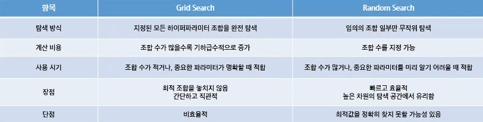
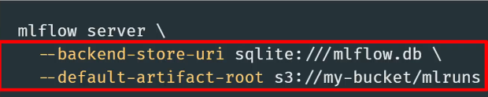
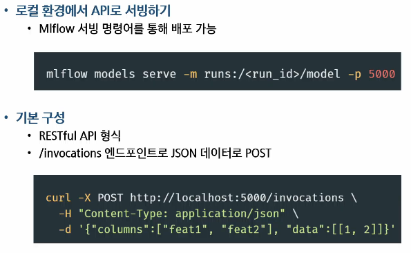
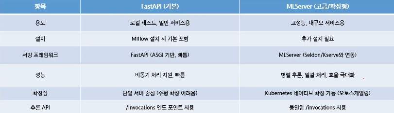

# MLFlow 데이터 실험 환경 구축
- 머신러닝 실험 환경의 필요성
- MLFlow Tracking을 활용한 실험 관리 전략
- MLFlow를 활용한 모델 관리 및 배포

## 머신러닝 실험 환경의 필요성
- 머신러닝 실험
    - 머신러닝 실험이란?
        - 모델의 성능을 개선하거나 다양한 설정을 비교 분석하기 위해 반복적으로 수행하는 **과정 중심의 실험 활동**
        - 즉, '어떤 데이터를 써서', '어떤 알고리즘에', '어떤 하이퍼파라미터를 적용했더니', '어떤 결과가 나왔는지' 체계적으로 비교하는 작업
    - 왜 실험이 중요한가?
        - 머신러닝에서는 하나의 정답이 존재하지 않고, **여러 조건에 따라 성능이 달라지기 때문에** 실험이 필수적
        - 데이터셋: 전처리 방식에 따라 결과가 크게 달라질 수 있음
        - 모델 구조: 동일한 데이터여도 모델 구조가 성능에 영향을 줌
        - 하이퍼파라미터: 학습률, 에폭 수, 정규화 강도 등
        - 성능 지표: Accuracy, F1 score, AUC 등 목적에 따라 다름
    - 반복 실험의 문제점
        - 재현성의 문제
            - 다시 똑같은 성능 재현할 수 없음(하이퍼파라미터, 전처리 방법 등 기억 안나는 경우)
            - 논문이나 리포트 제출 시 신뢰도 하락
            - 실무에선 QA, 테스트에서 큰 문제 발생
        - 협업의 문제
            - 협업자 간에 커뮤니케이션 오류 발생(실험 결과 공유가 구두/스크린샷 등에 의존)
            - 실험 중복, 불필요한 시간 낭비
                - 모델만 공유됨(학습 과정 및 데이터가 없음)
            - 실험 결과가 조직적으로 축적되지 않음
                - 실험명이 '찐막', '찐찐막' 등
        - 비효율적인 반복 작업
            - 불필요한 리소스 낭비(시간, 전력, 인프라)
                - 실험 로그는 있지만 폴더가 흩어져 있어 검색 불가
            - 연구 생산성 저하
        - 성과 측정 및 비교의 어려움
            - 정확한 모델 선택이 어려움
                - 다양한 모델을 실험했어도, 성능 비교 테이블이 없음
            - 튜닝 결과가 장기적으로 축적되지 않음
                - 지표 종류마다 따로 기록되어, 비교 자체가 어려움
        - 해결방안
            - 실험 관리 도구(MLFlow 등)
    - 실험 추적 및 관리 도구
        - 실험 추적 도구의 필요성
            - 반복 실험에서 발생하는 문제를 해결하기 위함
            - 실험마다 사용된 코드, 데이터, 하이퍼파라미터, 성능 지표를 자동으로 기록
            - 실험 결과를 비교 분석할 수 있는 인터페이스 필요
        - 실험 환경 자동화의 필요성
            - 실험은 단순 로깅을 넘어서, 재현 가능한 환경에서 실행되어야 함
        - 실험 추적 + 모델 저장 + 서빙까지 지원하는 통합 도구: MLFlow
            - MLFlow는 오픈 소스로 제공되는 머신러닝 실험 관리 플랫폼
            - 다양한 프레임워크와 호환성이 좋음
            - 실험 로그 관리 뿐 아니라 모델 저장, 등록, 서빙까지 한번에 가능
        
## MLFlow Tracking을 활용한 실험 관리 전략
- 실험 관리 전략
    - 실험 관리 전략
        - 실험을 체계적으로 계획하고 수행하고 비교 분석하는 전 과정
        - 실험 목표 수립 -> 실험 단위 정의 -> 비교 가능한 실험 설계 -> 자동화
        - 예시로 실험 목적에 따른 실험 공간을 분리해서 관리할 수 있음
    - 실험 결과 저장 위치 구조
        - MLFlow 실험 디렉토리 구조
            - MLFlow는 실험 데이터를 기본적으로 mlruns/ 디렉토리에 저장
            - 로컬 저장 기준이며, 백엔드 저장소를 바꾸면 DB/S3 등에 저장 가능(외부 저장소 사용가능)
            - 추가로 MLFlow UI에 접속하여 해당 Run을 클릭하면 파일 구조를 확인 가능
        - 디렉토리 종류
            - Metrics/: 실험 성능 지표 파일들
            - Params/: 하이퍼파라미터 저장
            - Artifacts: 모델, 이미지 등 결과물
            - Meta.yaml: 사용한 데이터 버전
- 실험 단위 구분
    - 실험 단위 구분 전략: 실험 그룹/Run 이름 정리법
        - 실험 그룹: baseline_rf_exp1, tuned_rf_exp2
        - Run 이름: max_depth=5, max_depth=10
        - 모델/데이터/전처리 조합에 따라 Run 그룹화
        - 파일 이름 형식도 '모델명_전처리 방법_데이터셋 버전'으로 하면 명확함
- 실험 정보 구조화
    - 실험 정보를 체계적으로 기록하는 방법
        - MLFlow는 실험 정보를 4가지 요소로 구분해 기록
        - 각각의 정보는 비교, 분석, 재현성에 중요한 역할을 가짐
        - Params: 실험 조건(실험 설정값(하이퍼파라미터))
        - Metrics: 성능 결과(성능 지표)
        - Tags: 설명 요약(실험 설명, 날짜 등 메타정보)
        - artifact: 결과물 저장소(결과 파일, 시각화, 모델 등)
- 실험 태그 및 노트 관리 방법
    - MLFlow는 메타 정보 태그화
        - UI와 API에서 태그 기반 검색이 가능함 -> 실험 분류 / 필터링에 유용
        - 예시
            - Author(태그 키): 작성자 이름(용도)
            - Description(태그 키): 실험 목적(용도)
            - Notes(태그 키): 참고 사항(용도)
            - Data_version(태그 키): 사용한 데이터 버전(용도)
    - 커스텀 로깅 전략
        - 중요한 정보를 직접 로깅하는 방법
            - MLFlow는 기본 로깅 외에도 **내가 원하는 정보를 자유롭게 추가 가능**
            - 모델의 의미 있는 지표를 따로 로깅 가능(val_f1, recall 등)
            - 태그에 설명을 담아 UI에서 실험의 목적, 주요 이벤트도 기록이 가능
    - 고급 실험 로깅
        - 자동화된 실험 반복 + 시각화 저장하는 방법
            - GridSearch나 반복 실험에서 각 결과를 자동으로 MLFlow에 로깅하면 관리가 편함
            - 실험별 파라미터, 지표 로깅, ROC curve, confusion matrix 이미지를 생성 후 저장
            - 반복 실험이 많을 수록 자동 로깅 코드 구조화는 필수
            - 시각화 파일도 artifact로 저장하면 UI 상에서 바로 확인이 가능함
- 실험 비교 전략
    - 실험 결과를 효율적으로 비교하는 방법
        - MLFlow UI에서는 다양한 실험을 필터링, 정렬, 시각화하며 비교 가능
        - 파라미터 조합별 성능 비교가 쉬워짐
        - 성능이 아니라, 실험 설정 자체에 주목 가능
        - 실험 목적
            - 필터링: 특정 조건(max_depth=10)으로 run 선택
            - 지표 정렬: Accuracy등 성능 기준 정렬
            - 그래프 비교: 여러 Run의 성능 변화 시각화(선형 그래프, 히트맵 등)
            - 다운로드: CSV로 성능 결과 저장 가능
    - 실험 검색 / 비교 예시
        - Python API를 활용한 실험 검색
            - 기본 실험은 ID=0 (Default experiment)
            - 사용자 지정 실험 생성 시 ID 증가
    - 실험 실패 / 중단 상황 관리
        - Try ... finally / try ... except + mlflow.end_run()
            - 실험이 끝나면 mlflow.end_run() 명령어를 통해 명시적으로 종료해줘야 로그가 깔끔하게 남음
            - 하지만 에러가 나면 종료가 누락될 수 있음
    - 실험 자동화 흐름 예시
        - Config.yaml에 실험 조건 정의
            - 반복할 실험의 조건(예:하이퍼파라미터)을 YAML 파일에 정의해두면, 실험을 체계적으로 구성하고 재사용 가능
        - itertools.product 또는 반복문으로 조합 생성
            - 모든 실험 조합을 만들기 위해 Python의 itertools.product를 사용하거나 중첩 반복문을 사용할 수 있음
        - MLFlow.start_run() 블록 안에서 파라미터와 결과를 자동으로 로깅
            - 각 조합에 대해 하나의 실험(run)이 생성되며, 비교/시각화에 활용
    - 실험 관리 전략 팁
        - 실험을 전략적으로 관리
            - MLFlow는 실험 전략 실행 플랫폼
            - 실험 이름/구조 설계 -> 자동화된 로깅 -> 정리된 비교 -> 재현성 확보
            - 단순 로그 기록이 아니라, **모델 실험을 반복 가능한 연구 활동**으로 만드는 도구
        - 실험 관리 시 유용한 팁 3가지
            - 실험명 관리: 실험 목적, 날짜 포함
            - Jupyter 요약 정리: mlflow.search_runs()로 테이블 생성
            - 중단 대비 로깅: try-finally로 중간 로그 남기기(fail인 경우도)
- MLFlow Tracking 구조 다시 보기
    - MLFlow Tracking의 구조
        - MLFlow Tracking의 구조는 다음과 같은 계층적 구조
        - Experiment
            - 실험의 상위 그룹(예: RandomForest 튜닝 실험)
        - Run
            - 하나의 실험 실행 단위(예: max_depth=10, n_estimators=100)
    - Experiment 단위로 실험을 분류
        - 실제 실험을 반복하다보면 다양한 실험 목적 발생
        - 표와 같이 실험 단위마다 별도의 Experiment 객체를 만들어 실험을 논리적으로 그룹화 가능
    - 하나의 Experiment에는 여러 개의 Run이 존재
        - 각 Run은 실험 한 번 실행 시 생성되는 단위
        - 파라미터, 성능지표, 로그, 모델 등을 저장
        - 예시: rf_tuning_exp 안에 있는 Run
            - Run이 많아져도 같은 목적 안에서 모아서 비교할 수 있어 관리가 쉬움
    - Run ID 기반 추적
        - MLFlow는 각 Run에 대해 고유한 Run ID를 부여(검색 정렬함)
        - 이 Run ID는 실험 결과의 정확한 출처를 추적하거나, 특정 모델을 재사용할 때 사용
        - 저장된 모델과 실험 로그를 연결할 수 있어 재현성과 추적성 확보
        - 예시: 모델을 저장하고 나중에 불러올 때
- MLFlow 하이퍼파라미터 튜닝
    - 하이퍼파라미터 튜닝의 중요성
        - 하이퍼파라미터는 학습 알고리즘의 학습 방식에 직접적인 영향을 미침
        - 잘 튜닝된 모델 vs 기본값 모델 -> 성능 차이가 상당함
        - GridSearch, RandomSearch, HyperOpt 등의 사용
    - Grid Search vs Random Search 개념 정리
        - 하이퍼파라미터 튜닝의 대표적인 2가지 기법
        -  
    - HyperOpt란?(튜닝 도구)
        - 머신러닝 모델의 하이퍼파라미터 튜닝을 자동으로 수행해주는 라이브러리
        - 핵심 목표는 최적의 파라미터 조합을 효율적으로 찾는 것
    - HyperOpt 특징
        - 목적 기반 최적화
            - 단순 반복이 아닌, 성능을 기반으로 검색
        - 이전 결과 학습
            - 과거 실험 결과를 기반으로, 다음 탐색 위치를 정교하게 조정(랜덤서치보다 좋은 결과를 낼 수 있음)
        - 계산량 절약
            - 수백 개 실험을 거치지 않아도 좋은 조합에 빠르게 수렴
        - 다양한 공간 지원
            - 실수형, 정수형, 범주형, 조건부 파라미터 등 복잡한 탐색 구조 지원
- MLFlow 모델 관리 및 배포
    - 실험 결과로 나온 모델
        - ML 실험의 목적은 결국 좋은 모델을 찾는 것
        - 성능 좋은 모델을 저장, 버전 관리, 배포할 수 있어야 실무에 사용 가능
        - MLFlow는 이 과정을 **Tracking과 연결된 모델 저장 시스템**으로 처리
    - Stage란?
        - MLFlow Model Registry에서 하나의 모델 버전이 어떤 배포 단계에 있는지를 표시하는 상태 값
        - MLFlow에서 모델은 다음과 같은 'Stage' 상태를 가질 수 있음
    - 상태
        - 모델 개발 및 실험 -> None(초기 등록)
        - 성능 검증 후 테스트 환경 배포 -> Staging(테스트 또는 검증 단계)
        - QA 통과 후 서비스 배포 -> Production(실제 서비스에 배포된 모델)
        - 새 모델로 교체되면 이전 모델 -> Archived(더 이상 사용하지 않는 이전 버전 모델)
    - 모델 버전 관리
        - MLFlow에서는 하나의 모델 이름 아래 여러 버전의 모델을 등록할 수 있음
        - 최근에는 Alias 방식이 도입되면서, 자유로운 문자열로 여러 버전으로 저장 가능(코드 안바꿔도 버전만 바꾸기 가능-version 1, 2, 3)
    - 새로운 방식: Alias
        - 여러 alias를 동일 버전에 연결할 수 있고, 하나의 alias를 쉽게 다른 버전으로 전환 가능
        - 버전 관리 + 배포 환경 + 실험 그룹을 명확하게 구분이 가능
- MLFlow models 구조 소개
    - MLFlow 구성요소 및 개념
        - 모델 포맷
            - 다양한 프레임워크 지원(sklearn, keras 등)
        - 모델 경로
            - run ID 기반으로 저장
        - 환경 정보(재현성 확보하는데 도움 주는 파일)
            - conda.yaml, Mlmodel, requirements.txt 자동 생성
    - 모델 저장의 필요성
        - Pickle, joblib
            - 간단하지만 환경 정보 없음, 코드 추적 불가
        - MLFlow Models
            - 모델뿐 아니라 실험 환경, 입력 형태, 프레임 워크 정보까지 저장 가능
        - 핵심은 실험 결과를 재현하고 협업하려면 단순한 .pkl 파일로는 부족
- 모델 저장 방법
    - 모델 저장 방법
        - Log_model()은 모델 객체와 함께 실행 환경 정보까지 저장
        - UI에서도 해당 모델 확인 가능
        - 모델을 저장하면서 자동으로 artifact에 등록
    - 저장된 모델 불러오기
        - 모델 검증 시, 추론 테스트를 위해 저장된 모델 불러오기
        - 모델 서빙 시, API 배포에 활용
        - MLFlow.pyfunc.load_model()을 사용하면 공통 인터페이스로 불러올 수 있음(추상화된 요소로 볼 수 있음)
    - 모델 저장 위치 설정(로컬 vs 원격)
        - 로컬 디스크: 기본 설정, 간단한 실험에 적합
        - S3, GCS: 탐 프로젝트, 클라우드 기반 실험에 적합(공유하는 실행환경에서 유리)
        - 데이터베이스(e.g, SQLite, MySQL): 실험 메타데이터 저장 용도로도 활용 가능
    - 모델 저장 위치 설정 코드
        - 
    - 모델 경량화 및 구조 분석 팁
        - 저장된 Mlmodel(메타파일) 파일에는 모델 flavor, 입력/출력 signature(입력, 출력 형태를 명확히 정의한 메타데이터) 정보가 있음
        - Signature를 정의하면 추론 식 입력 형태를 자동 검증 가능
    - 모델 관리 배포의 흐름
        - 모델 저장 -> 로딩 -> 예측
        - 실험 끝난 후 성능 좋은 모델 선택
        - 모델 저장
        - Run ID 기반으로 불러와서 예측 수행
        - 예측 결과를 평가하고 다시 로깅
    - 
        - REST API 형식: 예측 요청 보내는 것
- MLFlow 모델 서빙
    - MLFlow 모델 서빙
        - 훈련된 머신러닝 모델을 운영 환경에 쉽게 배포할 수 있도록 도와주는 도구
    - MLFlow 모델 서빙 엔진
        - 
- MLFlow 모델 서빙 환경 및 확장성
    - 서빙 환경 고려사항
        - 입출력 형식
            - Signature 미지정 시 예측 요청 에러 발생 가능 -> 입력 스키마 명확히 지정 필요
        - 동시 요청 처리
            - 기본 서버는 단일 스레드 -> 실무 배포 시 gunicorn, uvicorn 등 활용 권장
        - Docker 서빙
            - MLFlow models build-docker 명령으로 모델을 컨테이너화 해 이식성 향상
    - MLFlow Models의 확장성
        - 다양한 프레임워크 지원
            - scikit-learn, tensorflow, xgboost, pytorch 등과 연동 가능
        - 이식성
            - Databricks, AWS SageMaker 등 다양한 플랫폼에 배포 가능
        - 모델 관리 연계
            - 추후 Model Registry, 서빙 인프라(API Gateway 등)와 자연스럽게 연결됨
        - 통합 구조
            - 모델 저장 -> 로딩 -> 배포까지 하나의 포맷으로 처리 가능 (MLmodel + artifact)

## MLFlow Tracking을 활용한 모델 관리 및 배포
- 실행 비교, 모델 선택, REST API 배포 실습
    - 하이퍼파라미터 튜닝(HyperOpt로 찾기) -> 모델 비교 -> 최종 배포
    - 목표
        - 하이퍼파라미터 스윕 실행
        - MLFlow UI에서 실행 결과를 비교
        - 가장 좋은 Run을 선택하여 모델 등록
        - REST API에 모델 배포
    - 실험 내용
        - 데이터셋: 와인 품질 데이터셋
        - Keras 딥러닝 모델의 RMSE를 최소화
            - learning_rate와 momentum를 여러 값으로 수정
        - 각각의 실험 결과를 MLFlow에 자동으로 기록
    - 실험 포인트
        - 하이퍼파라미터 변경 후, 비교
        - 성능 비교와 모델 선택
        - REST API 모델 배포
    - Wine 데이터 전처리
        1. 
            - 입력 정규화를 위한 평균과 분산 계산
            - Dense 2층 구조의 회귀 모델
            - 출력은 하나(와인 품질 예측)
        2. 
            - SGD 옵티마이저로 학습률과 모멘텀 적용
            - 손실함수: MSE, Metric:RMSE
        3. 
            - 파라미터, metric, 모델 로그
        4. 하이퍼파라미터 최적화 및 모델과 로그저장
    
