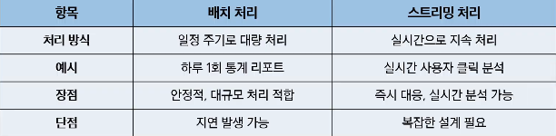
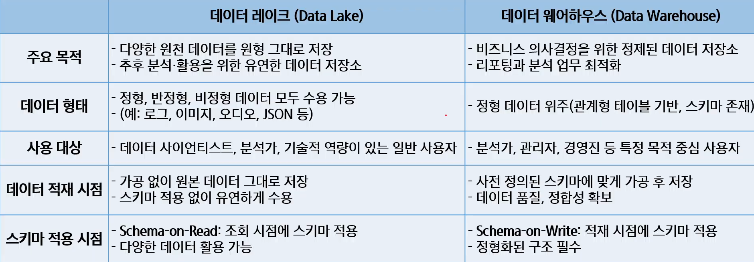
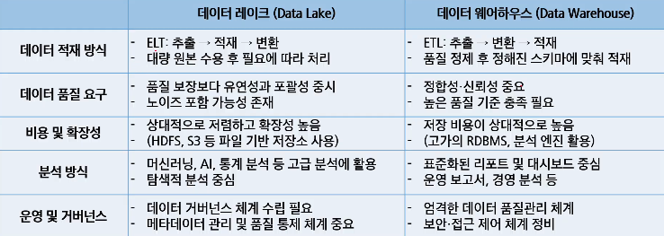
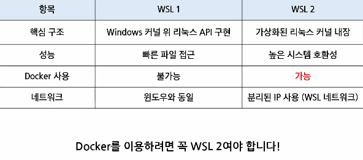
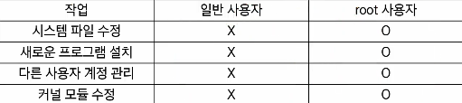
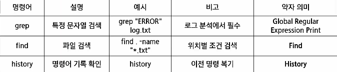
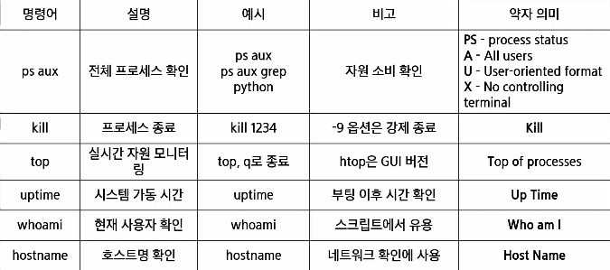
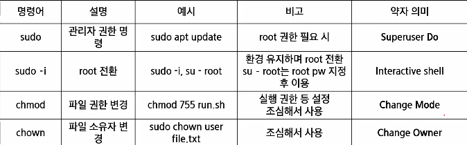
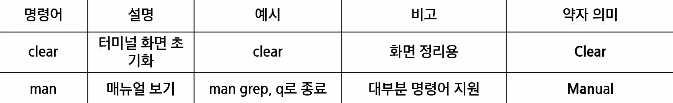

# 데이터 파이프라인 이해와 WSL
- 데이터 파이프라인
- 리눅스
- WSL
- 리눅스 기본 명령어

## 데이터 파이프라인
- 데이터?
    - 정보 vs 데이터
        - 데이터(2010년 이후)
            - 대규모로 수집된 원시 자료
            - 나중에 의미를 부여
        - 정보(2000년대 전)
            - 실제 도움이 되는 데이터
            - 유의미
        - 과거에는 정리되고 유의미하게 도움되는 '정보'가 중요했음
        - 그러나 현재는 원시 자료인 '데이터'의 중요성이 강조됨
- 데이터의 중요성
    - 중요해진 이유
        - 빅데이터
            - 데이터의 양, 다양성, 증가 속도 향상 + 신뢰성, 가치
            - 데이터를 수집, 가공, 활용할 수 있는 기술의 대두 -> 데이터 파이프라인
    - 데이터 활용
        - 비즈니스 리더들의 의사 결정
        - 데이터를 통한 서비스 / 제품 강화

- 데이터 엔지니어의 주요 활동
    - 주요 역할
        - 데이터를 안정적으로 수집하고 가공하여 전달
        - 분석과 모델링이 가능하도록 데이터 흐름을 자동화
        - 신뢰성 있고 재사용 가능한 파이프라인 구축
    - 주로 하는 일
        - 다양한 시스템에서 데이터 수집
        - 정제 및 변환 (ETL / ELT 설계)

- 데이터 파이프라인
    - 데이터 파이프라인이란?
        - 데이터를 추출하고 정제하고 저장, 분석, 시각화하는 일련의 자동화 과정

- OLAP와 OLTP
    - OLTP (Online Transaction Processing)
        - 운영 데이터 처리 시스템
        - 실시간 트랜잭션(주문, 결제, 예약 등) 처리
        - 행(Roe) 단위 저장 구조
        - 빠른 입력, 수정, 삭제에 최적화
    - OLAP (Online Anlytical Processing)
        - 분석 데이터 처리 시스템
        - OLTP 등에서 수집된 데이터를 기반으로 통계, 리포트 분석
        - OLAP 시스템은 분석 성능을 위해 컬럼 기반 저장 구조를 사용하는 경우가 많음
        - 집계, 요약, 예측 분석에 최적화

- ETL의 구조
    - ETL란?
        - 데이터를 가공한 후 저장. 전통적인 방식
        - 추출(Extract) -> 가공(Transform) -> 저장(Load)
    - ELT란?
        - 데이터를 저장한 후 가공. 클라우드 시대에 많이 쓰이는 방식
        - 추출(Extract) -> 저장(Load) -> 가공(Transform)
        - 장점
            - 원본 데이터가 그대로 보존 됨
            - 원본 데이터를 재사용할 수 있음
        - 단점
            - 저장소를 많이 차지하여 무거워짐
    - ETL, ELT 차이
        - ETL
            - 정제 우선(온프레미스)
        - ELT
            - 속도와 유연성 중심(클라우드, 대용량)
- 데이터 처리 방식 - 배치와 스트리밍
    - 배치 처리 방식 (Batch Processing)
        - 데이터를 모아서 한 번에 처리하는 방식
        - 주로 하루 1회, 또는 시간 단위로 처리가 이뤄진다.
        - 정확성, 안정성과 대량 처리에 적합함
    - 데이터 스트리밍 처리 방식(Data Stream Processing)
        - 데이터가 들어오는 즉시 실시간 처리하는 방식
        - 빠르게 변화하는 데이터에 즉시 반응 가능
        - 실시간 분석, 즉시성과 대응이 가능
        - 

- 데이터 파이프라인의 기본 구조
    - 자동화된 데이터 흐름
        - 데이터 소스 -> 수집 -> 가공 -> 저장 -> 분석/제공

- 데이터 저장소의 중요성
    - 저장소는 분석을 위한 인프라
        - 데이터를 단순히 저장하는 것이 아니라 분석, 활용을 위한 설계가 필요
        - 저장소에 따라 처리 방식과 유연성이 달라짐
        - 파이프라인에서 중요한 핵심 축

- 데이터 저장소의 종류
    - 데이터 웨어하우스
        - 정형 데이터를 저장하는 구조. 기본 저장구조
        - 정형 데이터 중심
        - 스키마 사전 정의
        - ETL 기반의 처리 방식
    - 데이터 레이크
        - 원본 데이터(정형, 비정형 상관X)를 저장하는 구조. 수집 후 재가공하여 활용
        - DW의 구조적 질서에 유연성을 결합
        - 분석, 모델링, BI 모두 대응하는 형태
    - 데이터 마트
        - 특정한 목적을 위해 데이터 웨어하우스의 내용을 다시 추출하여 저장
    - 
    - 

- 데이터 웨어하우스 vs 데이터 레이크
    - 데이터 웨어하우스는 최종 사용자가 보고싶은 관점별 데이터 구성을 위해 원천 DB로부터 데이터를 수집
    - 스키마 관리와 품질 관리를 통해 리포트를 제공하는 시스템
    - DW는 데이터 구조가 이미 결정되어 엄격한 스키마 관리가 필요하고 한 번 구축 시 변경이 어려움

- 데이터 도구
    - 데이터 수집 도구
        - Kafka
            - 분산 메시지 큐 시스템
            - 대용량 데이터를 빠르고 안정적으로 전달
            - 실시간 스트리밍 수집에 강점

    - 데이터 처리(가공) 도구
        - Spark(배치)
            - 대규모 배치 처리 프레임워크
            - ETL/머신러닝 통합 가능
            - DAG 기반 처리로 안정성과 확장성 확보
        - Flink
            - 스트리밍 처리 전문 프레임워크
            - 이벤트 기반 실시간 분석에 최적화
            - 상태 기반 연산 및 복잡한 처리 가능
    
    - 데이터 저장 도구
        - RDBMS(PostgreSQL, Oracle, 등)
            - 고급 기능을 지원하는 오픈소스 관계형 데이터베이스
            - 정형 데이터 저장에 적합
        - Elasticsearch
            - 실시간 검색과 분석에 강력한 NoSQL DB
            - 로그, 텍스트 분석, 모니터링 등 다양한 사용처(검색 서비스)
        - Hadoop (HDFS)
            - 대용량 비정형 데이터 저장용 HDFS 기반 저장소
            - 정형, 비정형 데이터 통합 저장 가능(원시데이터 및 대용량데이터 분산저장)

    - 데이터 모니터링 및 워크플로우 관리 도구
        - Airflow
            - 워크플로우 스케줄러(DAG 기반)
            - 파이프라인의 각 단계를 자동화 및 모니터링
            - 자동으로 순서(시점)에 맞게 실행시킴
        - Grafana
            - 실시간 시각화 대시보드
            - 다양한 데이터 소스와 연결 가능 (Prometheus, Elasticsearch 등)
        - Prometheus
            - 시계열 기반 모니터링 도구
            - 지표 수집, 알림, 시각화 연동 기능 제공

    - 데이터 레이크 분석 도구
        - BI(Business Intelligence) / OLAP(Online Anlytical Processing)
            - 데이터를 시각적으로 분석하거나 리포트를 만들기 위한 도구
            - 엑셀의 Pivot 기능 또는 시각화 기능과 같은 기능을 좀 더 전문적으로 다루는 도구
            - 원래 데이터 웨어하우스의 등장과 함께 같이 쓰이는 도구였으나, 데이터 레이크도 연결 가능
            - 라이선스 비용 높은 편
    
    - 데이터 레이크하우스
        - 정형 + 비정형 데이터 모두 저장
        - 스키마는 나중에 적용
        - 대용량 로그/센서 데이터 수용 가능
    
    - 아키텍처 설계
        - 데이터 엔지니어 관점에서 데이터 아키텍처 주 관심사는 파이프라인 설계
        - 데이터 수집부터 분석/시각화 환경까지 데이터를 견고하게 전달할 수 있는 아키텍처 설계를 목표로 함
    
    - 파이프라인 설계
        - 파이프라인 설계는 환경마다 다르기에 정답은 없음
        - 오픈레미스 vs 클라우드
        - 요구사항에 따라 각양각색으로 구현 가능하나, 실시간 수집이 필요한지 여부에 따라 파이프라인 설계 구분 가능
        - 람다 아키텍처, 카파 아키텍처
            - 실시간 수집이 필요한 경우 참조할 수 있는 아키텍처가 존재함
            - 대표적으로 람다(Lambda) 아키텍처와 카파(Kappa) 아키텍처가 존재
            - 구조화된 아키텍처는 참고를 위한 아키텍처일 뿐 모든 데이터를 해당 아키텍처 기반의 파이프라인으로 만들 필요는 없음
            - 아키텍처 수용 여부는 파이프라인마다 데이터의 활용 요건으로 결정
            - 데이터 활용 요건을 분석 후 아키텍처를 따를지 어떤 데이터 뷰를 활용할 지 결정
            - 람다
                - 실시간 수집이 필요한 경우 배치 처리와 스트림 처리를 모두 이용 가능
                - Serving Layer
                    - 배치 Layer에 저장된 데이터를 빠르게 보여주기 위한 서비스 계층
                    - 사용자가 쿼리할 수 있도록 함
                    - 필요에 따라 스피드(스트림이랑 같은 의미) Layer에 있는 데이터를 결합하기도 함
                - 배치 Layer, 스트림 Layer
                    - 배치 Layer에 저장된 데이터가 특정 기준 데이터라면 스피드 Layer에는 당일 데이터가 저장/정제하여 저장하는 공간
                    - 배치 Layer에서 테이블 갱신이 완료되면 스트림 Layer는 그 이후 데이터부터 저장 및 정제
                    - 람다 아키텍처는 컨셉만 제공
            - 카파 아키텍처
                - 배치 Layer를 제거하되 배치 Layer에서 하던 일을 모두 스피드 Layer에서 수행하는 구조(전처리 후 필요한 테이블로 재구성)
                - 데이터 소스는 주로 메시지 큐를 의미
                - 메시지 큐에는 여러 솔루션이 존재하지만 Kafka를 개발한 Jay Kreps가 만든 카파 아키텍처에서 데이터 소스는 사실상 Kafka의 Cluster를 의미
                - 카파 아키텍처에서 대표적으로 데이터는 Kafka로 수집함
                - 그러나 일반적으로 배치 파이프라인도 많이 활용

- 데이터 파이프라인 전체 구조
    - 데이터 소스
        - 데이터가 유입되는 소스(고객정보, 제품정보, 행동 정보 로그 등)
    - 데이터 수집 및 변환
        - 데이터 소스에서 내용을 추출하고 저장에 적절한 형태로 변환
    - 데이터 저장
        - 데이터를 저장하는 시스템
    - 과거 데이터 분석
        - 과거 데이터를 활용한 분석 단계(집계)
    - 예측 분석
        - 데이터를 바탕으로 머신러닝 및 예측을 하는 단계(추천)
    - 출력
        - 데이터 분석 결과를 시각적으로 표현하거나 시스템에 제공
    - 지원 시스템
        - 데이터 파이프라인을 관리하고 보완 및 모니터링 하는 시스템

## 리눅스
- 유닉스(UNIX)
    - 리눅스가 탄생하기 이전 운영체제(OS)
    - 지금도 많이 사용되는 운영체제 중 하나이지만 높은 비용 지불 필요
    - IBM의 AIX, HP의 HP/UX, 오라클의 Solaris, DEC의 Digital Unix, SCO의 SCO
    - Unix 등
- 리눅스(Linux)
    - 무료(Free) 유닉스 개념
    - 유닉스와 거의 동일한 운영체제이면서 무료, 어떤 면에서는 유닉스보다 뛰어남

- 리눅스의 구성
    - 커널(Kernel)
        - 운영체제의 핵심 구성 요소로, 하드웨어와 응용 프로그램 사이를 중재하는 역할을 한다

- 리눅스의 장점
    - 무료, 오픈소스(Free, Open Source)
        - 누구나 자유롭게 사용, 수정, 배포 가능
        - 라이선스 비용 부담 없이 교육/개발에 적합
    - 가볍고 빠른 성능
        - 구형 하드웨어에서도 작동 가능
        - 불필요한 GUI 없이 CLI 중심 운영 가능
    - 서버로서의 점유율
        - 전 세계 웹 서버의 70% 이상이 리눅스 기반
        - 클라우드, 데이터센터, 웹 호스팅에서 필수 OS
    - 개발 환경
        - Git, Docker, Python, Node.js 등 대부분 리눅스 친화적
        - 패키지 설치, 자동화, 백엔드 개발에 최적

- 우분투 리눅스
    - 데비안 기반 배포판, 다양한 플래버(Desktop, Server, IoT 등)
    - 릴리스 주기: 일반 버전(6개월), LTS 버전(2년)

## WSL
- WSL
    - 정의
        - Windows 환경에서 리눅스를 실행할 수 있도록 도와주는 도구
        - 윈도우에서 리눅스를 가상 머신 없이 실행
        - 명령어, 파일 시스템, 리눅스 도구 사용 가능
    - 장점
        - 별도 리눅스 컴퓨터가 없어도 Windows에서 바로 리눅스 사용 가능
        - Docker, Python, Git 등 리눅스 친화 도구 활용이 쉬움
        - VM 대비 가볍고 빠르며, 설치가 간편함(재부팅 없이 가능)
    - 

- root 사용자란?
    - 최고 권한(Superuser)을 가진 계정
        - 시스템의 모든 파일, 설정, 사용자 계정 등에 제약 없이 접근 가능
        - Windows의 Administrator에 대응되는 개념
    - root 권한 이용시 주의점
        - 실수로 중요한 시스템 파일 삭제 가능
        - 잘못된 명령어로 OS 자체를 망가뜨릴 위험
        - 외부 공격자가 root 권한을 얻으면 시스템 전체를 장악 가능
        - 그래서 보통은 sudo 명령어로 필요한 작업만 root 권한을 임시로 위임받아 실행함
        - 
    - 검색과 필터링
        - 
    - 시스템 정보 및 프로세스
        - 
    - 사용자 권한 및 보안
        - 
    - CLI 환경 관련 유용 명령
        - 

- chmod (Change Mode)
    - 리눅스 권한 구조
        - 리눅스에서는 각 파일/디렉토리에 대해 다음 3가지 주체에 대한 권한을 따로 설정할 수 있다
    - 주체
        - u(user): 파일의 소유자
        - g(group): 파일이 속한 그룹
        - o(other): 그 외 사용자
    - 권한
        - r(read): read(내용 보기 가능)
        - w(write): write(수정, 삭제 가능)
        - x(excute): excute(실행 가능, 디렉토리 접근 포함)
    