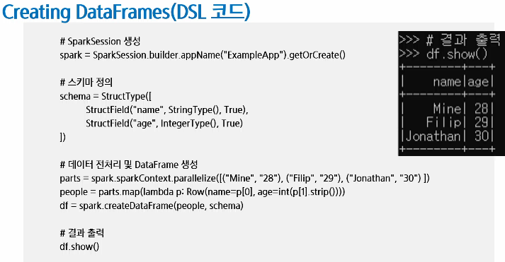
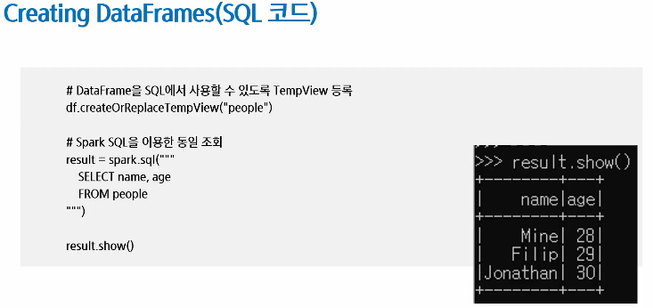
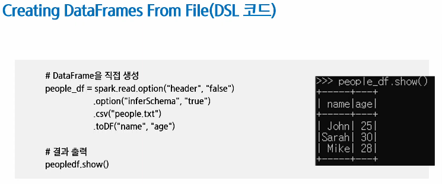
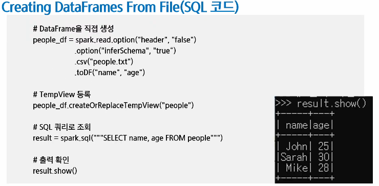
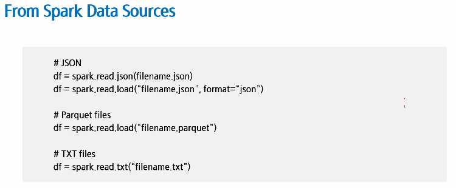

# Spark Dataframe과 SparkSQL
- DataFrame과 Spark SQL
- DSL과 SQL을 활용한 데이터 처리

## RDD란?
- Resilient Distributed Dataset
    - 데이터를 병렬 처리하는 핵심적인 역할을 수행하여 빠르고 안정적으로 동작하는 프로그램을 작성 가능
    - 데이터 값 자체는 표현 가능하지만, 데이터에 대한 메타 데이터, '스키마'에 대해 명시적 표현 방법이 없음

- RDD API의 문제점
    - 스파크가 RDD API 기반의 연산, 표현식을 검사하지 못해 최적화할 방법이 없음
        - RDD API 기반 코드에서 어떤 일이 일어나는지 스파크는 알 수 없음
        - join, filter, group by 등 여러 연산을 하더라도 스파크에서는 람다 표현식으로만 보임
        - 특히 Pyspark의 경우, 연산 함수 Iterator 데이터 타입을 제대로 인식하지 못함
            - 스파크에서는 단지 파이썬 기본 객체로만 인식
    - 스파크는 어떠한 데이터 압축 테크닉도 적용하지 못함
        - 객체 안에서 어떤 타입의 컬럼에 접근한다고 해도, 스파크는 알 수 없음
        - 결국 바이트 형태로 직렬화해 사용할 수 밖에 없음
        - 스파크가 연산 순서를 재정렬해서 효과적인 질의 계획으로 바꿀 수 없음

- DataFrame
    - 스키마(schema)를 가진 분산 데이터 컬렉션
    - 데이터를 행(row)과 열(column)로 구성된 표 형태로 관리
    - 각 열은 명확한 데이터 타입과 메타 데이터(schema)를 가지고 있음
    - Spark SQL이 제공하는 구조화된 데이터 모델로서 RDD의 한계를 보완

- Dataframe API - 개요
    - 구조, 포맷 등 몇몇 특정 연산 등에 있어, Pandas의 Dataframe에 영향을 많이 받음
    - 이름 있는 컬럼과 스키마를 가진 분산 인메모리 테이블처럼 동작
    - Spark Dataframe은 아래 처럼 하나의 표의 형태로 보임

- Dataframe API - 데이터 타입
    - 기본타입
        - Byte, Short, Integer, Long 등
    - 정형화 타입
        - Binary, Timestamp, Date, Array, Map, StructField 등
    - 실제 데이터를 위한 스키마를 정의할 때 어떻게 이런 타입들이 연계되는지를 아는 것이 중요

- Dataframe API - 스키마(Schema)
    - 스파크에서의 스키마는 Dataframe을 위해 컬럼 이름과 연관된 데이터 타입을 정의한 것
    - 외부 데이터 소스에서 구조화된 데이터를 읽어 들일 때 사용
    - 읽을 때 스키마를 가져오는 방식(동적)과 달리, 미리 스키마를 정의(명확성)하는 것은 여러 장점 존재
        - 스파크가 데이터 타입을 추측해야 되는 책임을 덜어줌
        - 스파크가 스키마를 확정하기 위해, 파일의 많은 부분을 읽어 들이려 별도의 job을 만드는 것을 방지
        - 데이터가 스키마와 맞지 않는 경우, 조기에 문제 발견 가능

- DataFrame
    - DataFrame = RDD(분산 처리 능력) + schema(최적화) + DSL(스타일, 편리함)
    - 실행최적화(RDD 연산)
    
- DataFrame 구성
    - DataFrame은 DSL과 SQL 쿼리 방식 모두 지원

- RDD와 DataFrame의 차이점
    - DataFrame을 사용하면 데이터를 더욱 효율적이고 편리하게 처리 할 수 있으며, 데이터의 메타 정보를 활용하여 더 빠르고 최적화된 분석을 수행할 수 있다
    - RDD: 데이터 처리할 때 비중은 낮다
    - 데이터 표현 방식  
        - RDD: 값만 표현 가능, 스키마 표현 불가능
        - DataFrame: 명확한 스키마(컬럼, 데이터 타입)을 가진 구조적 데이터
    - 최적화 및 성능
        - RDD: 최적화가 어려움 , 직접적 연산 필요
        - Catalyst Optimizer(최적화 엔진)를 통한 자동 최적화 및 빠른 처리 가능
    - 사용 편의성
        - RDD: 낮음(저수준 API)
        - DataFrame: 높음(고수준 API, SQL 활용 가능)

- RDD를 사용하는 경우
    - 저수준의 Transformation과 Action을 직접 제어해야 할 때
    - 스트림 데이터(미디어나 텍스트 스트림)가 구조화되지 않은 경우
    - 특정 도메인 표현을 위해 하수형 프로그래밍이 필요할 때
    - 스키마 변환이 필요 없을 때
        - 예: 열 기반 저장소를 사용하지 않는 경우
    - DataFrame이나 Dataset에서 처리할 수 없는 성능 최적화가 필요할 때
        - 자동 최적화보다 개인이 최적화 잘할 때?
    
- DataFrame을 사용하는 경우
    - 고수준의 추상화와 도메인 기반 API가 필요할 때
    - 고수준의 표현(filter, map, agg, avg, sum SQL, columnar access) 등 복잡한 연산이 필요하거나 반구조적 데이터에 대한 lambda 식이 필요할 때(컬럽 단위로 접근하고 싶을 때)
    - 타입 안정성과 최적화를 위해 컴파일 시 타입 안정성을 보장(스키마)하고,
    - Catalyst 최적화(최적화 엔진) 및 Tungsten(코드 실행 빠르게하는 엔진)의 효율적인 코드 제너레이션이 필요할 때
    - Spark API의 일관성과 간결함을 원할 때

- SparkSQL란?
    - Spark SQL은 구조화된 데이터를 SQL처럼 처리할 수 있도록 해주는 스파크 모듈
    - 내부적으로는 DataFrame/Dataset API와 동일한 엔진(Catalyst)을 사용하여 처리
    - DataFrame과 Dataset을 SQL처럼 다룰 수 있게 해주는 분산 SQL 쿼리 엔진
    - Spark SQL은 RDD보다 더 높은 수준의 추상화와 자동 최적화를 제공
    - DataFrame이 중심이고, Spark SQL은 그것을 SQL 방식으로 접근하게 해주는 방법 중 하나

- SparkSQL의 역할
    - SQL 같은 질의 수행
    - 스파크 컴포넌트들을 통합하고, DataFrame, Dataset가 java, scala, python, R 등 여러 프로그래밍 언어로 정형화 데이터 관련 작업을 단순화할 수 있도록 추상화
    - 정형화된 파일 포맷(JSON, CSV, txt, avro, parquet, orc 등)에서 스키마와 정형화 데이터를 읽고 쓰며, 데이터를 임시 테이블로 변환
    - 빠른 데이터 탐색을 할 수 있도록 대화형 스파크 SQL 셸을 제공
    - 표준 데이터베이스 JDBC/ODBC 커넥터를 통해, 외부의 도구들과 연결할 수 있는 중간 역할 제공
    - 최종 실행을 위해 최적화된 질의 계획과 JVM을 위한 최적화된 코드를 생성

- Spark SQL의 내부 동작
    - SQL 쿼리를 실행하는 역할 + 사용자가 입력한 쿼리나 DataFrame의 명령을 가장 빠르고 효율적인 방식으로 처리
    - Spark SQL이 내부에서 데이터를 효율적으로 처리하는 핵심적인 엔진이 Catalyst Optimizer
    - Catalyst Optimizer
        - 연산, 필터 순서 등 최적화
    - Physical Plan
        - 어떤 연산, 어떤 방식, 순서 수행할 지에 대한 구체적인 로직
    
- Catalyst Optimizer의 최적화 과정
    - Catalyst Optimizer가 내부적으로 복잡한 최적화 과정을 자동으로 처리
        - SQL Parser, DataFrame API 해석 단계
        - Logical Plan (논리적 계획) 생성
        - Optimized Logical Plan(최적화된 논리 계획) 생성
        - Physical Plan (물리적 실행 계획) 생성 -> 여러개 중 비용따져서 제일 좋은거 선택함
    
- Spark 실행 시점
    - 실행 할 때
        - Transformation
        - Action
    - 실행 전
        - Catalyst + 최적화

- Spark SQL과 DataFrame API의 관계
    - Spark SQL과 DataFrame API는 서로 완전히 독립된 별개의 것이 아님
    - 동일한 최적화 엔진(Catalyst Optimizer)을 공유하고, 내부적으로 통합된 구조를 가짐
    - Spark에서는 DataFrame API를 이용해 작성된 데이터 처리 명령을 내부적으로 Spark SQL의 엔진으로 최적화해 실행

- Dataset API
    - 스파크 2.0에서, 개발자들이 한 종류의 API만 알면 되도록, DataFrame, Dataset API를 하나로 합침
    - Dataset은 정적 타입(typed) API와 동적 타입(untyped) API의 두 특성을 모두 가짐
    - Java, Scala(타입 안전을 보장하는 언어)에서만 사용 가능하고, Python, R(타입 안전을 보장하지 않는 언어)에서는 사용이 불가능, DataFrame API만 사용 가능

- DataFrame , Dataset
    - 가장 큰 차이점은 오류가 발견되는 시점
    - SQL
        - 문법 오류: Runtime
    - DataFrames
        - 문법 오류: CompileTime
        - analysis error: CompileTime
    - Dataset
        - 문법 오류: CompileTime
        - analysis error: CompileTime

- 코드 순서
    - View 등록 및 SQL 실행
    - DataFrame 구조 변환
        - DataFrame을 분산 처리용 RDD로 변환

## DSL과 SQL을 활용한 데이터 처리
- SQL쿼리 기본 문법
    - 데이터 조회
        - SELECT, WHERE
    - 정렬
        - ORDER BY
    - 중복 제거
        - DISTINCT
    - 데이터 집계
        - GROUP BY, HAVING, 집계 함수(COUNT, AVG, SUM)
    - 데이터 결합
        - JOIN(중요함)
    
- 
- 
- 
- 
- 