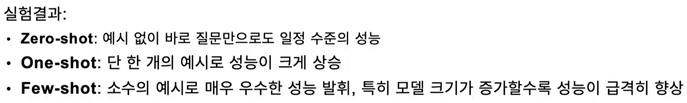

# Quantization
- FP32(Float 형태)를 INT(4) 형태로 매핑하면서 메모리 사용량 줄임
- 스케일링이 변하는 거지 분류가 바뀌는 게 아니라 유효함

- 학습 이후 양자화
- 학습 이전 양자화

- 용량차이는 많이 나는데 성능차이는 거의 0.5% 정도밖에 차이안남(예: 91% vs 91.5%)
- Float 32-bit
    - 공학 전공한 사람들 좀 씀
    - 실수(Exponent): 8bits, 가수(Mantissa):23bits
- Bfloat 16-bit
    - 거의 표준
    - 실수(Exponent): 8bits, 가수(Mantissa): 7bits

- 양자화 에러
    - Symmetric Quantization
        - 최대값을 기준으로 반올림
        - 2.6이나 3.14를 반올림하면 둘 다 3이 되는데 이를 다시 돌이키기 어려움
    - Asymmetric Quantization
        - 최소, 최대값을 기준으로 반올림
        - 0을 0으로 매핑하지 않음(데이터의 중심값을 데이터 분포를 고려한 맵을 만든다음 이동시킴)

- 양자화 에러를 해결하는게 가장 중요함
    - 데이터 분포를 보존하기 위해서

- Quantization의 취약점
    - outlier(256) 있을 때 나머지 데이터가 0에 가까우면 데이터들 다 0으로 됨(양자화 에러)
    - **outlier를 없애고 줄이는게 매우 중요하고 핵심**

- Calibration
    - outlier 정의하기 어려움(핵심)
    - llm 한테 일단 데이터를 넣고 확률 나옴
    - 아무렇게나 양자화 해본 후 다시 llm 에 넣고 확률 나옴
    - 위를 반복해서 확률차이를 줄이면서 분포 고정시킴
    - 양자화는 학습없이 모델을 경량화 시키고 싶은 욕심(큰 모델 쓰고싶은)에서 나온 작업

- Calibration 하기 적합한 데이터는?
    - train(학습)된 데이터
        - 학습한 데이터라면 이미 학습돼있기 때문에 그 분포를 따를 확률이 높음
        - 고로, 학습에 사용된 데이터를 Calibration에 사용해도 됨
        - 메타가 데이터는 절대 내놓지 않음, 다만 모델의 출력을 보고 추측하는 것이기 때문에 학습된 데이터를 사용할 수가 없음
    - GPT 데이터, 크롤링한 데이터는 안됨

- train 대신 어떤 데이터를 씀?
    - AI한테 아무렇게나 생성하게 함
    - user턴을 비워 놓음 (chat template)
    - 그럼 ai가 알아서 답변 내놓음
    - 위 데이터(self-distillation)를 Calibration 데이터로 사용

- 그럼 양자화 왜 함? 그냥 학습하면 되는 거 아닌가?
    - 모델 아키텍쳐가 다르고, 데이터 학습된게 다르면 고려할게 너무 많다
    - 모델 웨이트의 스케일이 달라지고, 학습 어떻게 시켰는지에 따라 다른 결과 나옴
    - 변수사항이 너무 많음

- 그럼에도 학습된 데이터셋을 사용하고 싶다?
    - wilki 를 쓰긴 한다
    - 가장 합법적인 대형 데이터셋

- 양자화 한다고 속도 안빨라짐
    - 4비트를 또 16비트 풀어서 양자화 또 하는 비효율성
    - 커널마다 성능이 다르고, 하드웨어 마다 성능이 다름
    - 그래서 하는게 커널 최적화
- 양자화 접근방법
    - PTQ(효율적 접근, 대부분 쓰임)
        - 이미 학습된 모델을 이후에 양자화 하겠다
    - QAT(정규화)
        - 양자화 하기 위해 학습 시키겠다
        - 학습된 모델을 양자화 시키는데 기존 모델 기능 그대로에 양자화만 됨
        - fp32 이지만 int 됐다고 가정하고 실시함
        - 이미 양자화 됐다고 가정으로 하니까 양자화 할 때 잘될 것
        - 고로, Calibration이 잘된 모델처럼 쓰여질 것
        - 단점
            - 데이터를 어떻게 만들 것인가 의문
            - 양자화를 위해서 학습을 할 때 자원 많이 듦
            - 경량화 위해서 많은 데이터 및 자원을 쓴다? 의문
            - 이때 self-distillation(샤프닝) 쓰이긴 함
            - 양자화를 위한 학습 뿐만 아니라 기존 모델 잘되게 하기 위한 학습도 하려하기 때문에 애매해질 수 있음

- PTQ 종류
    - GGUF 의 구조
        - 잘 된다는 방법론들을 하나의 집약체로 만듦
        - 토크나이저, 모델을 gguf(방법이면서 포맷)에 넣음
    - GPTQ
        - 베이스라인, 방법론의 기본
        - 출력 간의 차이를 최소화 시키는 게 목표(손실)
        - 원본 가중치 행렬, 양자화 된 가중치 행렬 차이 최소화
        - 곡률의 변화를 잘 봐야됨
            - 얼만큼 변화했을 때 얼마나 변화하는 지(해시안인벌스)
            - 해시안인벌스를 어떻게 구할 건가?(연산이 너무 오래 걸림)
                - 아래 근거를 어떻게 증명함?
                - 행렬식이 0이 되면 안됨
                - 역행렬이 가능해야 됨
            - 행렬식이 0이 안되게 하려면
                - 행렬에서 대각 성분의 곱이 0 아니면 보통 0이 아님
                - 뱀핑? 모든 대각에 람다의 아주 작은 값을 더하는 방법
            - 연산 속도 향상
                - GPT-Q(많이 비교됨): 블록 단위의 업데이트
                - 행렬 분해해서 적은 비용으로 빠르게 연산
    - AWQ
        - 모든 행동 양상을 조사
        - 양자화하는데 모두 다 양자화 해야되나? 의도
        - 중요한 건 양자화 안함 -> 데이터 살리기 위해
        - 핵심 원리
            - 활성화 기반(모델 연산하고 나온 값을 기반) 가중치 중요도 분석
            - 하드웨어 효율성
            - 슈퍼 웨이트가 나오는 해당 레이어는 양자화 안함
            - 대신 모델 복잡도가 기존 모델과 비슷(정렬이 어느정도 비슷하게 나옴)(양자화 하면 복잡도 올라가는 경우 다수)

- Spin Quant(sotaq 급으로 성능에 가까움)
    - outlier가 더 이상 outlier가 아니게끔 만드는 방법
    - 회전행렬과 회전행렬 역행렬을 곱하면 변화가 없음
    - 회전행렬을 분산되어 있는 outlier들을 조밀하게 회전 시켜서 outlier 가 없는 균일한 공으로 만들어줌(Rotation matrix)
        - outlier 가 outlier 가 아니게 만드는 게 이 부분
        - 역을 붙여서 연산에서는 다른 값이 안나오게 보장
        - 이렇게 묶어서 연산하게 되면 가중치 이상한 outlier 들이 정상인 것처럼 잘 조밀하게 모임
    - Stiefel Manifold
        - 데이터의 분포를 Manifold로
        - 회전 매트릭스는 직교하는 건 무조건 직교
        - Stiefel Manifold에 속한다
        - 회전행렬은 무조건 역행렬이 있음
        - 회전행렬 Spin Quant에선 아무거나 쓰고 싶지 않음
            - 학습을 하면서 회전행렬이 업데이트 됨
                - 회전성이 보장 안될 수 있는 문제 가능성 발생
                - 회전성이 보장되지 않는 매트릭스가 학습을 통해 만들어질 수 있음
                - 그래서 Stiefel Manifold 엔 무조건 회전행렬이 있으니까 여기 안에서 회전성을 보장한 채로 업데이트 하는 방법론을 써볼까?가 Spin Quant(Stiefel Manifold 에 어떤 행렬이라도 직교성을 보장한채로 업데이트 -> 회전행렬일 수 있다 -> Outlier 속하지 않게)
            - **선형대수학**
        - 업데이트 할 수 없는 행렬
            - KBKC
                - 해당 토큰 들어왔을 때 키, 밸류 다 저장해야 됨
                - 토큰 너무 많아서 다 저장 못함(메모리, 비용 이슈)
            - 그래서 Hadamard matrix 사용
                - 데이터 포인트를 넓게 펼치지만 조밀하게 만듦

- Quantization: QLoRA - NF4
    - 

## Prompt 엔지니어링
- 프롬프트란
    - 원하는 작업을 수행하도록 지시하는 명령어 또는 질문
    - Instruction(지시)
    - Context(맥락)
    - Input Data(입력 데이터)
    - Output Indicator(출력 지표)

- 좋은 프롬프트 활용법
    - 명확한 정체성, 임무(목표) 에서 시작
    - 방향 설정
        - 페르소나: 어떻게 행동할지
        - 목표: 무엇을 달성할지
    - 경로
        - 상세한 지침과 제약 조건
            - 반드시 지켜야 하는 규칙
        - 생각의 과정을 직접 설계
        - 단계별 절차를 명확히 제시

- Zero-shot Prompting
    - 모델에게 추가적인 예시나 맥락 없이 지시사항만으로 결과 생성을 요청하는 기법
    - 장점
        - 빠르고 간편함
        - 긴 문맥으로 인해 생기는 혼란 감소
    - 단점
        - 모델이 의도한 결과를 정확히 이해하지 못할 수 있음
        - 복잡한 작업에서 성능이 저하될 가능성 높음

- Few-shot Prompting
    - 프롬프트에 몇 가지 예시를 포함하여 모델에게 원하는 형식을 직접 학습시키는 방식
    - 장점
        - 복잡한 작업에서도 정확도를 높임
        - 모델이 명확한 문맥과 패턴을 이해하도록 도와줌
    - 단점
        - 프롬프트가 길어지며 비용과 처리 시간 증가 가능
        - 부적절한 예시가 포함되면 성능이 오히려 떨어질 수 있음
    - 포함되는 예시는 대표적이고 명확한 사례를 선정
    - 예시 간의 형식과 구조를 통일하면 성능 향상 가능

- In-Context Learning
    - In-Context Learning (ICL)의 정의
        - 학습 데이터를 추가적인 훈련 없이, 오직 프롬프트 내에 제공된 예시를 통해 작업을 즉각적으로 학습하고 이해하는 능력
        - 제시된 문맥을 기반으로 사전학습된 정보를 바탕으로 즉시 작업 수행
    - ICL의 원리
        - LLM은 이미 방대한 데이터를 기반으로 다양한 언어 패턴과 규칙을 내재화
        - 프롬프트에 제시된 예시들은 문맥 안에서 즉시 fine-tuning 이루어지는 것처럼 작동
    - 추가 학습 및 미세조정 불필요, 시간과 비용 절약
    - 지나치게 복잡하거나 명확하지 않은 예시들은 오히려 성능을 떨어뜨릴 수 있음

- 

- Few shot 활용법
    - 입력 -> 출력 쌍 예시를 직접 포함
    - 답변 요구할 때 가장 적합한 형태의 데모를 선택해줘야됨
        - 이때 최대한 다양한 말 하면 좋음

