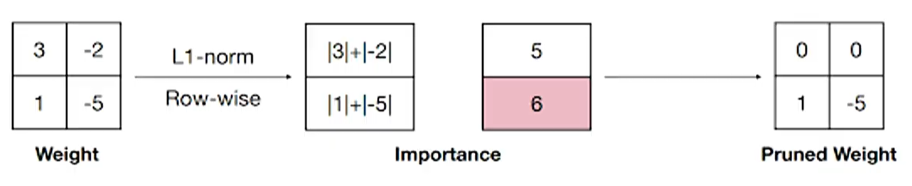
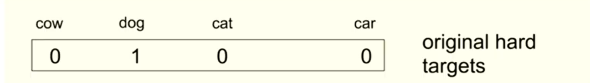
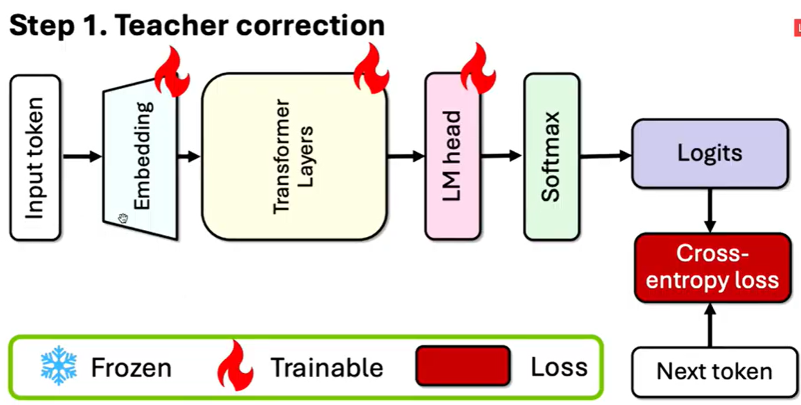
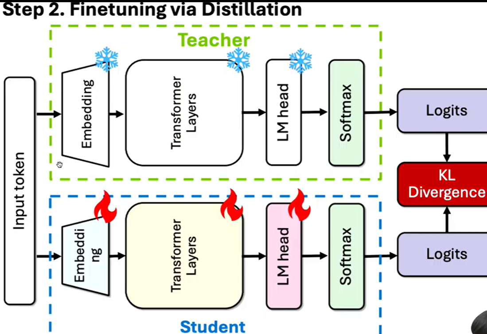
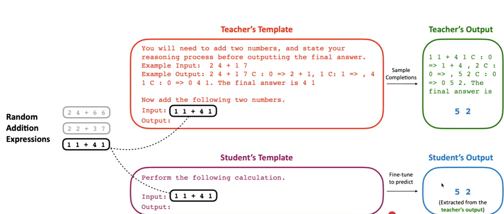

# Pruning & Knowledge Distillation
- 주요 경량화 방법론
    - Pruning
    - Knowledge Distillation
    - Quantization

## Pruning
- 개념
    - 모델이 너무 크니까 줄이자(노드를 삭제)
    - 기존 출력과 Pruning 된 출력 차이를 최소화 시켜야 됨
    - 무조건 healing 과정이 필요함
- 장점
    - 복잡성 감소
    - 메모리 사용량 감소

- 기준
    - 어떤 모양
    - 아무렇게나 하나씩 쳐내가면서 할 것인가
    - 기준은 어떤 것이든 될 수 있음
    - 자료구조
        - 구조적
        - 비구조적
    - 어떤 기준?
        - 크기
        - 민감도
        - 로스 변화 등

## 자료구조 Pruning
- Unstructure Pruning(비구조적)
    - 모델의 구조를 고려하지 않음(아무렇게나 자름)
    - 필요없다 생각하는 노드 삭제
    - 계산을 많이 해야됨
        - 비용 증가
        - 좀 더 정규화될 수 있음
        - 다루는데 힘들 수 있음

- Structure Pruning(구조를 날림, 요즘 많이 쓰임)
    - 트랜스포머 레이어들은 중복성이 조금 있다(레이어끼리 출력 간의 차이가 별로 나지 않는게 있음)
    - 레이어를 자름
    - 다루기 비교적 나음

## 기준
- Magnitude Pruning
    - 꽤 훌륭한 기준
    - 가중치의 절대값이 특정 값을 넘지 않는 가중치면 0으로 만듦
    - 가중치의 절대값 크기를 기준으로 가중치의 중요도를 판단
    - 구조, 비구조적 둘 다로 볼 수 있음

- lp norm based pruning
    - 잘 쓰이진 않음
    - L1, L2 둘 다 될 수 있다
    - 구조적 pruning 에 가깝지만 lp 베이스로 함
    - 

- Sensitivity (민감도 기반 프루닝)
    - 가중치의 중요도를 해당 가중치가 네트워크 손실에 미치는 영향도로 평가
    - 넣었다 뺐을 때 로스가 커지면(중요도 높음) 놔두고 로스 차이 안나면 버림

- Loss Change (손실 변화 기반 프루닝)
    - 제일 많이 쓰임
    - 가중치를 제거했을 때 네트워크의 손실 변화량을 기반으로 중요도를 평가
    - 테일러 급수전개 활용
    - Sensitivity 와의 차이점
        - Sensitivity 는 하나하나 계산
        - Loss Change 는 테일러 급수전개로 좀 더 수학적으로 계산

- 위 모델들은 기존 모델보다 퍼포먼스가 떨어질 수 밖에 없음
- 고로, 재활운동 해야됨(healing이 무조건 따라옴)
    - 데이터를 기반으로 모델의 성능을 복원함(학습 이뤄짐)
        - 이때 Knowledge Distillation 이 정말 많이 활용 됨, 스스로가 피쳐가 될 수 있음

- Knowledge Distillation
    - Knowledge
        - 모델이 가지고 있는 지식이나 정보 혹은 task에 대한 이해
    - Distillation
        - 어떤 용질이 녹아 있는 용액을 가열하여 얻고자 하는 액체의 끓는점에 도달하면 기체상태의 물질이 생긴다. 이를 다시 냉각시켜 액체상태로 만들고 이를 모으면 순수한 액체를 얻어낼 수 있는데, 이러한 과정을 증류라고 함
    - 딥러닝에서는 KD는 Teacher Model로 부터 증류한 지식은 Student Model로 전달하거나 주입하는 일련의 procedure로 볼 수 있음
    - 즉 Teacher Network의 방대하거나 잘 훈련된 지식을 이보다 더 작은 Network인 Students Network에게 전달하는 방법론으로 볼 수 있음
    - 다만 KD를 하기위해서는 well defined 된 Teacher Model이 필수적으로 필요함

- Knowledge Distillation의 등장 배경
    - Depoly models
    - MOE 아키텍처
        - 앙상블과 비슷하지만 어느정도 여러 모델이 유기적으로 작동
        - 큰모델 인 경우 cost가 많이 듦, 작은 모델은 빠르지만 성능이 좋지 않음
        - 그래서 큰 모델의 지식을 작은 모델에게 넘겨주면 좋을 거 같음 -> Knowledge Distillation
    - 앙상블과 같은 모델을 고려하였을 때, 이 모델이 가지는 지식을 단일한 모델에 전달하는 방법론은 있으나 좀 더 일반화 하여 큰 모델이 가진 지식을 증류하여 단일의 작은 모델에 전달하였을 시 효과적으로 전달이 되는 것을 확인
    - 앙상블과 같은 모델의 학습시간을 단축시키는 새로운 방식의 앙상블 기법을 연구 및 제시

    - 
    - Hard target, 즉 discrete한 class의 문제를 해결한다고 하였을때, 기존의 image classification 영역에서는 마지막 모델의 logit 값에 softmax를 활용하여 모델이 각 class에 내뱉는 확률 값으로 변환 할 수 있엇음
    - 즉 각 모델의 출력 값을 활용하여 이를 특정 class 에 대한 probability로 표현 가능

    - 
    - 만약 학습이 잘된 모델에 강아지 사진을 넣게 된다며? 실제 모델의 출력값은 cow, dog, cat, ..., car 에 대한 logit 값
    - 이를 softmax를 취하게 되면 위와 같은 probability 값으로 활용 할 수 있음

    - distillation: 모델이 강아지로 결과 낸 것을 학습 시킴
    - Knowledge Distillation: 위 이미지 자체(결과를 낸 논리? 근거)가 데이터(지식)이므로 이미지 자체를 학습 시킴
    
    - 위 이미지는 0 1 0 0 과 비슷함
        - 다른 값은 매우 적은 값을 가지고 있어 사용하기 어려움
        - 이를 soft 하게 만들면(soft max인가?)
            - 그래프화 시켰을 때 dog만 압도적으로 높은 걸 좀 완만하게 만듦
            - 그래도 똑같이 dog가 가장 높고 dog가 cow 보다 cat 보다 가깝고 car는 절대 아니라는 정보임(나타내는 게 완전 동일)
        - 이게 바로 KD의 시초, soft output이라 할 수 있으며 dark knowledge

- Knowledge Distillation: distillation loss
    - 가장 많이 쓰이는 방법
    - 정규화 잘된 모델을 Corrected teacher로 제작 -> student로 Pruning 작업함 -> Corrected Teacher를 KD 하며 Student를 healing 함 -> Minitron model 제작

- The Minitron Approach: KD
    - 원래 학습 데이터 없이 교사 교정(Teacher Correction)을 통해 학습 데이터를 보정 후 증류를 수행하여 성능 손실을 보완
    - 원래 교사 모델이 학습한 데이터에 접근할 수 없는 경우가 많음
    - 이때 교사 모델이 새로운 데이터셋에서 잘 작동하도록 보정하는 단계가 필요
    - 이 과정을 통해 학생 모델에게 더 적합한 지식을 전달
    - 
    - 
        - KL Divergence(KD): 각 예측한 분포가 최대한 유사할 수 있도록 로스를 줄 수 있음
        - 기존에 Teacher model 이 예측한 분포를 Student 모델이 예측할 수 있게함
            - 대신, 모델이 만들어낸 시퀀스를 학습 시키는 것이 아닌 teacher 분포를 따라갈 수 있게 student를 학습시킴
            - LLM 은 토큰이 엄청 많음. 이걸 비교하는 것보다 각 분포의 차이를 최소화 시키는 것이 훨씬 효과적임. 라벨의 범위가 너무 넓음. 정보가 너무 많아서 분포형태로 전달하려 하는 것임
            - 이것과 비슷한게 sequence Distillation: 모델이 생성된 sequence를 학습 시킨다는 것
        
- The Minitron Approach: Pruning은?
    - Block Importance
        - 이전 모델의 입력과 출력에 대한 코사인시뮬러리티를 확인하겠다(차이를 확인, 중복성이 있으니까(위에 내용 있음))
        - 차이 없으면 의미없는 블록으로 생각하고 지우겠다(유사하면 출력: 1 공식은 1-(출력))
    
- Distillation
    - 
    - 대표적 Deepseek r1
        - aha moment
            - 모델이 문제 해결 중 스스로 푼 걸 또 가져와서 스스로 검증 등
        - Experiments(중요)
            - 32B를 강화학습 시킨 것 보다 Distill로 학습 시킨게 성능이 훨씬 좋아짐
            - 강화학습은 본인의 잠재력을 끌어올리는 것이기 때문에 한계가 있음
            - 결국 큰 모델이 학습시키는게 훨씬 좋음
        
- ICLR: 논문 페이지
    - 논문을 LLM한테 그냥 던지고 읽기만 하는 건 좋지 않음
    - LLM 한테 받은 정보를 읽은 후 본문 내용 확인하기 필수
    - 좋지 않은 논문도 많기 때문에 잘 걸러서 좋은, 중요한 논문(신뢰성)을 확인하는게 중요함
    - NeurlPS 2025
    - 신뢰도 확인법
        - 최소한 어디 기관에서 만들었는지, 코드가 있는지를 확인
        - 인용 수도 확인(적어도 00회)

## CBQ(Cross-Block Quantization for Large Language Models)
- CQB(PTQ 방식)
    - Motivation
        - 기존 PTQ 기법은 레이어 또는 블록 단위로 모델을 최적화하여 아웃라이어를 처리하고 최적화 기법을 적용해 왔지만 다음과 같은 문제가 발생
        - 모델 크기가 커질수록 양자화로 인한 레이어 내 및 레이어 간 종속성이 심화
    - 레이어 내 종속성(Intra-layer Depedency)
        - 한 레이어 안의 파라미터들이 서로 밀접하게 연결되어 있을 경우, 한 파라미터의 양자화 오류가 다른 파라미터에 영향, 특히 낮은 비트에서 파라미터 값의 범위가 제한되기 때문에 이 오류가 더 두드러지게 나타남
    - 레이어 간 종속성(Inter-layer Dependency)
        - 한 레이어의 출력은 다음 레이어의 입력으로 사용되며, 한 레이어에서 발생한 양자화 오류가 다음 레이어로 전파되어 전체 모델 성능에 큰 영향을 미침. 모델 크기가 클수록, 즉 레이어 수가 많을수록 이런 종속성의 영향심화
    - 양자화는 종속성을 증가시키며 이는 성능 저하의 원인이 됨
    - Method
        - 레이어 간 연결된 정보를 무시하지 않고, **여러 레이어가 함께 최적화되도록 할 것**
    - Cross Block DEpendency(레이어 간의 감소)
        - 슬라이딩 윈도우 방식 활용(두개씩 묶어서 양자화(1,2 묶고 2,3 묶고 3,4 묶고))
        - 한번에 인접한 여러 블록을 최적화 -> 레이어 간 상호작용을 유지하여 오류를 최소화 시킴
    - LoRA Rounding(레이어 내에서 감소)
        - PTQ에 학습을 넣는 건 별로라고 생각하심
        - 낮은 랭크 행렬을 사용해 **양자화 오류를 보정(원래 데이터를 4비트로 표현한 값에 작은 보정값을 더해줌)** 
        - 정밀도를 유지하면서도 추가적인 계산 부담이 거의 없음
    - Coarse-to-Fine Preprocessing(CFP)
        - 아웃라이어를 잡기 위해 사용
        - NERF(2D 이미지를 보고 3D 처음에 대략적으로 잡고 그 후 정규화를 통해 렌더링)
            - 대략적으로 아웃라이어 갯수를 추측하고 조밀하게 찾는 방법
        - 양자화 시 발생하는 아웃라이어 문제를 데이터의 범위를 계산해, 그 범위 밖에 있는 값들을 찾거나 **아웃라이어와 정상 값을 더 세밀히 구분**하여 아웃라이어를 잘라내거나 세밀하게 조정함