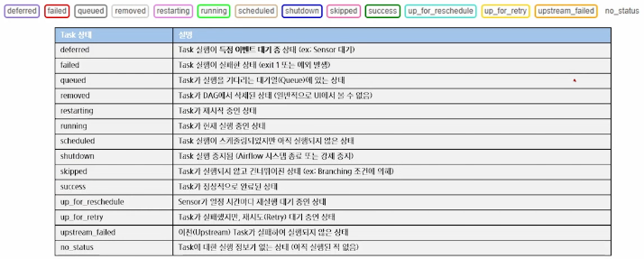
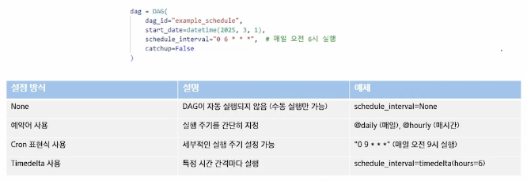
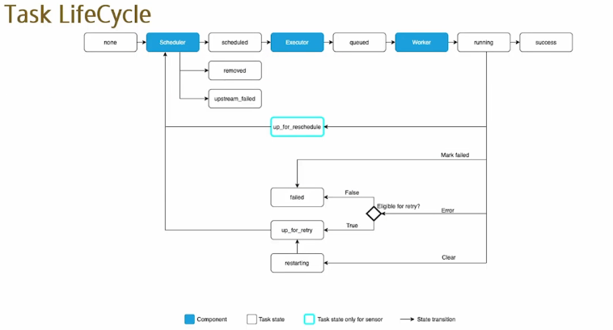
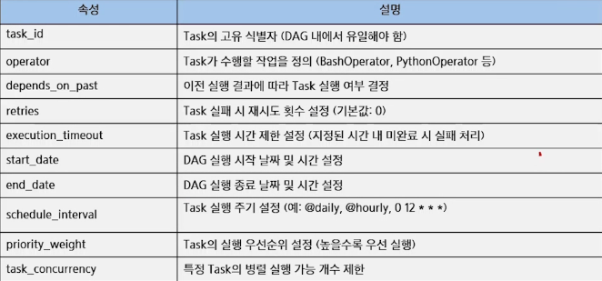

# Airflow 기본 구조와 세팅
- 워크플로우 오케스트레이션
- Airflow 개요 및 아키텍처
- Airflow 주요 컴포넌트
- DAG 실행
- Airflow DAG 기본 구조

## 워크플로우 오케스트레이션이란?
- 작업(Task)을 정해진 순서에 따라 실행하고 자동화하는 기술
- 데이터 파이프라인, 머신러닝, CI/CD 등 다양한 분야에서 활용
    - 작업 자동화 -> 반복적인 수작업 제거
    - 의존성 관리 -> 특정 작업이 완료된 후 다른 작업 실행 가능
    - 실패 처리 및 모니터링 -> 장애 발생 시 재시도 및 알림 제공
    - 스케줄링 기능 -> 특정 시간 또는 이벤트 기반 실행 가능

- Apache Airflow란?
    - Python를 기반의 데이터 파이프라인 자동화 및 스케줄링 도구
    - 배치 프로세스를 효율적으로 관리하는 워크플로우 오케스트레이션 도구
    - 다양한 시스템 및 데이터베이스와 통합 가능(ETL, MLOps, 클라우드 등)

- Apche Airflow 역할
    - 데이터 파이프라인 자동화
    - DAG(Directed Acyclic Graph)로 작업 정의
    - 실행 및 장애 관리, 모니터링 기능 제공

- Apche Airflow의 주요 활용 사례
    - Business Operations - 기업의 핵심 비즈니스 데이터 애플리케이션 자동화
    - ETL/ELT - 데이터 파이프라인 구축 및 관리
    - Infrastructure Management - 인프라 자동 배포 및 관리
    - MLOps - 머신러닝 모델 개발 및 운영 자동화

    - Business Operations
        - Airflow를 활용한 기업 비즈니스 운영 자동화
            - 데이터 중심 애플리케이션 및 업무 자동화
            - 정기적인 리포트 생성 및 배포
            - 고객 데이터 파이프라인 및 CRM 연동
    - ETL / ELT
        - Airflow를 활용한 데이터 파이프라인 구축 및 관리
            - 데이터 수집(Extract), 변환(Transform), 적재(Load) 자동화
            - 여러 데이터 소스를 통합하여 분석 가능
            - Data Warehouse(BigQuery, Snowflake 등)와 연계하여 최적화
    - Infrastructure Management
        - Airflow를 활용한 인프라 배포 및 운영 자동화
            - 클라우드 리소스 자동 프로비저닝Airflow를 활용한 인프라 배포 및 운영 자동화
            - (AWS, GCP, Azure 등)
            - CI/CD 파이프라인 자동 실행
            - Kubernetes 및 서버 배포 자동화
    - MLOps
        - Airflow를 활용한 머신러닝 파이프라인 자동화
            - 데이터 수집 -> 모델 학습 -> 평가 -> 배포 과정 자동화
            - 머신러닝 워크플로우 오케스트레이션
            - 모델 재학습 및 모니터링 자동화

- Airflow 사용하는 이유
    - 기존 방식의 한계(Cron Job, Bash Script)
        - 작업 간 의존성 관리 어려움
        - 장애 발생 시 원인 추적 및 복구 어려움
        - 로그 관리 및 모니터링 부족
    - Airflow 도입 시 장점
        - DAG 기반 의존성 관리 -> Task 실행 순서 설정 가능
        - WEB UI 제공 -> 직관적인 모니터링 가능
        - 재시도 및 알림 기능 -> 장애 발생 시 자동 대응
        - 확장성 및 유연성 -> 다양한 실행 환경 지원

## Airflow 개요 및 아키텍처
- Airflow의 장점
    - Python 기반 -> 개발자가 쉽게 접근 가능
    - 강력한 UI 제공 -> 직관적인 모니터링 가능
    - 태스크 간 의존성 관리 용이 -> DAG 구조 활용
    - 확장성 높음 -> 다양한 Executor 지원
    - 장애 복구 기능 제공 -> 재시도 및 알림 설정 가능

- Airflow의 단점
    - 초기 설정 및 학습 곡선이 가파름
        - 다양한 컴포넌트가 많이 있어서 설정 까다로울 수 있음
    - 실시간 데이터 처리에는 적합하지 않음
    - 복잡한 DAG의 경우 성능 튜닝 필요

- Airflow 설치
    - docker-compose.yaml 설치
        - $ curl-LfO 2.10.5
    - Airflow User 세팅
        - echo -e 'AIRFLOW_UID=$(id-u)' > .env
    - docker airflow 설치
        - $ docker compose up airflow-init
    - Airflow 실행
        - docker compose up

## Airflow 주요 컴포넌트
- DAG란?
    - Airflow에서 작업(Task)들의 실행 순서를 정의하는 그래프
    - 방향성(Directed) -> 작업이 정해진 순서로 실행됨
    - 비순환(Acyclic) -> 순환(Loop) 구조가 없어 무한 실행 방지
- Task란?
    - 워크플로우를 구성하는 개별 작업 단위
    - ETL, 데이터 변환, 머신러닝 모델 실행, 파일 이동 등의 작업을 수행할 수 있음
    - 워크플로우를 구성하는 기본 요소

- Airflow 주요 컴포넌트
    - Scheduler -> DAG 실행 스케줄 관리
    - Executor -> 태스크 실행 방식(Local(한 서버에서 실행), Celery(워커 여러 개 띄어서 병렬로 가능(분산), 도커 컴포즈 띄우는 게 기본적으로 celery 형태), Kubernetes 등)
    - Worker -> 실제 태스크 실행하는 프로세스
    - Metadata Database -> DAG 실행 정보 저장
    - Web UI -> DAG 및 태스크 상태 모니터링

- DAG Directory
    - 파이썬으로 작성된 DAG 파일을 저장하는 공간
    - dag_folder, dags_folde라고 불림
    - 기본적으로 $AIRFLOW/dags/로 설정되어 있음
    - DAG를 작성한 후 DAG Directory에 저장하면, Airflow Scheduler가 주기적으로 DAG Direcctory를 스캔한 후 DAG를 파싱함

- Scheduler
    - DAG 파일을 파싱하고, Task 및 DAG를 모니터링하며 실행을 스케줄링하는 핵심 컴포넌트
    - DAG Run과 Task Instance 상태를 관리하고 Executor에게 실행을 요청하는 역할 수행
    - DAG 파일 처리 과정
        - DAG 파일 검색 및 로드
        - DAG 파일 파싱 및 해석
        - DAG 등록 및 실행 준비

- Executor
    - Executor는 Scheduler에서 생성하는 서브 프로세스
    - Queue에 들어온 Task Instance를 실제로 실행하는 역할
        - 단일 프로세스형(Single-Process)
            - Sequential Executor
                - 한 번에 하나의 Task만 순차적으로 실행하며, 개발, 테스트용으로 사용됨
        - 로컬 병렬형(Local Multi-Process)
            - Local Executor
                - Scheduler 내부에서 여러 Task를 병렬로 실행할 수 있음(멀티프로세싱 기반)
        - 분산형(Distributed)
            - Celery Executor
                - 여러 워커 노드에 Task를 분산 실행하며, 대규모 분산 환경에 적합함
            - Kubernetes Executor
                - 각 Task를 독립적인 Pod로 실행하여 완전한 격리와 자동 확장을 지원

- Meta Database
    - Airflow의 DAG, DAG Run, Task Instance, Varialbes, Connections 등 여러 컴포넌트에서 사용해야 하는 데이터를 저장함

- Webserver
    - Webserver는 Meta Database와 통신하며 DAG, DAG Run, Task Instance, Variables, Connections 등의 데이터를 가져와 웹에서 보여주고 유저와 상호작용할 수 있게 함

- Apache Airflow 방식?
    - Basic Deployment
        - 여러개의 DAG들 스케줄링 하고 metaDB랑 연결해서 표현되는 정보들 주고 받음, UI에서도 주고 받음(유기적으로 연결되어 있음)
    - Distributed Airflow architecture
        - 분산처리
        - 여러개의 DAG들 Basic Deployment 와 똑같이 연결되어 있지만 metaDB와 스케줄러 사이에 worker(s) 있음
    

## DAG 실행
- Airflow Web UI 개요
    - Airflow Web UI는 DAG 및 Task의 실행 상태를 시각적으로 모니터링하고, DAG 실행을 제어할 수 있는 웹 기반 인터페이스
        - DAG 및 Task의 실행 상태 확인
        - DAG의 수동 실행 및 중지
        - Task의 재시도 및 강제 실행
        - 실행 로그 확인 및 실패 원인 분석
        - DAG 및 Task의 의존성 시각화

- Airflow Web UI 주요 메뉴 구성
    - DAGs View
        - 등록된 모든 DAG를 조회할 수 있는 기본 화면
        - DAG 실행 상태(활성, 비활성, 일시정지)확인 가능
        - 특정 DAG를 클릭하여 세부 정보 확인 가능
        - 'Trigger DAG' 버튼을 눌러 DAG 수동 실행 가능
    - Graph View
        - DAG 내부의 Task 간 관계를 시각적 그래프로 표현
        - Task들의 의존성(Upstream/Downstream) 구조 확인 가능
        - 각 Task의 실행 상태를 색상으로 구분(성공, 실패, 진행 중 등)
    - Tree View(트리 뷰)
        - DAG의 실행 이력을 날짜별 트리 구조로 제공
        - DAG 실행 시 Task가 어떤 상태였는지 기록 확인 가능
        - 특정 실행 날짜의 DAG 상태 및 Task 상태 히스토리를 쉽게 추적 가능
    - Task Instance Details(태스크 실행 상세 정보)
        - 특정 Task를 클릭하면 실행 정보와 로그를 확인 가능
            - DAG 실행 시 Task가 어떤 상태였는지 기록 확인 가능
        - 실패한 Task를 다시 실행하거나, 강제로 종료할 수 있음
    - Gantt Chart(간트 차트)
        - DAG 실행 시 각 Task의 실행 시간을 시각화
        - Task 실행 시간 비교 및 병렬 실행 분석 가능
        - 실행 시간이 오래 걸리는 Task를 찾아 최적화할 수 있음
    - Code View(코드 뷰)
        - DAG의 소스 코드를 UI에서 직접 확인 가능
        - DAG를 수정하려면 별도의 파일 편집이 필요하지만, UI에서 DAG 정의를 쉽게 검토 가능
    - Log View(로그 뷰)
        - 실행된 Task의 로그를 확인하여 오류 분석 및 디버깅 가능
        - 실패한 Task의 원인을 파악하고, 재시도를 결정하는 데 활용

- DAG 실행
    - DAG 실행 방법
        - 자동 실행
            - DAG에 설정된 스케줄(Interval, cron 등)에 따라 실행
        - 수동 실행
            Web UI 또는 CLI(Command Line Interface)를 통해 즉시 실행
        - 이벤트 기반 실행
            - 특정 트리거(예: API 요청, 파일 업로드 등)로 실행
    - DAG 및 Task 실행 상태 종류
        - Airflow에서는 Task의 실행 상태를 다양한 값으로 나타냄
        - failed, queued, running, skipped, success
        - 

- Airflow 스케줄링
    - Schedule
        - DAG를 실행하는 주기를 설정하는 방식
    - Schedule interval
        - DAG가 실행되는 시간 간격을 결정하는 속성(이미지는 cron 식)
    - 

- DAG 파일 생성 및 경로 수정
    - dags 폴더를 생성하고, 하위에 dags_bash_operator.py 파일 생성
    - Airflow 컨테이너에서 로컬 디렉토리를 활용하기 위한 볼륨 마운팅 작업
    - docker-compose.yaml 수정
    - 선행 단계를 완료한 후, Airflow에 dags_bash_operator 파일이 업로드 되었는지 확인

## Airflow DAG 기본 구조
- 
- Task란?
    - Task는 DAG 내에서 실행되는 개별 작업 단위
    - 특정 연산을 수행하는 Operator를 사용하여 정의(BashOperator, PythonOperator, SQLExecuteOperator, ...)
    - DAG 내에서 하나의 노드로 존재하며, 특정한 작업(데이터 처리, API 호출, SQL 실행 등)을 수행
    - TASK는 서로 의존성을 설정하여, 순차적 실행(Sequentail) 또는 병렬 실행(Parellel)이 가능함
    - 재시도(Retry) 및 실행 시간 제한 설정 가능
- Task 주요 속성
    - 

## 실습

- ```yaml
postgres:
  image: postgres:13
  ports:
    - "5433:5432" ```

- 반드시 명시해야 외부에서 접근 가능
- Docker는 기본적으로 컨테이너 내부의 포트를 외부에 노출하지 않기 때문
- `ports:` 설정이 없으면 WSL, Windows, DBeaver 등 외부에서는 PostgreSQL 접근 불가

## 타임존 설정
- Asia/Seoul
- 한국 시간 기준 스케줄을 맞추기 위해 아래 설정 적용
- yamllint disable rule:line-length 위에 추가하세요.
- AIRFLOW__CORE__DEFAULT_TIMEZONE: Asia/Seoul

> UI는 여전히 UTC로 표시되지만, DAG 실제 실행 시점은 `Asia/Seoul` 기준으로 동작합니다.  
> 예) `"0시마다 실행"` → `UTC` 기준이면 오전 9시에 실행됨.  
> `Asia/Seoul` 설정 시 정확히 자정에 실행됨.


## 예제 DAG 제거(선택)
Airflow는 기본적으로 70개 이상의 예제 DAG를 자동 로드합니다.  
실제 운영에서는 비활성화하는 것이 좋고 실습을 위해서도 제거하는 것이 좋습니다.

```yaml
# AIRFLOW__CORE__LOAD_EXAMPLES가 true로 있는데 false로 변경
AIRFLOW__CORE__LOAD_EXAMPLES: 'false'
```

## DAG 수정 및 재배포
- Airflow가 자동 reload 하거나, 필요 시 명시적으로 재시작
- 최초 한 번 웹 UI에서 DAG 활성화 필요 (스위치 ON)
```bash
sudo docker compose down
sudo docker compose up -d
```

## 개발 환경용 Airflow 설치 (로컬 설치 시)
- 가상환경 상에서

```bash
pip install "apache-airflow[celery]==2.10.5" \
  --constraint "https://raw.githubusercontent.com/apache/airflow/constraints-2.10.5/constraints-3.10.txt"
```

> **주의사항**: 반드시 constraints 파일과 함께 설치해야 버전 충돌을 방지할 수 있습니다.

