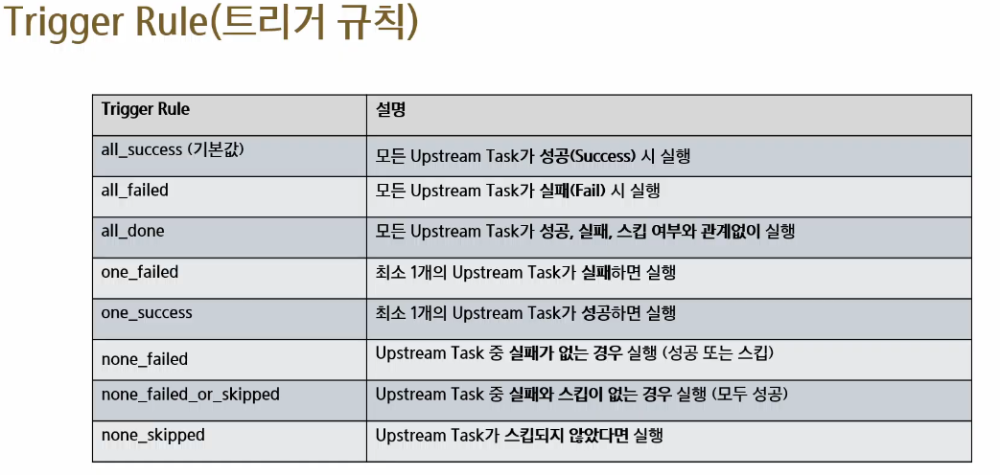
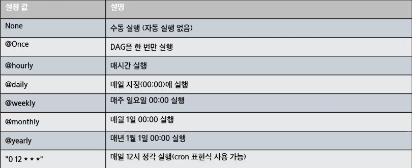
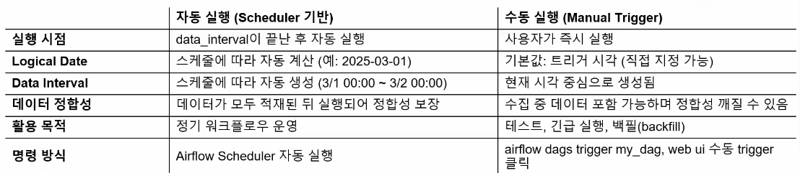
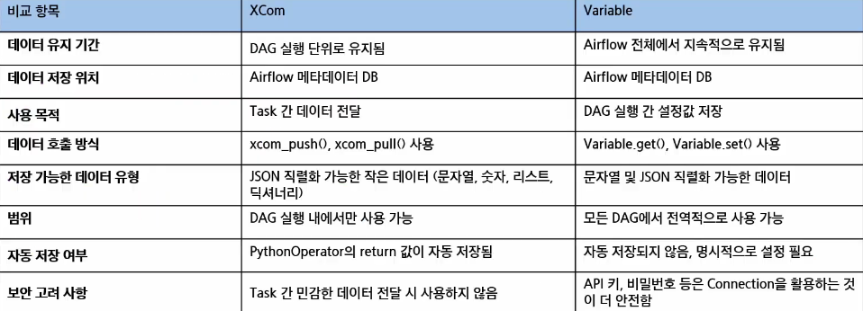

# Airflow DAG 작성 및 데이터 공유
- Operator
- DAG Scheduling 및 Trigger
- Cron 스케줄링 및 Task 연결
- Xcom과 Variable

## Operator
- Operator란?
    - Airflow에서 Task를 실행하는 역할을 수행하는 객체
    - DAG 내에서 개별 Task로 사용되며, 다양한 실행 방식을 제공
    - Python 기반으로 확장 가능하며, 기본 제공(내장) 오퍼레이터와 사용자 정의 오퍼레이터가 있음

- 오퍼레이터 종류(기본)
    - Action Operators
        - 기본 실행 오퍼레이터(로직 수행)
        - 특정 동작을 수행하는 오퍼레이터
    - Sensor Operators
        - 센서 오퍼레이터(외부 이벤트)
        - 특정 이벤트를 감지할 때까지 대기
    - Transfer Operators
        - 데이터 전송 오퍼레이터
        - 한 위치에서 다른 위치로 데이터를 이동
    - Database Operators
        - 데이터베이스 관련 오퍼레이터
        - DB에서 SQL을 실행하는 오퍼레이터
    - Big Data & ML Operators
        - 빅데이터 & 머신러닝 오퍼레이터
        - Spark, Hive, Dataproc, ML 관련 오퍼레이터
    - Docker & Kubernetes Operators
        - 컨테이너 환경에서 실행
    - Empty Operators
        - Task 흐름을 설정하는 데 사용
    
- Action Operators
    - Task는 특정 오퍼레이터를 기반으로 정의됨
        - BashOperator -> Bash 명령어 실행
        - PythonOperator -> Python 함수 실행
        - EmailOperator -> 이메일 전송
    - 각 오퍼레이터를 조합하여 다양한 워크플로우를 구성할 수 있음(Task 조합해서 다양한 워크플로우 구성 가능)
    - 데이터수집(Bash) -> 정제(Python) -> 저장(Bash) -> 이메일 전송(Email)

    - BashOperator
        - Bash 명령어를 실행하는 Task를 정의할 때 사용됨
        - BashOperator로 컨테이너 외부의 쉘 스크립트 수행
            - shell script 만들고, 해당 파일 권한 설정 변경
            - 쉘 스크립트 수행 dag 수행
    - PythonOperator
        - Python 함수를 실행하는 기능
    - EmptyOperator
        - Task 실행 없이 DAG 구조를 설정하는데 사용됨
        - DAG의 논리적 흐름을 구성하는 용도로 활용
    - BranchOperator
        - Airflow에서 DAG 실행 흐름을 조건에 따라 분기할 수 있도록 하는 오퍼레이터
        - 특정 조건을 평가하여 어떤 Task를 실행할지 동적으로 결정
        - 선택되지 않은 Task는 자동으로 Skipped 상태가 됨
        - DAG 실행을 최적화하고 불필요한 작업을 줄이는데 유용
        - 종류
            - BranchPythonOperator
                - Python함수를 사용하여 실행 Task 결정
            - BranchDagRunOperator
                - 다른 DAG 실행을 분기 처리하는 오퍼레이터

- 분기 처리 및 XCom 활용
    - 조건 기반 실행 흐름
    - API 응답값 기반으로 분기 처리 방식

- Airflow에서 배치 작업 최적화
    - Airflow Decorators
        - Python 함수 데코레이터로 태스크 정의
            - @task 데코레이터를 사용하여 Python 함수를 간단하게 Airflow 태스크로 변환
            - 코드의 가독성 향상: 태스크 정의가 간결하고 직관적
            - DAG 정의 간소화: DAG와 태스크 간의 관계를 쉽게 정의할 수 있음
        - 주요 구성
            - @task: 함수 데코레이터, Python 함수가 Airflow 태스크로 변환
            - DAG 정의: DAG 매개변수로 태스크가 속할 DAG를 정의
            - 태스크 간 의존성: 데코레이터를 사용하여 태스크 간의존성 간단히 설정 가능
    - Airflow Decorators 코드 비교
        - 전통적인 방식
            - PythonOperator를 사용하여 각 태스크를 명시적으로 정의
            - XCom을 사용하여 데이터를 전달하고 의존성 설정
        - Python 함수 데코레이터로 태스크 정의
            - @task: @task 데코레이터를 사용하여 Python 함수가 자동으로 Airflow 태스크로 변환
            - 데이터 전달: 함수 간 데이터 전달이 자동으로 처리되므로 XCom을 수동으로 사용하지 않음
            - 의존성 설정: 함수 간의 의존성은 변수를 통해 자연스럽게 설정
            
## DAG Scheduling 및 Trigger
- DAG 내 Task 간 의존성(Dependency)이란?
    - Airflow에서는 DAG 내에서 Task 간 실행 순서(의존성)를 정의해야 함
    - Task 간 의존성을 설정하면 특정 Task가 완료된 후 다음 Task가 실행됨
    - 연산자(>> 또는 <<)를 활용하여 Task간 의존성을 설정

- Task 연결 원리
    - DAG 내에서 Task 의존성(Dependency)을 설정하여 실행 순서를 설정함
    - Task간의 실행 관계를 명확하게 지정해야 DAG 올바르게 동작함
    - Task 연결 방식은 순차 실행(Sequential Execution), 병렬 실행(Parallel Execution)으로 나뉨
    - 종류
        - Upstream Task: 현재 Task 이전에 실행되는 Task
        - Downstream Task: 현재 Task 이후에 실행되는 Task
        - Linear Dependency: 순차적으로 Task를 실행
        - Branching: 특정 조건에 따라 Task 실행 흐름을 분기
        - Parallel Execution: 여러 Task를 병렬로 실행
    
    - 연결 방식
        - 기본 연결(순차 실행)
            - task_1 >> task_2 : task_1이 완료된 후 task_2 실행
        - 다중 Task 연결(병렬 실행)
            - task_1 >> [task_2, task_3] : task_1 실행 후 task_2와 task_3 병렬 실행
        - 다중 Task 종속단계
    - Trigger Rule(트리거 규칙)
        - Task가 실행되기 위한 조건을 설정하는 기능
        - 기본적으로 모든 Upstream Task가 성공해야 실행됨(all_success)
        - 특정 Task의 실행 결과에 따라 실행 조건을 다르게 설정할 수 있음
        - 

## Cron 스케줄링 및 Task 연결
- DAG 스케줄
    - DAG 실행을 이해하려면 Airflow의 start_date, logical_date, schedule_interval, data_in terval 등의 시간 개념을 정확히 이해해야 함

- start_date(실행 기준 시작점)
    - DAG가 처리하기 시작할 데이터의 기준 시점
    - 첫 번째 data_interval의 시작점을 정의함
    - DAG는 start_date 직후에 실행되지 않고, 해당 구간이 끝난 후에 처음 실행됨
    - 예: start_date = 2025-01-01 -> 첫 실행은 2025-01-02 00:00에 발생
    - 주의: start_date는 미래 시점으로 설정하지 말아야 하며(만약 설정할 경우 Airflow가 스케줄링할 구간이 없다고 판단함), 미래 시점으로 설정하면 DAG가 예상대로 실행되지 않을 수 있음
- logical date
    - 각 DAG run을 식별하는 논리적 날짜
    - data_interval_start와 동일하며, 어떤 데이터를 처리하는 run인지 나타냄
    - 실제 실행 시간과는 다름(예: logical_date=1월1일 -> 실행은 1월2일 00:00 이후)
    - Airflow 자체가 처리할 데이터가 있을 경우 모두 적재되었다라고 가정할 수 있는 시점에 도달해야 실행할 수 있음
    - 실행된 시간이 아닌 해당 DAG run 이 책임지고 있는 데이터 시간 범위
    - 예시
        - DAG가 매일 실행되는 경우(Schedule_interval = '@daily')
        - Logical Date 가 2025-03-01이면, DAG는 2025-03-02에 실행됨
        - 항상 Logical Date보다 늦게 실행되므로 데이터 정합성을 유지하는데 중요함
        - 즉, 데이터가 모두 적재된 이후에 실행되므로 데이터 정합성을 보장

- schedule_interval(스케줄 간격)
    - DAG가 실행되는 주기를 결정하는 설정값
    - DAG가 얼마나 자주 실행될지를 정의하는 간격
    - Cron 표현식 또는 예약어를 사용하여 주기를 정의
    - DAG 실행 주기가 DAG의 Execution Date를 결정함

- Schedule_interval 설정 방법
    - 
    - Cron 표현식을 사용하여 맞춤형 실행 주기 설정 가능
    - Schedule_interval=None 설정 시 DAG는 자동 실행되지 않음

- Cron Schedule 표현
    - {분}{시}{일}{월}{요일*}
    - */5**** : 5분마다
    - 09**3#4 : 매월 4번째 수요일 9시0분에 배치

- 빈도 설정
    - cron 식은 특정 빈도로 스케줄을 정의할 수 없음(3일에 한 번 실행 등)
    - timedelta 인스턴스를 사용해 빈도 기반 스케줄을 정의
        - timedelta(days=3) # 3일 간격으로 실행

- Backfill이란?
    - 특정 과거 Execution Date에 대해 DAG를 수동 실행하여 데이터 복구하는 작업
    - 과거 실행이 누락되었거나, 데이터 오류가 발생했을 때 필요
    - Airflow dags backfill 명령어를 사용하여 특정 날짜 범위의 DAG 실행 가능

- Catchup이란?
    - DAG 시작 날짜(start_date) 이후 누락된 실행을 보완하기 위해 과거의 Execution Date를 채우는 기능
    - Catchup = True 설정 시, 과거 미실행 DAG를 자동으로 실행하여 누락된 데이터를 처리
    - Catchup = False 설정 시, DAG 가장 최신 실행 시간부터만 실행됨

- 수동 실행 vs 자동 실행
    - DAG가 얼마나 자주 실행될지를 정의하는 간격
    - 자동 실행은 스케줄러가 주기적으로 워크플로우를 관리 -> 안정적 운영 중심
    - 수동 실행은 운영자나 개발자가 직접 트리거 -> 테스트, 장애 복구, 백필 등에 활용
    - 수동 실행 시에도 logical_date는 존재하나, 스케줄 기반 계산이 아니므로 데이터 기준 구간과 어긋날 수 있음
    - 

## XCom 과 Variable
- XCom
    - Cross-Communication의 약자로, Airflow에서 Task 간 데이터를 주고 받기 위한 기능
    - 각 Task가 독립적으로 실행되기 때문에, Task 간 데이터 공유를 위해 XCom을 활용
    - DAG Run 내에서만 존재하며, 다른 DAG Run과는 공유되지 않음
    - DataFrame과 같은 대용량 데이터는 지원하지 않으며, 주로 문자열, 숫자 등 작은 크기의 데이터를 공유함
    - PythonOperator를 사용할 경우, 해당 함수의 return 값이 자동으로 XCom에 등록됨

- Xcom을 이용한 데이터 전달 원리
    - Xcom 데이터 저장(xcom_push)
        - Task 실행 중 데이터를 저장할 때 사용
        - task_instance.xcom_push(key, value)를 사용하여 특정 키로 값 저장
        - Key- Value 형식으로 저장됨
        - 해당 DAG의 실행 내에서만 사용 가능
    - Xcom 데이터 조회(xcom_pull)
        - Task 실행 시 이전 Task에서 저장한 데이터를 가져올 때 사용
        - task_instance.xcom_pull(task_ids, key)를 사용하여 특정 Task의 데이터를 가져옴
        - Task 실행 시, 특정 task_id에서 저장한 데이터를 가져옴

- Xcom 사용 방법
    - PythonOperator Return 값을 이용한 Xcom
    - Push-pull을 이용한 Xcom
    - Jinja template를 이용한 Xcom(Task 파라미터 구문들을 통해서 값을 동적으로 생성, DAG를 실행하는 시점엔 자동으로 채워줄 수 있게)
    - @task 데코레이터 사용 시 반환값으로 자동 XCom 저장

- 전역 공유 변수(Variable)란?
    - Airflow에서 여러 DAG 및 Task 간에 데이터를 공유하기 위한 변수
    - 모든 DAG가 공유할 수 있음
        - 협업 환경에서 표준화된 DAG를 만들기 위해 사용되며, 상수로 지정해서 사용할 변수를 세팅
        - Variable에 등록한 Key, value는 메타 데이터베이스에 저장
        - 변수 값은 Airflow UI, CLI, API를 통해 관리 가능

- 전역 공유 변수(Variable) vs XCom
    - XCom은 Task 간 데이터 전달용, Variable은 DAG 실행 간 설정값 저장용으로 사용
    - DAG 실행 단위로 데이터를 유지하고 싶으면 XCom, 여러 DAG에서 공통으로 사용할 데이터는 Variable 사용
    - 