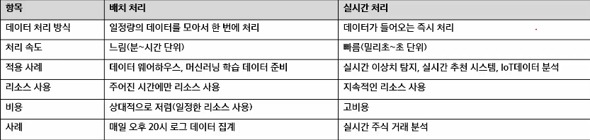
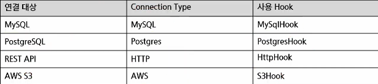

# 배치처리 워크플로우 구축(Airflow + Spark)
- 배치 처리 워크플로우
- Airflow Connections 및 Hooks
- SparkSubmitOperator
- DAG 실행 오류 확인

## 배치 처리 워크플로우
- 배치 처리(Batch Processing)란?
    - 일정량의 데이터를 모아서 한꺼번에 처리하는 방식
    - 정해진 시간(예: 매일 밤 12시) 또는 특정 이벤트(예: 파일 업로드) 발생 시 실행
    - 대량 데이터를 처리하는데 적합하며, 주로 ETL 파이프라인, 데이터 웨어하우스 적재 등에 활용
    - 주요 활용 사례
        - 데이터 웨어하우스 적재(예: Redshift, Snowflake)
        - 사용자 로그 분석(예: 하루 단위 사용자 접속 로그 집계)
        - 기계 학습 모델 학습을 위한 데이터 준비
    
    - 여러 데이터 소스를 수집하여 일정 시간 단위로 처리한 후 결과를 목적지에 저장
        - Delay: mins, hours, days
        - Source 대기 하다가 Batch Processor에서 처리 후 Destination(목적지)
    
- 실시간 처리(Real-time Processing)란?
    - 데이터가 발생하는 즉시 실시간으로 처리하는 방식
    - 지연 시간이 짧고, 스트리밍 데이터(예: 실시간 로그, IoT 세서 데이터)에 최적화
    - 주로 실시간 모니터링, 이상 탐지, 실시간 추천 시스템 등에 활용
    
    - 데이터가 생성되자마자 거의 실시간으로 처리되어 목적지에 전달됨

- 

- Apache Spark
    - 대규모 데이터를 빠르고 효율적으로 처리하는 분산 데이터 처리 프레임워크
    - In-Memory Computing
        - Spark는 데이터를 메모리(RAM)에서 처리하기 때문에 디스크 I/O가 많은 Hadoop보다 훨씬 빠름
        - 메모리에서 데이터를 유지한 채 연산을 수행하여 반복 연산(예: 머신러닝, 데이터 변환)이 Hadoop보다 최대 100배 빠름
    - 다양한 데이터 처리 방식 지원
        - Spark는 단순한 배치 처리가 아니라 여러 가지 방식으로 데이터를 처리할 수 있음
            - RDD(기본적인 Spark 데이터 구조)
            - DataFrame
            - Spark SQL
        - Scalability
            - 수십~수천 대의 클러스터 노드에서 병렬 실행 가능
                - AWS, Azure, Google Cloud 환경에서도 손쉽게 확장 가능
        - 배치 & 실시간 데이터 처리 모두 가능
            - Spark는 기본적으로 배치 처리를 지원하지만, 스트리밍 처리도 가능

- Spark Data Structure
    - RDD (Resilient Distributed Dataset)
        - 분산된 데이터를 저장하고 처리하는 기본 단위 (Hadoop의 HDFS와 유사)
        - 변경 불가능(Immutable) -> 안정적인 분산 처리를 지원
            - 분산된 상태로 데이터를 저장하고 처리하는 형태로 만들어져 있다. 다양한 파티션으로 나눳고 파티션들이 처리될 때 Transformation, action으로 나뉘어져 있다
            - **Transformation, action 부분 잘 알아두기** 중요 30분쯤
        - 여러 노드에서 병렬로 처리 가능 
    - DataFrame(Pandas와 유사)
        - 구조화된 데이터(테이블 형태)를 처리하는 최적화된 데이터 구조
        - Spark SQL과 연동 가능 -> SQL 쿼리를 사용하여 데이터 변환
    - Spark SQL
        - SQL을 활용해 데이터를 쉽게 조회하고 변환 가능
            - **view를 등록하고 viewname을 붙이고 SQL 문법 만드는 거**
        - 다양한 데이터 소스(HDFS, S3, JDBC, Hive, Cassandra 등)에서 데이터를 가져올 수 있음

- Apache Spark, RDD
    - Apache Spark 의 RDD
        - RDD는 여러 Worker Node에 분산되어 저장되고 병렬 처리함
        - Driver Node는 RDD의 연산을 스케줄링하고 각 Worker Node에 작업 분배

    - Apache Spark의 RDD 배치 처리 과정
        - 데이터를 parallelize 또는 외부 소스에서 불러와 RDD를 생성
        - Transformation 연산(map, filter 등)은 RDD를 새로 생성하지만 즉시 실행되지는 않음
        - 여러 Transformation이 체이닝되어 실행 계획(DAG)을 구성
        - Action 연산이 호출될 때 DAG가 실행되어 실제 데이터 처리가 수행

- Apache Spark, Dataframe
    - Apache Spark 의 Dataframe
        - Spark DataFrame은 Hive, CSV, JSON, RDBMS, XML, RDD, Cassandra 등 다양한 소스의 데이터를 통합하여 구조화된 형식으로 표현
        - Spark SQL을 통해 생성된 DataFrame은 열(Column) 기반의 테이블 형태로 데이터를 처리하며, SQL 쿼리도 사용 가능
    - Apache Spark의 DataFrame 배치 처리 과정
        - 다양한 데이터 소스에서 read() 또는 load()를 통해 DataFrame을 생성
        - 생성된 DataFrame에 select(), filter(), groupBy() 등의 Transformation 연산 적용
        - 여러 단계의 Transformation이 체이닝되며, 새로운 DataFrame이 연속적으로 생성
        - 마지막에 show(), count(), write()와 같은 Action이 호출되어 실제 실행이 이루어짐
    
- Apache Spark 배치 처리의 주요 활용 사례
    - 데이터 웨어하우스 적재(ETL)
        - Spark를 활용해 데이터를 정제 & 변환 후 데이터 웨어하우스에 저장
        - EX) 매일 수집한 CSV 데이터를 Parquet 변환 후 Snowflake, BigQuery 적재
    - 로그 데이터 분석
        - 웹사이트, 애플리케이션, 서버 로그 데이터를 분석하여 사용자 행동 분석
        - EX) 사용자의 클릭 로그를 분석하여 마케팅 전략 최적화
    - 머신러닝 데이터 전처리
        - 대량의 데이터를 Spark에서 전처리하여 머신러닝 모델 학습에 사용
        - EX) 추천 시스템을 위한 사용자 행동 데이터 전처리

- Airflow에서 Spark를 활용
    - 단순 Python 코드로 처리하기 어려운 대규모 데이터 처리
        - Pandas는 메모리에 로드할 수 있는 데이터 크기에 한계가 있음
        - 병렬 처리가 어려워 속도가 느림
        - 데이터를 여러 노드에서 나눠서 처리하는 기능이 없음
    - Spark를 활용하여 대량 데이터 ETL 수행
        - 단순 SQL이나 Python으로는 복잡한 ETL 작업을 수행하기 어려움
        - 대규모 데이터 변환이 필요한 경우, Spark의 강력한 데이터 처리 기능이 필요
    - Spark 작업을 모니터링하고 실패 시 자동 재시도할 수 있음
        - Spark 작업이 실패하면 Airflow에서 자동으로 감지하고 재시도 가능
        - Airflow Web UI에서 로그를 확인하고, 어떤 Task에서 문제가 발생했는지 쉽게 파악할 수 있음

## 배치 워크플로우에서 DAG의 역할
- 배치 워크플로우에서 DAG의 중요성
    - 자동화
        - 사람이 직접 실행할 필요 없이 정해진 스케줄에 따라 실행
    - 유지보수 용이
        - 실행 로드 및 실패 이력을 기록하여 문제 해결 가능
    - 확장성
        - 여러 작업을 DAG 내에서 관리하고, 병렬 실행 가능
    - 재시도 및 오류 감지
        - Task 실패 시 자동으로 재시도하여 안정적인 운영 가능
    
- 배치 워크플로우에서 DAG 처리 흐름 예시
    - 병렬 태스크와 순차 태스크가 함께 구성된 DAG로, 데이터 로드부터 후속 처리까지 단계별로 실행 흐름을 정의할 수 있음
    - 작업 간 의존성을 명확히 설정하고, 병렬 처리를 통해 전체 실행 시간을 단축할 수 있음

- DAG에서 CSV파일 처리 작업 실행(CSV 파일 읽기 & 변환)
    - PythonOperator를 사용하여, CSV 파일 읽기 & 변환
- DAG에서 BashOperator를 활용한 데이터 전처리 스크립트 실행
    - Shell로 작성된 데이터 전처리 스크립트를 BashOperator로 실행

## Airflow에서 배치 작업 최적화
- 병렬 실행 및 성능 최적화 방법

## Airflow Connections 및 Hooks 소개
- Airflow Connetion & Hook
    - Connection
        - Airflow가 외부 시스템(DB, API, 클라우드 서비스 등)과 연결할 수 있도록 설정
        - Web UI 또는 환경 변수를 통해 관리 가능
    - Hook
        - Connection을 사용하여 실제 데이터를 전송하거나, 외부 시스템과 상호작용하는 역할(외부시스템과 작업수행하기 위해)
        - Operator에서 Hook을 활용하여 작업 수행
        - 
    
    - Web UI connection 설정
    - PostgreSQL Web UI connection 설정 및 테스트

## SparkSubmitOperator
- SparkSubmitOperator 개요 및 역할
    - Apache Airflow에서 Spark 애플리케이션을 실행하기 위한 전용 연산자
    - Spark 클러스터(YARN, Kubernetes 등)에 .py, .jar, .scala 파일 등을 제출(submit)
    - 복잡한 Spark 작업을 Airflow DAG 내에 통합하여 자동화된 데이터 파이프라인 구성 가능
    - DAG 태스크로서 Spark 작업 실행을 스케줄링 및 추적 가능함
    - SparkSubmit 명령어를 Python 코드로 대체하여 운영 효율성 확보
- SparkSubmitOperator 주요 파라미터
    - application: 실행할 Spark 애플리케이션 경로(.py, .jar 등)
    - conf: Spark 설정(예: 'spark.executor.memory":"2g")
    - executor_memory, driver_memory: 리소스 지정
    - application_args: 애플리케이션에 전달할 인자 목록
    - conn_id: Spark 클러스터 연결 정보(예: spark_default)
    - name: Spark 작업 이름

- docker-compose.yaml에 Spark 서비스 추가하기(따로 파일 만들어도 됨->분리하면 됨)

- **docker 파일, 이미지, 컨테이너, 컴포즈(컴포즈 통한 것들->컨테이너 묶는 거?) 등 이미지를 새로 빌드할 수 있게 하는 거 잘 알아둬야 됨** 1시간 30분쯤 중요

- SparkSubmitOperator를 통한 Spark Job 실행
    - spark 기본 ui:  디테일한 실행내용들 학인할 때(localhost로 확인 가능)
    - airflow: 한곳에서 모아보고 관리하기 훨씬 편함

## DAG 실행 오류 확인
- 로그들 기반으로 남게 될 텐데 어디 기록되냐
- DAG 실행 오류 확인(Airflow Web UI 로그)
    - DAG 실행 중, 에러 발생할 경우 각 Task에 관한 상세 로그 확인
    - Logs 폴더에 실행했던 DAG 로그가 DAG 별로 저장되어 있음
    - DAG 실행 로그는 Airflow 환경에 저장됨
        - DAG 이름, Task 이름으로 로그 찾을 수 있음