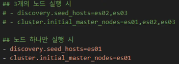

# Elasticsearch
- Elasticsearch 개요
- Elasticsearch 설치 및 환경 구성
- Elasticsearch의 아키텍쳐와 분산처리
- Elasticsearch REST API & Document CRUD

## Elasticsearch 개요
- Elasticsearch: 검색에 특화된 데이터 저장소
- 정보 검색이란?
    - 대규모 데이터 속에서 사용자가 원하는 정보를 찾아 제공하는 기술
    - 웹 문서, 이미지, 동영상, 연구 논문 등 다양한 데이터 유형을 대상으로 함
    - Google, Microsoft 등 글로벌 기업에서 핵심적으로 활용
    - 검색 시스템에서의 요구사항
        - 빠르고 정확한 검색 결과
        - 사용자 경험(직관적)
        - 보안 및 개인 정보
        - 확장성 및 유지보수
- 정보 검색의 핵심 기술
    - 데이터 수집
        - 웹 크롤링
            - 웹 문서를 자동으로 수집하여 색인하는 방식
        - 스크래핑
            - 특정 웹사이트에서 데이터를 추출하여 가공하는 방식
    - 데이터 저장 - 역색인
        - 키워드와 해당 키워드가 포함된 문서 정보를 저장하는 구조
        - 문서 검색 시 키워드를 기반으로 관련 문서를 빠르게 찾아줌
    - 검색 알고리즘
        - TF-IDF(Term Frequency-Inverse Document Frequency)
            - 특정 키워드가 문서 내에서 가지는 상대적 중요도를 평가하는 기법
            - BM25
                - TF-IDF를 개선한 가중치 기반 검색 알고리즘으로, 검색 정확도를 높임

- 기존 RDB 검색
    - '삼성 블루투스 이어폰' 이라는 타이틀을 가진 상품 검색한다는 가정
    - 문제점
        - 쿼리가 복잡해짐
        - 성능에 문제 발생(대량 데이터에서 LIKE 연산(Full scan 해야됨) 비효율)
        - 스펠링 오류, 유사 검색 불가

- 검색 엔진의 순위와 종류
    - Elasticsearch(순위 1등)
    - OpenSearch(아마존, 4등)

- Elasticsearch
    - Elasticsearch는 강력한 오픈소스 검색 및 분석 엔진
        - 텍스트 검색 기능, 로그, 구조화되어 있지 않은 데이터 빠르게 처리 및 분석 해줌
    - 수평적 확장성, 안정성, 쉬운 관리를 위한 설계
        - 데이터를 늘린다해도 구조 변경 없이 노드만 추가하면 됨
    - Apache Lucene 기반이며, Elastic Stack의 일부로 Elastic Stack은 Logstash, Beats, Kibana를 포함
        - Java 기반이긴 함

- Elasticsearch와 Lucene의 관계
    - Elasticsearch
        - 분산 검색 엔진, 데이터를 저장하고 빠르게 검색
        - Lucene을 내부 엔진으로 사용
    - Lucene
        - 검색 라이브러리, Elasticsearch의 핵심 검색 기능 담당
        - Java로 작성된 고성능 텍스트 검색 엔진 라이브러리
        - 검색, 색인(indexing) 기능을 제공
        - 단독으로 사용하려면 직접 애플리케이션 개발 필요
    - Elasticsearch vs Lucene: Elasticsearch는 Lucene을 기반으로 동작하며 REST API 및 분산 환경 지원
        - HTTP 통신 형태로 CRUD 할 수 있음

- Lucene
    - 데이터 저장
        - add / update(색인함)
        - Text analysis chains(분석 체인)를 통해 document 파싱 segment 단위로 index writer(인덱싱함으로써 검색할 때 문제 없이 검색되게 문장을 단위단위로 쪼갬) 함
        - codec 의 segments
        - files 로 storage에 저장
    - 검색
        - Query parser 가 문장을 단위단위로 쪼갬
        - Query 를 기반으로 데이터들 indexReader(인덱스 불러옴)
        - segments 를 조합
        - 조합된 결과를 점수를 매김
        - 점수를 통해 결과 도출

- Lucene이란?
    - 검색용 서비스의 핵심: 루씬
        - Elasticsearch에서의 검색관련 API의 대부분은 루씬 기반의 검색 API에서 출발
        - 분산 처리, 캐싱, 샤드 기반 검색 등의 추가 기능을 제공하여 대규모 데이터 검색을 최적화
        - Lucene index는 Elasticsearch shard로 이루어짐
        - Lucene index가 Lucene segment로 나눠짐
        - primary, replica 가 존재해서 다른 데이터가 훼손 되어도 문제 발생 방지

- Lucene의 segment
    - 세그먼트란?
        - Lucene에서 색인된 문서들을 저장하는 최소 단위
        - 하나의 샤드는 여러 개의 세그먼트로 구성
        - 세그먼트는 한 번 생성되면 수정되지 않음(Immutable)
            - 문서가 업데이트되면 새로운 세그먼트가 생성
            - 삭제된 문서는 '삭제 플래그'로 관리
    - 세그먼트의 장점
        - 동시성 확보
            - 여러 세그먼트에서 동시에 검색 가능(병렬 검색이라 빠름)
        - 빠른 색인 처리
            - 기존 세그먼트를 수정하지 않고 새로운 세그먼트 추가
        - 안정적인 검색
            - 검색 시 기존 세그먼트는 그대로 유지되므로, 검색 중단 없이 색인 가능

- Elasticsearch 동작 방법?
    - ELK(대량 서비스 아닌 경우 문제 없이 잘 됨(중규모 서비스))
        - Logstash
            - 데이터 들어오고 전처리함
        - Elasticsearch
            - 인덱싱, 저장(색인)
        - Kibana
            - 분석 및 시각화
    - bklek?(대규모 서비스)
        - beats
            - 서버나 어플리케이션 같은 곳에서 로그나 매트릭 등 수집
        - kafka
            - 수집된 데이터를 직접 전달 (Buffering 역할, 큐)
        - logstash
            - 집계, 전처리
        - Elasticsearch
            - 인덱싱, 저장(색인)
        - Kibana
            - 분석 및 시각화

- Elasticsearch 특징
    - 분산 구조(Distributed Nature)
        - Elasticsearch는 클러스터 내 사용 가능한 모든 노드에 데이터를 자동으로 분산하여 준실시간으로 대량의 데이터를 처리 가능하도록 함
    - 전문 검색(Full-Text Search)
        - Elasticsearch는 고급 전문 검색 기능을 지원하며, HTTP 웹 인터페이스와 스키마가 없는 JSON 문서를 사용
    - 확장성(Scalability)
        - 수백 대에서 수천 대의 서버로 확장 가능, 구조화된 데이터 및 비정형 데이터 수 페타바이트 규모까지 처리 가능
    - 유연성(Flexibility)
        - 다양한 소스로부터의 이질적인 데이터 유형을 색인할 수 있으며, 복잡한 검색 기능 제공

- Elasticsearch 활용
    - 기업 검색(Enterprise Search)
        - 기업에서 전체 디지털 콘텐츠를 색인하여 내부 네트워크 또는 웹사이트에서 고급 검색 기능을 제공하는 데 활용
    - 로그 수집 및 분석(Logging and Log Analysis)
        - Logstash 및 Kibana와 함께 사용하여 로그 데이터를 분석하고 IT 운영, 보안, 성능 모니터링에 대한 인사이트 제공
    - 보안 정보 및 이벤트 관리(SIEM, Security Information and Event Management, 유료임)
        - 조직에서 보안데이터를 실시간으로 분석하고 시각화하여 위협 감지 및 규정 준수 관리에 활용
    - 데이터 분석(Data Analysis)
        - 빅데이터 분석을 위해 사용되며, 대량 데이터를 빠르고 다양한 방식으로 탐색할 수 있도록 지원
    - 개인화 및 추천 시스템(Personalization and Recommendations)
        - 이커머스 웹사이트 등에서 사용자의 행동과 상호작용을 분석하여 맞춤형 상품 추천 및 동적 콘텐츠 제공에 활용

- Elasticsearch 기본 요소
    - 문서(Document)
        - Elasticsearch에서 문서는 색인될 수 있는 기본 정보 단위
        - 각 문서는 JSON(JavaScript Object Notation) 형식으로 표현되며, 가벼운 데이터 교환 형식
    - 필드(Field)
        - 필드는 Elasticsearch에서 가장 작은 데이터 단위이며, 키-값 쌍(key-value pair)을 의미

- Elasticsearch 데이터 저장 및 관리
    - 인덱싱
        - Elasticsearch에서는 데이터를 index 단위로 관리
        - 각 인덱스는 Database처럼 동작함
        - 문서는 JSON 형식으로 저장되며, 검색을 위해 최적화된 형태로 변환
    - 샤딩
        - index는 여러 개의 샤드로 나눌 수 있음
        - 데이터를 여러 노드에 분산 저장하여 성능을 향상시키고, 대용량 데이터와 높은 검색 요청을 효과적으로 처리
    - 래플리카
        - replica shard는 기본 샤드의 사본으로, 장애 발생 시 데이터 손실을 방지하고 검색 성능을 향상시키는 역할
        - 여러 복제본이 존재하면 검색 요청을 분산 처리할 수 있어 시스템의 안정성과 확장성이 높아짐
        
- Elasticsearch 검색 동작 원리
    - 질의 처리(Query Processing)
        - 사용자가 질의를 입력하면, 해당 질의는 구문 분석(Parsing) 및 변환(TRansforming) 과정을 거쳐 Lucene 인덱스에서 검색이 가능하도록 최적화된 형식으로 변환
        - 변환된 질의는 모든 관련 샤드(기본 샤드 및 복제 샤드)에 병렬로 실행되어 빠른 검색이 가능
    
    - 연관성 점수 계산(Relevance Scoring)
        - Text 형태 데이터일 때 이루어짐(그래서 TF-IDF, BM25)
        - Elasticsearch는 검색 결과의 연관성을 평가하기 위해 다양한 알고리즘을 활용
        - TF-IDF(단어 빈도-역문서 빈도) 및 BM25 등의 알고리즘을 사용하여 각 문서가 사용자의 질의와 부합하는지 계산
        - 해당 점수는 검색 결과의 순위를 결정하는 데 활용
        
    - 준실시간 검색(Near Real-Time, NRT)
        - Elasticsearch는 데이터를 검색하면서 동시에 색인할 수 있는 준실시간(NRT) 검색 기능을 제공
        - 메모리 버퍼를 활용해 새로운 문서를 저장
        - 일정 주기로 버퍼를 비워 색인 세그먼트를 생성하여 빠르게 검색 가능
    - 준실시간 검색이 가능한 이유
        - 메모리 기반 버퍼링으로 색인 속도 향상
        - 비동기 색인 처리로 검색과 색인을 동시에 수행
        - Lucene 엔진 최적화를 통한 빠른 색인 적용

- 그 밖의 Elasticsearch 특징
    - 유연한 JSON 데이터 관리
        - 스키마리스 방식으로 다양한 데이터 저장
    - 정밀한 검색 및 필터링
        - 다양한 검색 옵션과 필터 기능 제공
    - 다양한 검색 쿼리 지원
        - 복잡한 검색, 정렬, 그룹화 기능 제공
    - 다양한 클라이언트 지원
        - Java, .NET, PHP, Python 등 SDK 제공
    - 확장성과 안정성
        - 오토스케일링, 데이터 백업 및 복원 기능 제공
    - Kibana 데이터 시각화
        - 리포팅 및 대시보드 활용 가능

## Elasticsearch의 아키텍처와 분산처리
- Elasticsearch의 클러스터 및 노드 개념
    - 클러스터
        - Elasticsearch 클러스터는 하나 이상의 노드로 구성된 그룹
        - 클러스터는 고유한 이름을 가지며, 데이터를 분산 저장하고 관리하는 역할을 수행
    - 노드
        - Elasticsearch의 개별 실행 인스턴스를 노드라고 함
        - 각 노드는 데이터를 저장하며, 클러스터의 색인 및 검색 기능에 참여

- 클러스터
    - 분산된 데이터 처리
        - 여러 개의 노드로 구성되며, 데이터 저장, 검색, 분석 작업을 함께 수행
    - 노드의 역할과 관리
        - 각 노드는 고유한 이름과 IP로 클러스터에 참여하며, 특정 역할(마스터, 데이터, 인제스트 등)을 담당
    - 안정성과 가용성 확보
        - 장애 대비 및 데이터 보호를 위해 여러 지역에 노드를 분산 배치하고, 복제 기능을 활용
    - 유연한 확장성과 성능 최적화
        - 대량의 데이터도 빠르게 처리할 수있으며, 필요에 따라 노드를 추가하여 확장 가능

- 노드 유형
    - 마스터 노드
        - 클러스터 전체의 작업을 관리하고, 인덱스 생성/삭제 및 노드 상태 관리 수행
    - 데이터 노드
        - 데이터를 저장하며, CRUD, 검색 및 집계 작업 처리
    - 인제스트 노드
        - 색인 전에 필터링, 변환 및 데이터 정제 작업 수행
    - 코디네이팅 노드
        - 클라이언트 요청을 라우팅하며, 여러 노드에 분산된 검색 로드를 균형 있게 처리

- 마스터 노드
    - 클러스터 관리 역할
        - Elasticsearch 클러스터의 핵심 관리자로서 클러스터의 안정적인 운영을 담당
    - 중요한 결정 수행
        - 클러스터 내 인덱스 생성 및 삭제, 노드 관리, 샤드 분배 등 주요 작업을 결정
    - 연속적인 서비스 제공
        - 클러스터 운영이 중단되지 않도록 최소한 하나 이사의 마스터 노드 필요
    - 고가용성을 위한 다중 마스터 노드 구성
        - 운영 환경에서는 3개 이상의 마스터 노드 배치를 권장하여 장애 발생 시 안정성을 확보
    - 클러스터 상태 모니터링 및 전환 관리
        - 클러스터 상태를 지속적으로 모니터링하고, 필요할 경우 다른 노드를 마스터 노드로 전환하여 안정적인 운영 유지

- 데이터 노드
    - 데이터 저장 및 관리
        - Elasticsearch 클러스터에서 실제 데이터를 저장하고 관리하는 역할을 수행
    - 색인 및 검색 처리
        - 색인, 검색, 집계 작업을 담당
        - CPU, I/O, 메모리 등 하드웨어 리소스 많이 소모
    - 안정적인 클러스터 운영
        - 클러스터 안정성을 위해 적절한 개수의 데이터 노드를 유지하며, 장애 발생 시 대비하여 적절한 샤드 운영 필요
    - 유연한 구성 가능
        - 데이터 특성과 접근 패턴에 따라 다양한 데이터 노드 유형을 조정 가능
    - 성능 및 비용 고려
        - 데이터 노드의 구성은 클러스터 성능 최적화, 안정성 확보, 운영 비용 등에 직접적인 영향을 미침

- 인제스트 노드
    - 데이터 수집 및 사전 처리
        - 색인 전에 필터링, 변환, 정제 작업 수행
    - 다양한 데이터 변환 지원
        - 필드 추가/삭제, 날짜 변환, 텍스트 정규화 가능
    - 데이터 노드로 색인 최적화
        - 변환된 데이터를 색인하여 부하 감소
    - 리소스 분리 운영
        - CPU, 메모리 사용량이 높아 데이터 노드와 분리 권장
    - 자동화 및 색인 지원
        - 데이터 변환 후 즉시 색인하여 효율적 운영

- 코디네이팅 노드
    - 클러스터의 요청을 라우팅하고 상태를 관리하는 역할
    - 검색 및 색인 요청을 적절한 데이터 노드로 분산하여 처리
    - 대규모 클러스터에서는 별도로 분리 운영하여 부하를 줄이는 것이 효과적
    - 이 외에도 ml, remote_cluster_client, transform 노드 등도 존재

- 샤드
    - shard
        - 데이터를 나누어 저장하는 작은 단위로, 노드 간 분산 저장을 통해 성능과 확장성을 보장
    - Primary Shard
        - 색인 생성 및 CRUD 작업 수행
    - Replica Shard
        - 기본 샤드의 복사본으로 장애 복구 및 검색 성능 향상 역할
    - Primary shard는 기본적으로 '처음 인덱스 생성 시점' 에서 설정한 이후에는 변경이 불가능
    - 하지만 replica set의 개수는 언제든지 변경할 수 있음

- Replication
    - Replication
        - 데이터를 복제하여 중복성을 확보하고, 고가용성 및 장애 대응을 보장
    - Repliacation 동작 방식
        - Primary-Replica 관계
            - Primary Shard는 0개 이상의 Replica Shard를 가질 수 있음
        - 쓰기 연산
            - Primary Shard에서 발생한 변경 사항이 모든 Replica Shard에 복제됨
        - 읽기 연산
            - Primary와 Replica Shard가 함께 검색 부하를 분산하여 성능 향상
    - 장점
        - 고가용성
            - Primary Shard가 포함된 노드가 다운되면 Replica Shard가 Primary로 승격되어 데이터 접근 가능(무중단 운영 가능)
        - 부하 분산
            - 검색 요청을 Primary 또는 Replica Shard로 분산 처리하여 성능 향상
        - 데이터 중복 저장
            - 여러 노드에 데이터를 복사하여 장애 발생 시 데이터 손실 방지   
    - 고려사항
        - 노드 개수
            - 동일한 샤드의 Primary와 Replica를 같은 노드에 저장할 수 없으므로 충분한 노드 필요
        - 네트워크 및 저장소 부담
            - 복제본 유지로 인해 네트워크 트래픽 증가 및 저장 공간 추가 소모
        - 트레이드오프
            - 복제본 수가 많을 수록 데이터 안정성은 증가하지만, 디스크 및 네트워크 자원 소모도 커짐

## Elasticsearch의 검색방법
- 클라이언트가 클러스터 내 아무 노드에 검색 요청(GET) 전송
- 해당 노드는 Coordinate Node로 동작
- 쿼리를 모든 관련 샤드(Primary 또는 Replica 중 하나)에 전달
- 샤드별로 검색 실행 -> 결과를 Coordinate Node에 다시 전달
- Coordinate Node는 결과를 취합, 정렬, 필터링 등 후처리
- 최종 결과를 클라이언트에게 응답

## Elasticsearch 환경 구성
- 도커 활용
- 환경 구성
    - image
        - 사용할 Docker 이미지를 지정
    - container_name
        - 컨테이너 이름을 설정
            - es01로 고정
    - node.name
        - 이 노드의 이름을 es01로 지정
            - 클러스터 내에서 구분할 때 사용
    - cluster.name
        - 클러스터 이름을 설정
            - 클러스터 이름이 일치하는 노드끼리 합쳐져서 클러스터를 이룸
    - discovery.seed_hosts
        - 클러스터를 구성할 때 다른 노드의 '주소 목록'을 제공
        - es02,es03을 주석 해제하면 3개 노드를 연결
        - 하나만 실행할 땐 es01 자신만 바라보도록 설정
    - cluster.initial_master_nodes
        - 초기 클러스터 마스터 노드를 지정
        - 초기화할 때 반드시 필요한 설정
        - 
    - node.rolse
        - 이 노드의 역할을 설정
        - master
            - 클러스터 상태 관리
        - data
            - 데이터 저장 및 검색 처리
        - ingest
            - 데이터 전처리 파이프라인 실행
            - 즉, es01은 모든 역할을 수행하는 종합 노드
    - jvm.options
        - Elasticsearch가 사용할 Java 힙 메모리 크기를 지정
        - Xms
            - 최소 힙 크기
        - Xmx
            - 최대 힙 크기
    - volumes
        - Docker 컨테이너상에 띄워진 Elasticsearch 데이터 디렉토리를 공유 저장소에 연결
        - Shared_esdata 볼륨을 /usr/local/elasticsearch/data에 마운트
    - ports
        - 호스트의 9200번 포트를 컨테이너 9200번 포트에 매핑
        - Es02와 같은 경우는 docker를 띄운 호스트의 9201로 해당 컨테이너 9200번에 매핑
    - networks
        - elastic이라는 Docker 네트워크에 연결
        - 이 네트워크를 통해 Kibana와 다른 Elasticsearch 노드들이 서로 통신

## Elasticsearch REST API & CRUD
- Elasticsearch의 데이터 교환
    - 방식
        - Elasticsearch는 분산 검색 및 분석 엔진으로, 대량의 데이터를 빠르게 검색하고 분석하는 데 사용
        - RESTful API를 통해 클라이언트와 통신
    - REST API의 특징
        - HTTP 기반으로 동작
        - 자원을 URL로 표현(/users/1, /products/10 등)
        - HTTP 메서드를 활용하여 CRUD 작업 수행 (GET, POST, PUT, DELETE)
        - JSON, XML 등 다양한 데이터 형식을 사용

- Elasticsearch의 RESTful API
    - RESTful API
        - Elasticsearch는 HTTP 요청을 통해 데이터를 처리하며, API 설계를 통해 다양한 기능을 제공
        - 언어 독립성, 확장성, 직관적인 인터페이스 제공 등의 장점
    
- Elasticsearch의 index 생성
    - Index를 Elasticsearch가 자동 매핑(dynamic mapping) 으로 필드 타입을 추론해서 설정
        - 스키마리스 가능
    - 인덱스를 미리 정의된 설정으로 명시적으로 생성(mapping도 가능)
    
- Document CRUD
    - POST를 활용한 문서 생성
    - GET을 활용한 문서 조회
    - POST를 통한 업데이트
        - 기존 내용을 변경
        - 새로운 필드 추가
    

- Elasticsearch 문서 업데이트
    - Elasticsearch의 문서는 불변 하므로 직접 수정되지 않으며, 업데이트 시 새로운 문서로 저장 등으로 사용 가능
    - 업데이트 과정
        - 기존 문서 조회
            - 업데이트 요청 시 현재 색인된 문서를 가져옴
        - 변경 사항 적용
            - 기존 문서에 수정된 내용을 반영
        - 새 문서 색인
            - 변경된 문서를 새로운 버전으로 다시 저장
        - 이전 문서 삭제 처리
            - 기존 문서는 논리적 삭제(Logical Deletion)로 표시되어 검색에서 제외됨
        - 세그먼트 병합
            - Segment Merging을 수행하여 삭제된 문서를 물리적으로 제거하고 저장 공간 확보

- Document CRUD
    - Upsert
        - 업데이트(Update)와 삽입(insert)을 결합한 연산
        - 해당 ID의 문서가 존재 -> 업데이트 수행
        - 해당 ID의 문서 없음 -> 새 문서 생성
    - DELETE를 통한 삭제
        - 실제로 삭제되는 것이 아니고 표시되기 때문에 flush(반영)를 하면 버퍼까지 삭제(물리까지 완전 삭제 원할 경우 forcemerge)

- Elasticsearch에서 세그먼트와 Flush의 관계
    - upsert & update는 기존 문서를 수정하는 것이 아니라 새로운 세그먼트를 생성하는 방식으로 동작
        - Elasticsearch는 Lucene을 사용하며, 세그먼트는 수정될 수 없는(Immutable) 구조
        - 따라서 문서가 업데이트될 때 기존 세그먼트를 수정하지 않고 새로운 세그먼트를 생성
    - Flush는 새로운 세그먼트를 디스크에 기록하는 과정
        - 새로운 문서 추가(index), 업데이트, 삭제가 발생하면 메모리(Buffer)에 먼저 저장
        - Flush가 발생하면 메모리에 있던 문서들이 새로운 세그먼트로 생성되고 디스크에 저장됨
    - 세그먼트가 증가하면 자동으로 병합(Merge) 수행
        - 새로운 세그먼트가 많아지면 검색 속도가 느려질 수 있음
        - Elasticsearch는 주기적으로 여러 개의 작은 세그먼트를 하나로 병합하여 성능을 최적화

- bulk
    - 여러가지 데이터 묶음을 한번에 넣을 수 있게 하는 법
    - 대량의 데이터를 처리할 때 용이함