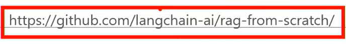

# Part 4 핵심 정리
- 분할 개선
    - 시맨틱 청킹, 구조적 청킹
- 검색 개선
    - BM25 + Vector 하이브리드 검색
- 결과 개선
    - Cross-Encoder 리랭킹
- 질의 개선
    - Query Rewritingm, Multi-Query

## 파이프라인
- LCEL 파이프라인 구성
    - Query(사용자 질의) -> Multi-Query(다관점 질의 생성) -> Hybrid Search(BM25) -> ReRanking -> Answer

## 추가 고급 기법들
- Chunk Enrichment
    - Contextual Retrieval
- HyDE
    - Hypothetical Document Embeddings
- RAPTOR
    - Recursive Abstractive Processing for Tree-Organized Retrieval

## LangChain, RAG 참고
- 

## ReRanker
- 같은 코드인데 RAGAS 테스트 시 메모리 터짐
    - LLM과의 심도 깊은 대화
    - 디버깅
    - 각종 실험
    - 결과
        - 문서 잘못 넣음(너무 큰 문서 삽입함)