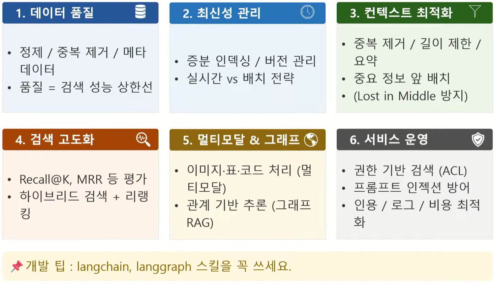

# Part 5.Agentic RAG
- Agent 개념 도입으로 더 똑똑한 RAG 구현
- Tool 정의 및 활용
- ReAct 패턴, Self-RAG
- 기존 RAG의 한계, Agentic RAG

## LangGraph 소개
- 그래프 기반 워크플로우 프레임워크 - LangGraph의 그래프(동적 경로)
- 핵심
    - LLM 호출은 노드 중 하나일 뿐, 범용 오케스트레이션 도구
- 노드
    - 실행 단위(함수)
- 엣지
    - 노드 간 실행 흐름
- 상태
    - 노드 간 공유 데이터
- 주요패턴
    - 루프
        - 응답 평가 후 불충분하면 이전 단계로 되돌아가기
    - 조건 분기
        - 쿼리 유형에 따라 다른 검색 전략 선택
    - 도구 결합
        - 웹 검색, 외부 API 호출 등 필요한 도구 자율 선택
    - 병렬 실행
        - 여러 소스를 동시에 검색
- 패턴 1
    - 가장 단순한 LangGraph: LLM 호출
        - state 정의
        - 노드 함수 작성
        - 그래프 조립
- 패턴 2
    - 조건 분기(Conditional Edge)로 라우팅
- 패턴 3
    - 병렬 실행으로 속도 개선
        - 약 3배 속도 개선
        - START에서 여러 노드로 엣지를 연결하면 자동 병렬 실행
- 패턴 4
    - LLM이 도구를 자율적으로 선택
        - bind_tools()
            - LLM에 도구 바인딩
        - tool_calls
            - LLM이 도구 호출 여부 판단
        - ToolNode
            - 실제 도구 실행 후 결과 반환
        - tools_condition
            - tool_calls 유무로 분기 결정
    - 도구 정의 방법
        - @tool +docstring
            - 도구 용도 힌트
        - 시스템 프롬프트
            - 도구 선택 전략 안내
    - 등록된 도구
        - search_documents
            - 프로젝트 문서 검색
        - web_search
            - DuckDuckGo 웹 검색

## Self-Reflective RAG (Self-RAG)
- 생성 -> 평가 -> 쿼리 재작성 -> 재검색
    - 불충분 시 재검색 루프
- 조건 분기 + 루프 = 자기 교정(Self-Corrective) 패턴
- 쿼리 재작성(Query Rewriting) 기법과 결합 가능
- 이후 실제 Agentic RAG 구현에서 이 패턴을 적용

## 검색기 구성: 4장의 성과를 그대로
- MultiQuery Retriever(LLM이 질문을 3개 변형 재작성 -> 3개 쿼리로 검색) -> Ensemble Retriever(BM25(Kiwi 형태소 분석, 40%) + Chroma(벡터, 60%) 결합) -> Compression Retriver(CrossEncoder(bge-reranker-v2-m3) 리랭킹 -> 상위 3건) -> Top 3 결과(최종 상위 3건 반환)

## 발전 방향과 개발 팁
- 

## 컨설턴트님의 회고
- 한 번에 너무 많이 바꾸지 말 것
- RAG
    - 시작은 쉬운데 완성은 어려운 기술
    - 우리가 절대 쉽게 원하는 결과물을 얻을 수 없는 이유
        - 테디노트
- RAG/LLM/NLP에 대한 지식이 넓어짐
- 비결정적 프로그래밍은 어렵다