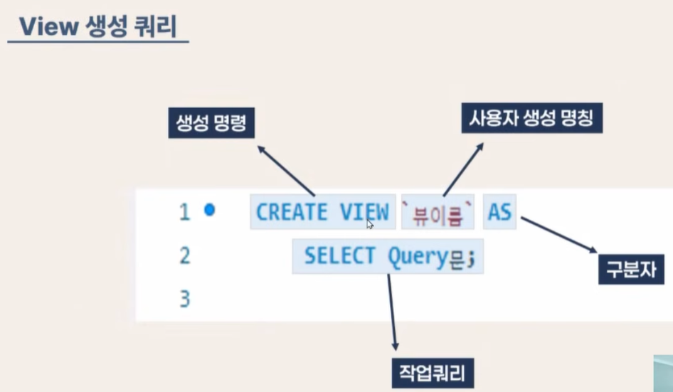

# SQLview
- 주요 특징
    - Table Join
    - 외부 보안 강화
    - 재사용
    - 구조 미변경
- 

## Procedure 와 Function 차이
- 구현 목적
    - Procedure 는 작업
    - Function 은 계산
- 반환값
    - Procedure는 미반환 또는 다수 가능
    - Function은 반드시 1개
- 기존 쿼리에 Function 사용 가능
- 처리 장소
    - Procedure는 서버
    - Function은 클라이언트

## Triger
- 테이블 데티어 변화 발생 시 액션 자동

## 프로젝트 활용안
- View
    - 여러 테이블과로 구성된 복잡한 쿼리가 자주 사용하게 될 상황에서 간단한 View 하나로 구성
    - 개인별 맞춤 상품 조회, 외부 제공 사용자 정보 데이터
- Procedure
    - 복잡한 SQL 쿼리 조직(조건문, 반복문, 여러 쿼리 실행)을 프로시저 하나로 호출하여 실행
    - 회원가입 처리, 주문 처리, 결제 처리
- Trigger
    - 특정 테이블에 CRUD 이벤트가 발생할 때, 미리 정의된 SQL 코드가 자동으로 실행
    - 로그인 기록 기반 회원 통계 업데이트, 게시판 조회 수 통계 업데이트