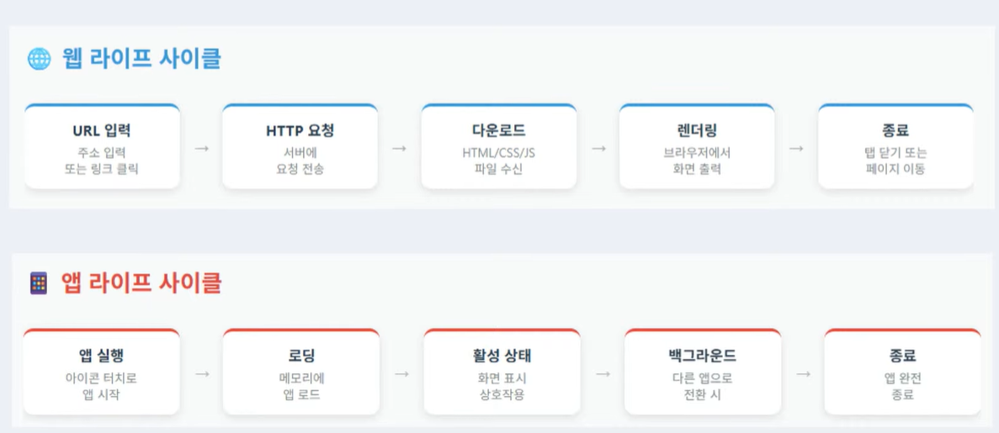
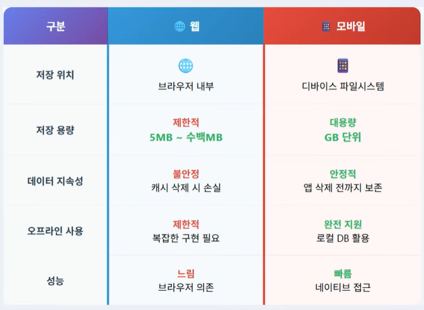

# Web VS App
- 웹과 앱 모두 CS 구조로 통신이 가능한 구조로 설계되어 있음
- 동일한 상태 관리 패턴 적용
    - 웹과 모바일 모두 MVC 상태 관리 방식으로 프로그래밍 할 수 있음
- 동일한 통신 프로토콜의 사용 가능
    - Http 기반의 통신 위에서 Rest API, Web Socket 등 호출 가능한 구조

## 웹, 앱 프로그래밍 차이점
- Web
    - 브라우저 안에서만 동작
    - 브라우저 엔진이 모든 웹 콘텐츠를 해석하고 실행
- Mobile
    - OS 기반 안에서 제약 없이 동작
    - OS의 모든 기능에 직접 접근 가능

## Life Cycle의 차이
- 

## 저장 매체의 차이
- 

## 모바일 특화 기능
- 생체 인증 센서를 통한 편리한 인증 시스템
    - 지문 인증
    - 얼굴 인증
- 블루투스 통신을 이용한 스마트 기기 제어
- 스마트 워치를 이용한 제스처 감지
- NFC 태깅을 통한 근접 통신 기능
- 자이로스코프를 활용한 회전 탐지 기능

## 웹과 모바일의 Hybrid 활용 방법 소개
- PWA(Progressive Web App)
- WebView 를 이용한 Hybrid 앱 구현