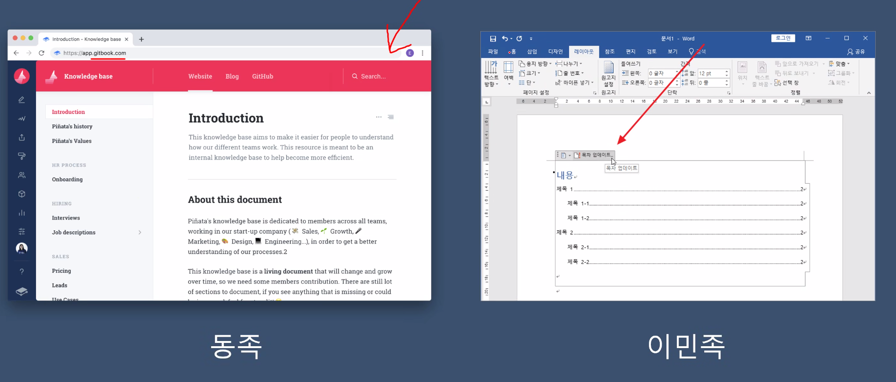

# 부족의 일원이 되는 법
- 회사는 어떻게 해서든 신입 사원을 동족으로 만들려고 애쓴다
    - 애초부터 같은 부족인 지원자라면 어떨까?
    - 면접관 입장에서 동족임을 느낄 수 있는 시그널을 만들어보자

- 시그널
    - 기술 스택
        - 반대 되는 기술 스택 사용하지 말 것
        - 시대 뒤쳐지는 기술 사용하지 말 것
    - 문서
        - 
    - 옷차림
        - 판교에서 신입 면접 보러 온 사람 바로 알 수 있음
        - TPO 맞지 않는 옷차림은 이질감 느껴짐
    - 화법
        - 결론을 제대로 말하는 법
            - 두괄식, 미괄식 이해하기
    - 공부하는 방식
        - 블로그 말고 공식문서도 보자
    - 코드와 깃 컨벤션
