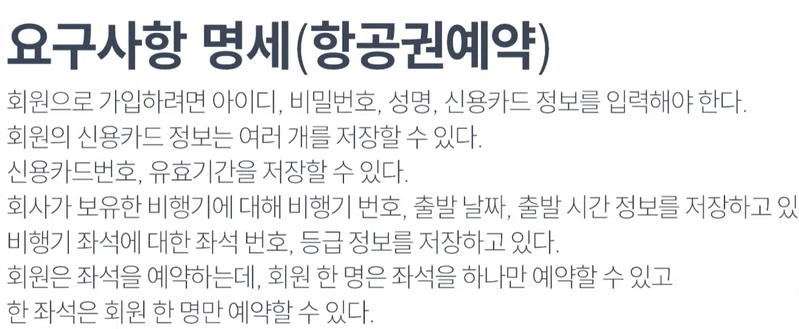
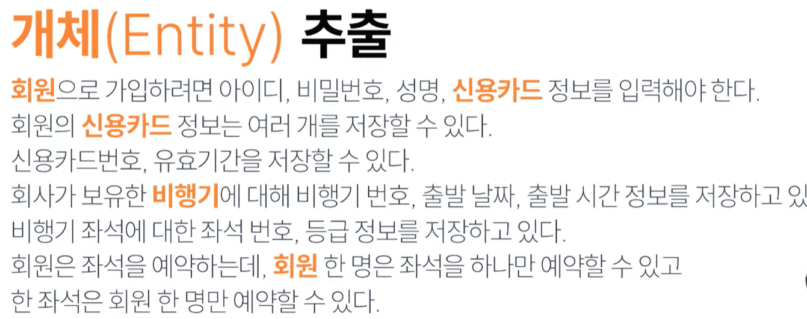
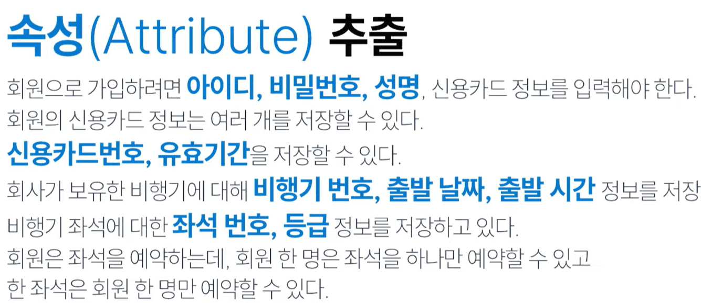
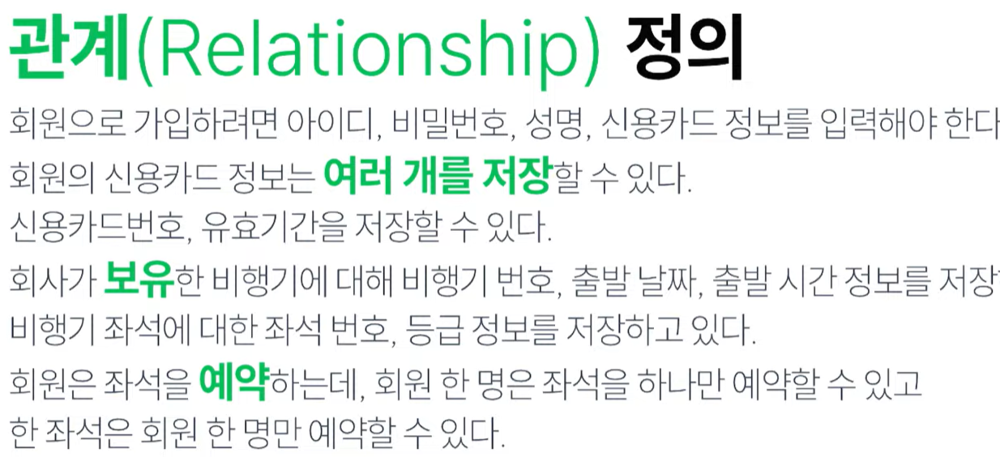
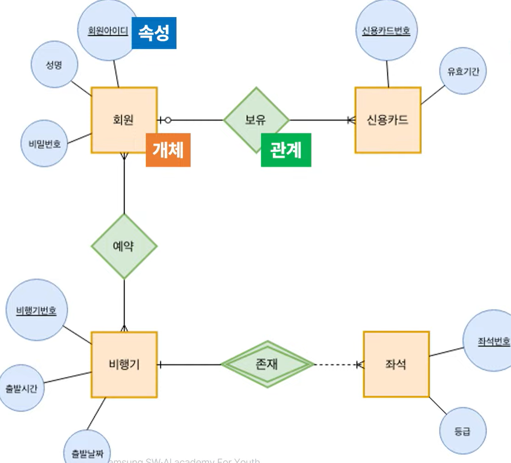
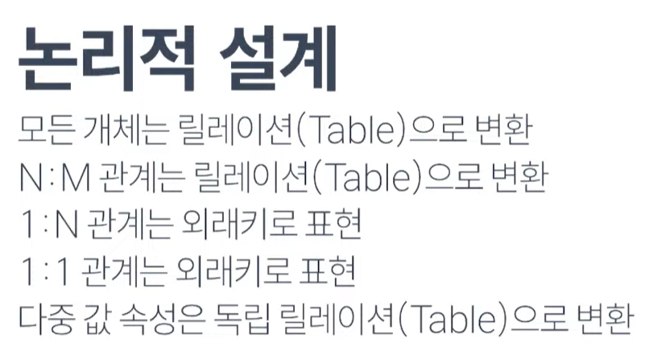
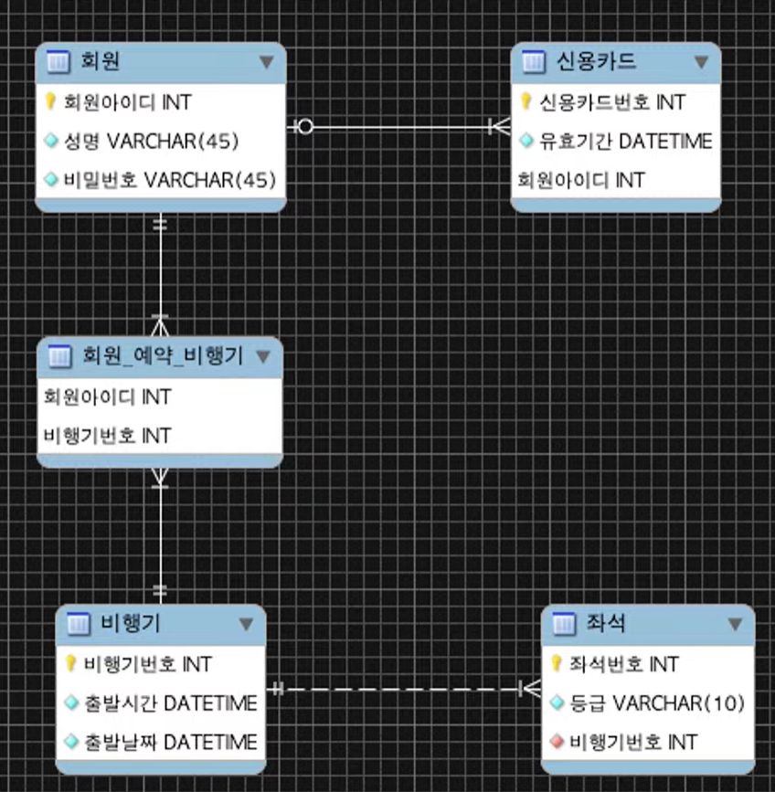
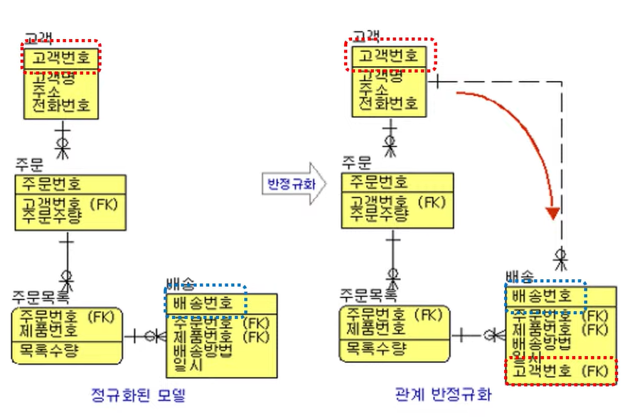

# DB 설계
- 
- 
- 
- 
- 개념설계 기반 ERD 생성
    - 
- 
- 
- 

- 정규화
    - 관계형 데이터베이스의 설계에서 중복을 최소화 하도록 데이터를 구조화 하는 프로세스
    - 여러 테이블이 생성되어야 됨. SQL 작성이 용이하지 않고 과다한 테이블 조인이 발생 가능
    - 성능 저하될 가능성 높음
- 반정규화
    - 관계정규화된 엔티티타입, 속성, 관계를 시스템의 성능향상, 개발과 운영의 단순화를 위해 모델을 통합하는 프로세스
    - 같은 데이터가 여러 테이블에 걸쳐 존재하므로 무결성이 깨질 우려 있음

- 테이블 반정규화 방법
    - 1:1 관계의 테이블 병합
    - 1:N 관계의 테이블 병합
    - 수퍼/서브 타입 테이블 병합
    - 수직 분할(집중화된 일부 컬럼을 분리)
    - 수평 분할(행으로 구분하여 구간별 분리)
    - 테이블 추가(중복테이블, 통계테이블, 이력테이블 등)

- 컬럼 반정규화
    - 중복컬럼 추가(자주조회하는 컬럼이 있는 경우)
    - 파생 컬럼 추가(미리 계산한 값)
    - PK에 의한 컬럼 추가
    - 응용시스템 오작동에 대비한 컬럼 추가
    - (이전 데이터 임시 보관)

- 관계 반정규화
    - 중복 관계 추가(이미 A테이블에서 C테이블의 정보를 읽을 수 있는 관계가 있음에도 관계를 중복하여 조회(Read) 경로를 단축)
    - 

- 반정규화란?
    - 데이터베이스의 성능 향상을 위하여 의도적으로 정규화 원칙을 위배하여 데이터 중복을 허용하고 JOIN 연산을 줄이는 최적화 기법