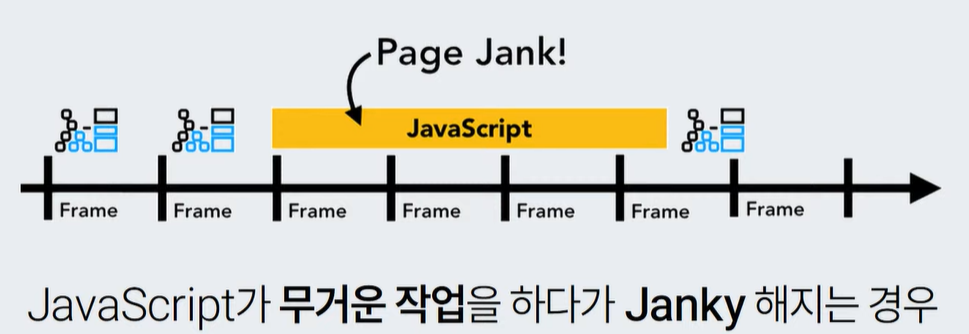
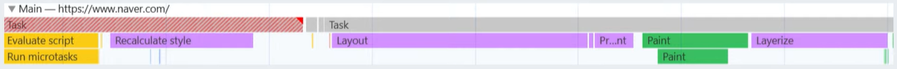
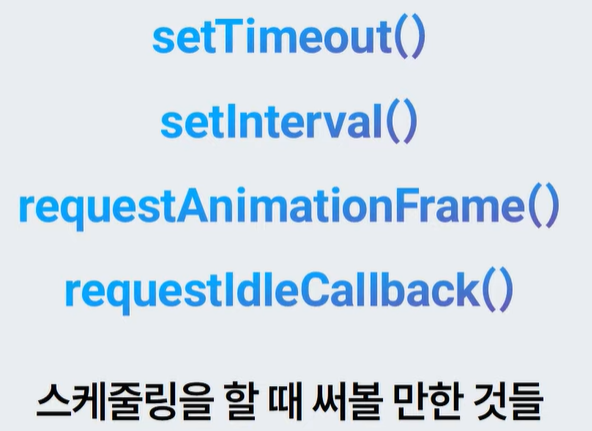
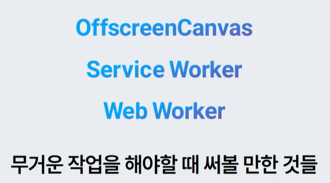

# 브라우저 렌더링
- Jank
    - 많은 작업을 하느라 UI가 버벅거리는 현상
- 어디서 이런 차이가 발생하는가

## Rendering Pipeline
- 브라우저가 페이지를 화면에 그리는 과정
- Loading -> Parsing -> DOM -> Style -> Layout -> Paint -> Layer 
-> Composite
- Loading, Parsing
    - Network 에서 받은 HTML 파일을 읽고, parsing을 시작함
- DOM
    - DOM tree를 만듦
- Style
    - 각 DOM node에 적용될 style을 계산
- Layout
    - 위치, 너비, 높이 등 기하학적 요소 계산해 레이아웃 트리를 만듦
    - 요소의 속성에 따라 레이아웃 트리에는 속하지 않을 수도 있음
- Paint
    - 각 요소를 그리기 위한 페인팅 명령들을 기록 즉, 아직 눈에 보이는 픽셀은 아님
    - 요소의 선언 순서와 paint 순서는 다를 수 있음
- Layer(함께 그릴 단위)
    - 함께 그리기 좋은 것들끼리 한 레이어로 그룹 짓고, 레이어 트리를 만듦
- 애니메이션
    - 모두 한 레이어라면 배경부터 스마일까지 매번 전부 다시 그려야 함
    - 움직이는 부분, 정적인 부분을 나눠서 그리면 효율적임
- Composite
    - 레이어는 만들어졌지만, 아직 픽셀로 만들어지지 않은 상태
    - 각 레이어의 Paint ops를 실행하면서 픽셀을 뽑아냄(Rasterize)
    - 뽑아낸 레이어의 이미지들을 위치에 맞게 놓고 합성(Composite)
    - Rasterize와 Composite은 GPU를 이용하기 때문에 훨씬 빠름

- 어느 단계부터 다시 시작하느냐에 따라 비용이 천차만별
    - x,y 수정 시 Layout부터 다시 시작: Reflow
    - 투명도 수정 시 Paint부터 다시 시작: Repaint

## css-triggers.com
- 여러 속성이 어떤 단계를 유발하는지 확인 가능

## JS
- 뭐든 할 수 있음
- 반복적인 경우엔 유의해야 함(작고 빠르게 해야 됨)
- js 실행 중에는 렌더링 파이프라인이 멈춤
    - 스크립트와 렌더링 모두 같은 스레드에서 발생(싱글 스레드)
- 얼마나 빨라야 하나?
    - 일반 모니터 60hz 경우 브라우저는 60fps 이상으로 이미지 생성하는 걸 목표(16.6ms 안에 렌더링 파이프라인이 다 돌아야 함)
    - 
    - 과하게 fps 를 높일 경우 무의미하게 리소스 낭비
        - 일을 가볍게 만들고 스케줄링 잘해야 함
- 해결방법
    - Devtools > Performance 패널에서 녹화
        - 
    - 어떤 단계가 가장 많이 실행되는 지 확인 가능
    - 
    - 