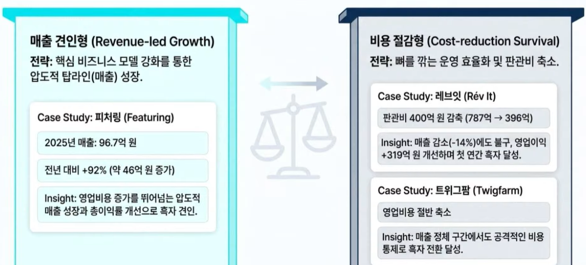
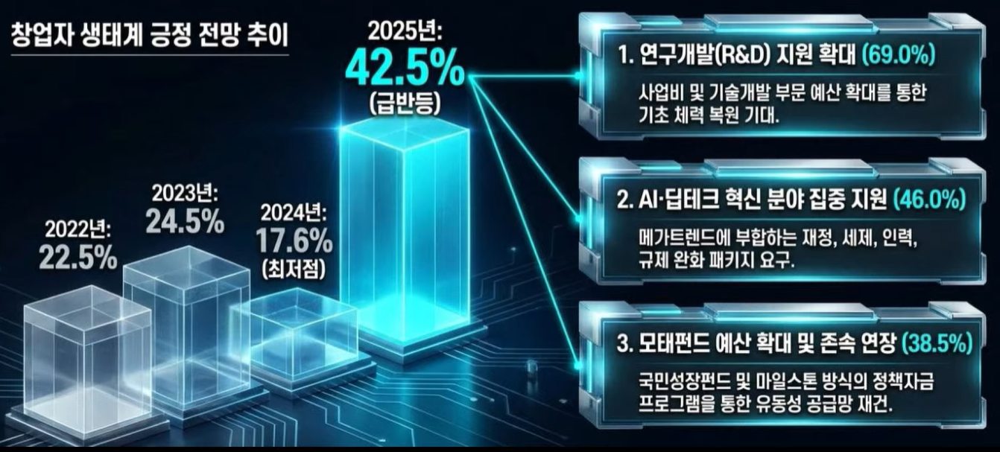
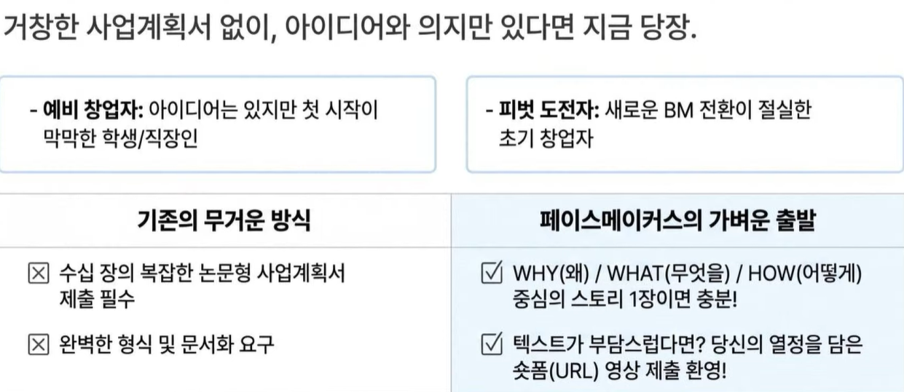

# vc, ac
- vc 는 큰 투자, 큰 리턴
    - 1에서 100을 만드는 과정
    - 성장 가속화를 위한 대규모 자금 투입
    - Series A 이상의 스케일업 투자
    - 네트워크를 통한 Exit 및 IPO 지원
- ac 는 작은 투자, 작은 리턴
    - 0에서 1을 만드는 과정(주로 멘토는 ac)
    - 초기 BM 고도화 및 팀 빌딩 지원
    - 시드 투자 및 직접 보육
    - 데모데이를 통한 시장 데뷔

## vc, ac 의 역할
- 네비게이터
    - 시행착오를 줄여주는 실전 비즈니스 가이드
- 브릿지
    - 대기업, 파트너, 해외 시장을 연결하는 강력한 인프라
- 방패
    - 법률, 재무, 인사 등 리스크를 방어해주는 지원팀

## 투자
- 투자는 스케일 업 할 때 받는 게 좋음

## 스타트업 생존 방정식: 계획된 적자 에서 수익성 증명으로
- 투자 혹한기를 거치며 플랫폼 기업들의 성장 모델이 '비용 통제와 실제 수익 창출'능력 입증으로 전환
- 

## 현장의 목소리: '혹한기'를 넘어선 기대감과 정책 과제
- 

## 시장 선정 규칙
- 압도적 시장 수요, 절실한 고객 니즈

## 멘토를 춤추게 하는 질문법
- 선배 창업가 멘토 선정이 좋을 듯
- 가설 기반 질문
    - 우리는 ~라고 생각하는데 시장은 어떻게 반응할까요?
- 실증 데이터 기반
    - 사용자 100명 테스트 결과 이 지점에서 막혔습니다.
- 구체적 비판 요청
    - 이 비즈니스 모델의 가장 큰 약점은 무엇인가요?

## 모두의 창업 선발
- step 1
    - 시작을 위한 장전
    - 창업활동자금 200만원 + 책임 멘토링 최대 4회
- step 2
    - 아이디어를 현실로
    - MVP 제작 및 시장조사 자금 1000만원 지원
    - 책임 및 기술 멘토의 딥다이브 멘토링
- step 3
    - 본격적인 스케일업
    - 사업화 지원금 1000만원 추가 지원(PMS 사용)
    - R2 멘토 및 선배 창업자 풀 연계
- step 4
    - 압도적 퀀텀 점프(final)
    - 상금 5억 원 + 5억원 투자 검토
    - 최종 1위 우승 시 CES 참관 특전 및
    - 내년도 사업화 자금(1억 원)연계

- 
- 그림이나 숏폼(핵심 영상) 넣는게 좋음
    - 멘토분께서 하나 오래 보기 힘들 듯
- 글로벌 방향성 없는 것보다 있는게 무조건 좋음