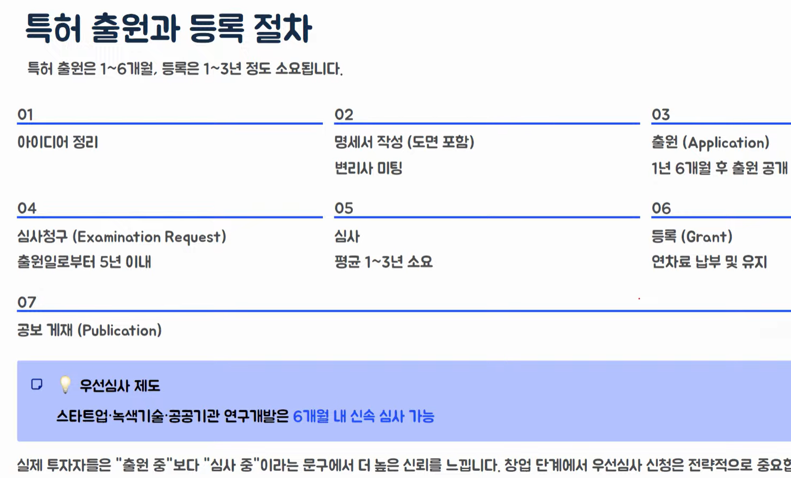
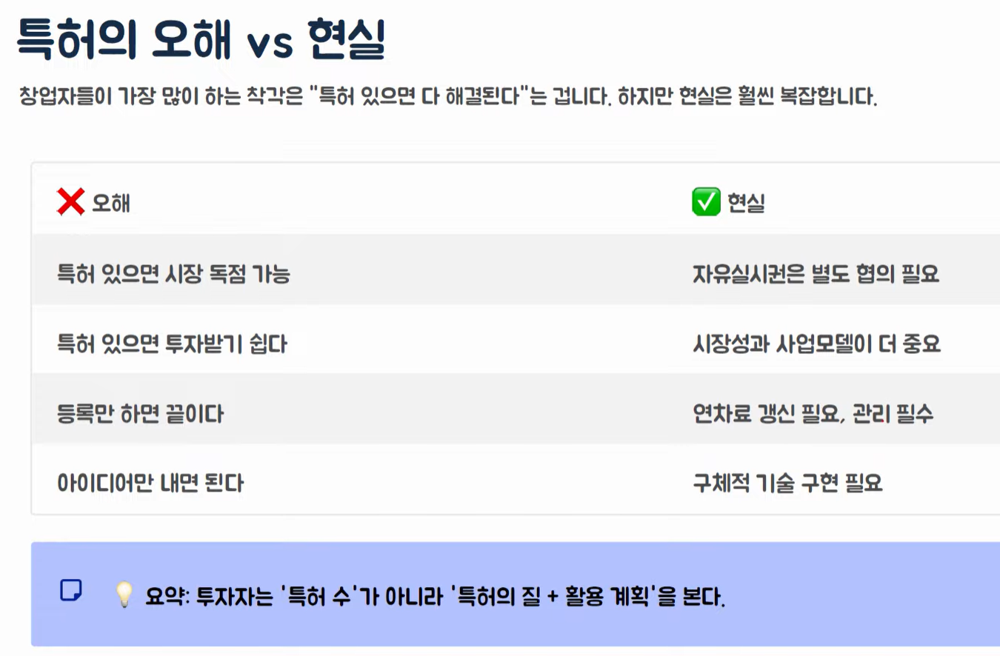
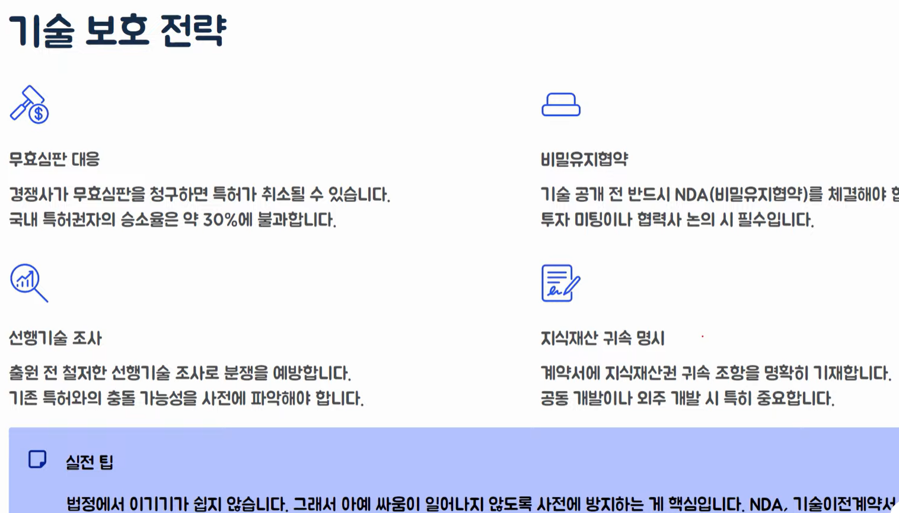
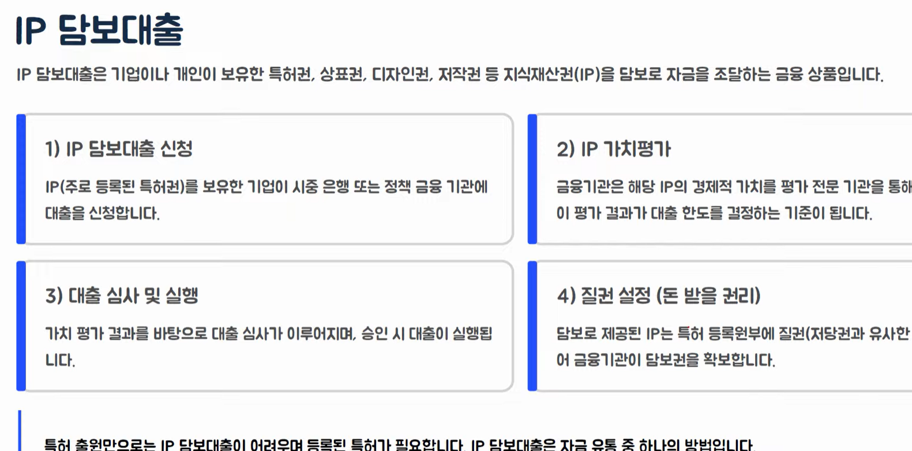
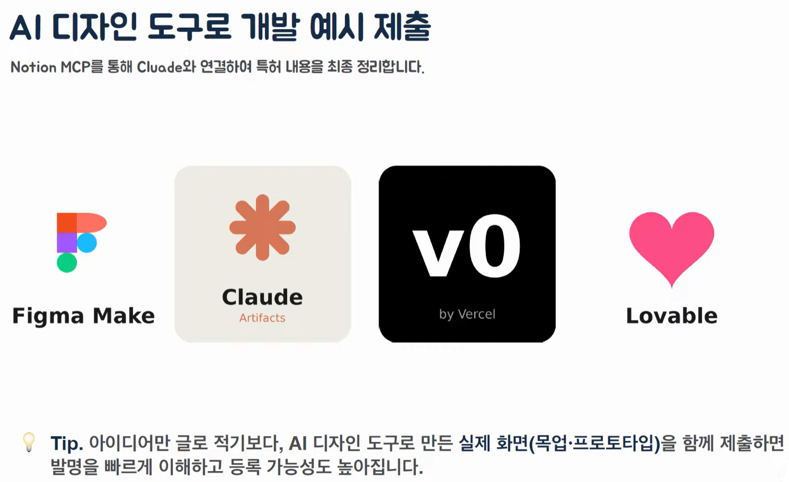
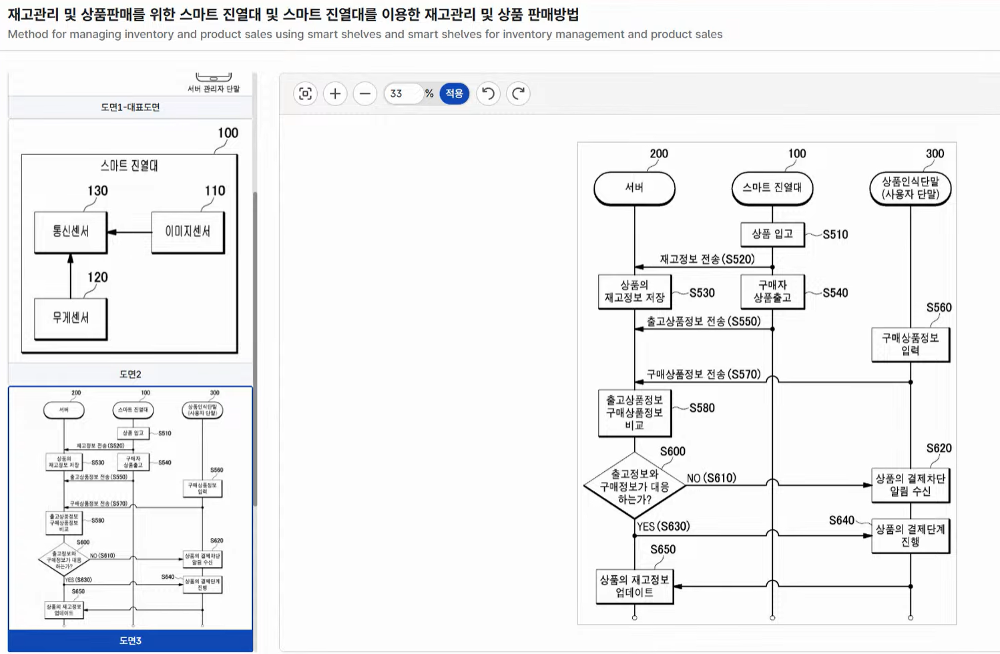

# 특허기본, AI 실습
- 

## 특허의 현실과 한계
- 특허는 만능 방패가 아님
- 등록되더라도 다른 특허를 침해할 수 있고, 반대로 내 기술도 우회당할 수 있음
- 기술 자유실시권 미보장
    - 등록 특허라도 다른 특허와 충돌하면 자유롭게 실시할 수 없음.
    - 기존 기술에 대한 라이선스가 필요할 수 있음
- 역침해 발생 가능성
    - 유사 기술과 충돌 시 오히려 내가 침해자가 될 수 있음
    - 선행기술 조사가 필수적인 이유
- 주관적인 판단 기준
    - 신규성과 진보성 판단은 심사관의 주관이 개입될 수 있으며, 동일한 기술도 심사관에 따라 결과가 달라질 수 있음
- 리버스 엔지니어링 위험
    - 특허 출원 시 기술이 공개되므로, 경쟁사가 이를 분석해 우회 기술을 개발할 수 있음

## 특허의 오해 vs 현실
- 

## 특허 비용
- 변리사 업체마다 가격과 기준은 상이하고, 특허의 종류마다 비용이 달라짐. 또한 특허 유지비도 고려 해야됨
- 출원 단계
    - 출원료: 기본 비용
    - 심사청규료: 별도 납부
    - 변리사 수수료: 수십만 원
- 등록 단계
    - 등록료: 최초 3년분 선납
    - 청구항 수에 따라 변동
    - 변리사 등록 대행비
- 유지 단계
    - 연차료: 매년 갱신
    - 4년차부터 비용 증가
    - 미납 시 권리 소멸

## 기술 보호 전략
- 
- 

## AI 디자인 도구로 개발 예시 제출
- 
- Stitch 까지(google)
- 

- 소프트웨어가 특허 좀 더 어렵고, 제조, 도매 쪽이 좀 더 낫다는 말이 있음