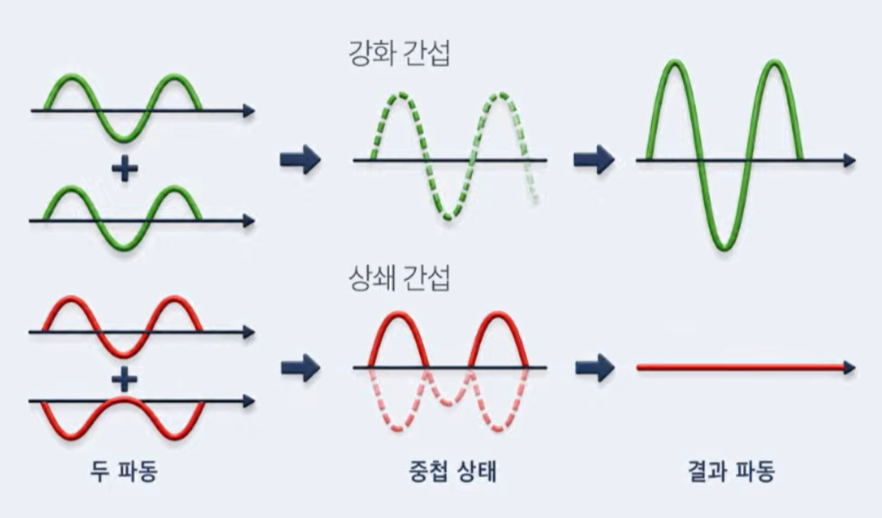
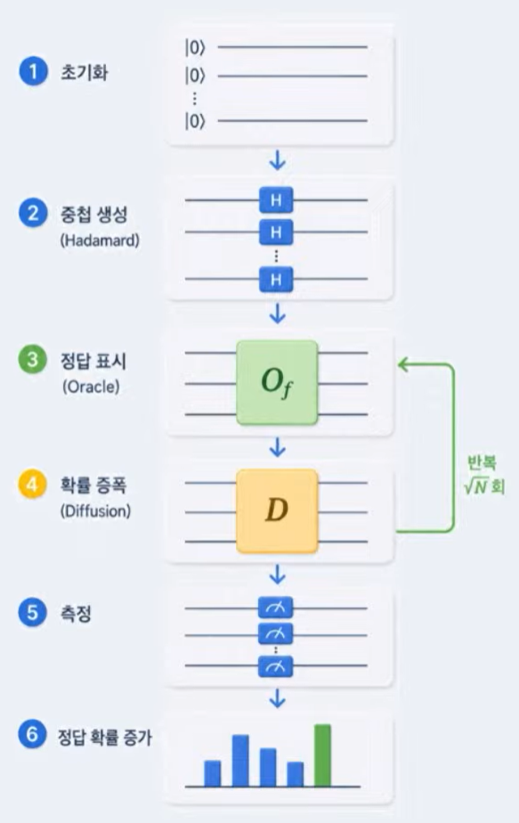
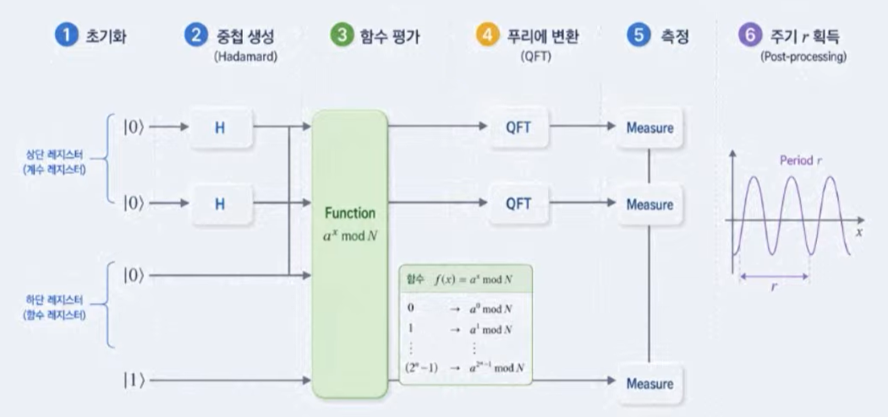
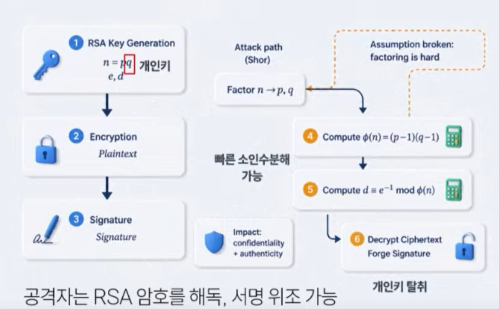
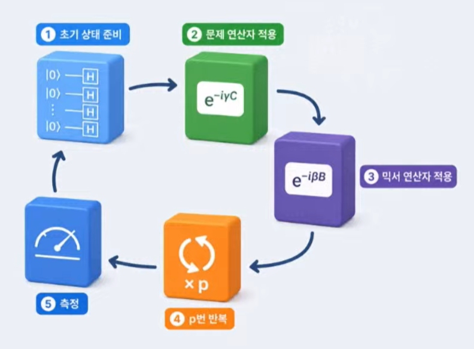
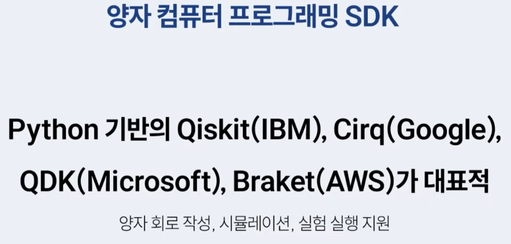
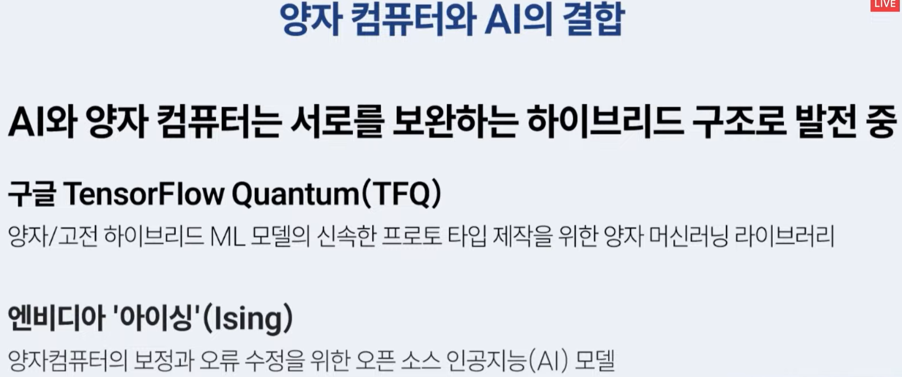
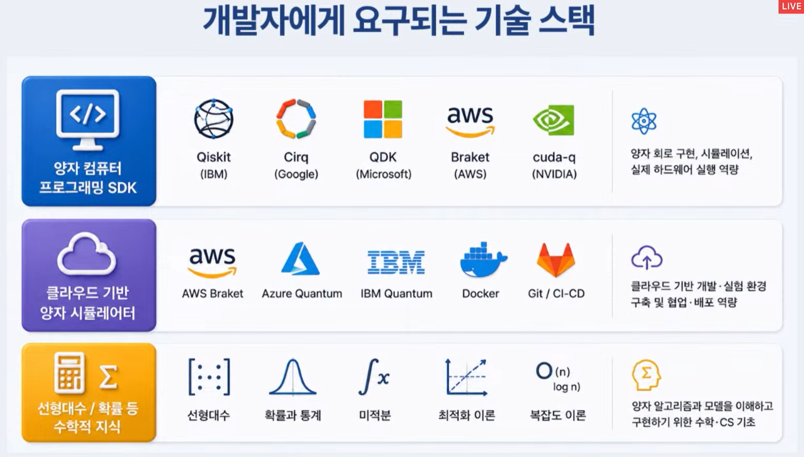

# 양자 시대에 필요한 개발자 주니어가 지금 준비할 것
- 고전 컴퓨터
    - 0과 1 비트
- 양자 컴퓨터
    - 0과 1 병렬 비트(큐비트)
- 큐비트
    - 양자 컴퓨터의 최소 단위
    - 0과 1의 상태를 동시에 표현
    - 데이터를 인코딩 하는데 사용되는 정보의 기본 단위
- 양자 컴퓨터의 중첩
    - 큐비트가 0과 1 두 상태를 동시에 가질 수 있는 현상
    - 두 상태가 겹쳐진 확률적 중간 상태로 존재
    - 수 많은 입력 조합을 하나의 상태 공간에서 동시에 표현하고 탐색할 수 있는 양자 계산의 기반이 됨
- 양자 컴퓨터의 얽힘
    - 양자 컴퓨터의 정보 연결성과 연산 효율성의 핵심
    - 하나의 상태가 바뀔 때 다른 하나에 즉각적으로 영향을 미침
    - 수십 개 큐비트가 하나의 거대한 상태로 연결되어 지수적인 연산 능력을 만들어 냄
- 양자 컴퓨터 간섭
    - 
    - 원하는 결과의 확률 증폭
    - 여러 경로(상태)로 중첩된 큐비트들이 서로 합쳐지거나 상쇄되는 현상
- 양자 컴퓨터 측정
    - 양자 상태를 현실로 투영
    - 측정하는 순간, 그 큐비트는 확률적으로 0 또는 1로 붕괴하여 하나의 결과로 고정됨
    - 단순한 출력이 아니라 확률적 결과를 통계적으로 읽어내는 프로세스
- 양자 컴퓨터 연산
    - 큐비트 상태를 회전, 중첩, 얽히게 하여 확률적 분포를 바꾸는 연산
    - 양자 게이트를 통해 수행
## 양자 게이트
    - 양자 컴퓨터의 기본 연산을 수행하는 구성 요소
        - 고전 컴퓨터의 논리 게이트와 유사
        - 회전과 중첩을 조정해 확률의 세계를 제어
    - Hadamard 게이트
        - 양자 연산의 시작점(동전 던졌을 때 공중에 있는 상황)
        - 하나의 큐비트를 0과 1이 동시에 존재하는 상태로 바꿔주는 연산
        - 모든 경우의 수를 한 번에 탐색할 수 있게 함
    - CNOT 게이트
        - 두 큐비트를 얽히게 하는 역할
        - 양자 병렬 연산의 핵심
        - 연결된 큐비트들은 서로 떨어져 있어도 영향을 주고 받음
    - 양자 컴퓨터 회로 구성
        - 여러 게이트가 순서대로 연결되어 하나의 계산을 수행
        - 마지막 단계에서 그 결과를 측정

## 양자 컴퓨터 알고리즘
    - 양자 컴퓨터를 위해 설계된 특별한 계산 절차
        - 입력 데이터를 큐비트로 변환하고, 게이트를 통해 상태를 변화 시키며, 여러 번의 측정을 통해 결과를 확률적으로 얻음
    - Grover 알고리즘
        - 데이터 탐색과 최적화에 특화된 알고리즘
        - 중첩된 모든 상태 중, 정답 상태의 확률 진폭을 반복적으로 강화해 측정 시 높은 확률로 정답이 나타나게 만들어 시도 횟수를 줄여 줌
        - 
    - Shor 알고리즘
        - 큰 수의 소인수분해를 빠르게 수행하는 알고리즘
        - Shor 알고리즘은 RSA 암호체계를 무너트릴 수 있음
        - 
        - RSA 암호 보안 취약
            - RSA는 두 소수 p, q를 곱해 만든 n=pq가 쉽게 인수분해되지 않는다는 점에 의존
            - Shor 알고리즘은 양자 병렬 계산을 통해 이 n을 빠르게 분해할 수 있어 개인키를 역으로 구할 수 있음
            - 전 세계 보안 연구자들이 양자 내성 암호(PQC)를 개발 중
            - 
    - 양자 근사 최적화 알고리즘(QAOA)
        - 복잡한 최적화 문제를 해결하는 알고리즘
        - 물류 경로 최적화, 네트워크 구성, AI 파라미터 튜닝 같은 문제에 적합
        - AI와 최적화 문제의 '다리 역할'을 하는 알고리즘
        - 
- 
- 양자 컴퓨터 프로그래밍 예제(Qiskit)
    - 큐비트를 만들고 게이트를 적용한 뒤 측정까지 완료하는 방식
    - 실제 클라우드 양자 컴퓨터가 계산
- 
- 
- 
- 

