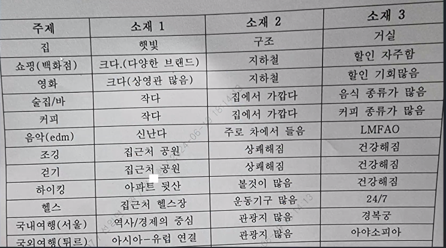
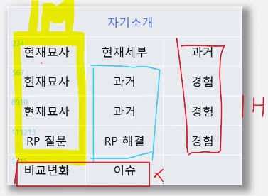

# Opic 실전 특강_ 취업 경쟁력을 올리는 가장 빠른 스피킹 전략

- 정확히 알고, 많이 해봐야한다
- 백그라운드 서베이는 메뉴판이다
  - 자신의 상황과 선호를 설문하여, 시험에 출제범위를 정함
  - 12가지 선택, 그 중 3개 출제
  - 총 주제 5개 -> 선택주제 3 + 돌발주제 2
  - 한 주제당 3문제 출제
- 난이도 선택
  - 맵기 선택
- 선택지
  1. 직장 선택하지 말것
  2. 학생 선택하지 말것
    - 강의 수강했는가? 
      - 수강 후 5년 이상 지남
  3. 거주지 (어쩔 수 없이 선택하고 무조건 시험 나옴)
    - 개인 주택 혹은 아파트 홀로 거주
    - 가족과 함께 거주
  4. 여가활동(여기서 많이 고를 수록 시험 유리함(9개 가까이), 여기서 많이 선택해도 한문제만 나오는데, 다른 쪽에서 하나만 선택하면 그게 무조건 나오기때문)
    - 영화보기, (**공연보기**, **콘서트 보기**), 해변 가기, (**술집/바에 가기**, **커피 전문점**(카페 없는 곳 없으니까 카페 하나만 해도 유리)), 공원 가기, 쇼핑하기
  5. 취미나 관심사
    - 음악 감상하기 선택할 것
  6. 운동
    - 운동 전혀 하지 않음(문제 없는 거임)
    - 자전거, 조깅, 걷기, 하이킹, 트래킹(4번에서 많이 못골랐을 경우)
  7. 휴가나 여행
    - 집에서 보내는 휴가
    - 국내 여행, 해외 여행(4번에서 많이 못골랐을 경우)

- 간단한 문장, 간단한 질문을 할 수 있으면 **IM1**
- 쉽게 간단한 문장, 내가 원하는 질문 할 수 있으면 **IM3(둘다가능)**, **IM2(하나만가능)**
- 돌발 주제 답변 가능, 시제 맞게 답변 가능, 롤 플레잉 12번 **(IH)**
- 다양하고 어려운 주제에 대해 정확하고 다양한 어휘를 사용, 토론 **AL**

- 난이도 설정전략(문제 유형을 결정)
  - 5, 6 단계 선택해야됨
  - IL이면 1, 2 단계
  - 3, 4 단계
    - 14, 15번이 IM 문제 나옴
  - 5, 6 단계
    - 14, 15번이 어려운 문제가 출제됨(AL 문제), IH 목표인 경우 스킵해도 됨
  - 문제유형(14, 15번)을 결정
  - 첫번째 문제는 평가 안들어감
## 최종
  - 집, 카페, 음악, 여행 선택(각 3문제 준비)
    - 
    - 집
      - 묘사 + 과거 + 경험(기억에 남는)
    - 카페
      - 묘사 + 과거 + 경험(기억에 남는)
    - 음악
      - 좋아하는 장르(묘사) + 어릴 적 음악 + 라이브 콘서트(기억에 남는 콘서트)
    - 여행
      - 좋아하는 장소(묘사) + 최근 여행, 어릴적(과거) + 기억에 남는 경험
- gpt에 내가 답변할 주제에 대해 특징들을 넣으면 gpt가 문장으로(대본) 만들어줌. google 번역기에 넣고 발음 여러번 들으면서 공부

- 발라드 음악을 좋아해요.
감정적인 느낌이 들어요.
음악을 들으면 차분하고 편안한 기분이 들어요.

제가 가장 좋아하는 발라드 그룹은 버즈예요.
어렸을 때 그들의 음악을 들었어요.

음악은 친구 같아요.

지금도 여전히 그들의 음악을 좋아해요.
그들의 노래는 힘이 넘치는 목소리와 아름다운 멜로디를 가지고 있어요.

어디에 갈 때면 음악을 자주 들어요.
지하철이나 버스에서 이어폰을 꽂고 들어요.
음악은 피곤하거나 지루할 때 기분을 좋게 해줘요.

저에게 음악은 친구 같아요.
매일 제 곁에 있어요.
음악을 통해 행복, 슬픔, 심지어 강렬함까지 많은 것을 느낄 수 있어요.

그래서 발라드 음악을 좋아해요.
좋은 감정과 좋은 추억을 선사해요.

- I live in Nowon with my younger sister.
 She is three years younger than me. She is 24 years old.
 We live in a two-room villa. It is not big, but it is good for us.
 There are many stores and restaurants near our house.
 So, it is a little noisy at night.
Our house has two rooms. The rooms are next to each other.
 There is one bathroom.
 The living room and kitchen are together in one space.
 It is simple and easy to use.
At home, I only do two things: study and sleep.
 I study at my desk in the room, and I sleep on my bed.
 That’s all. I don’t watch TV or play games at home.
The house is not special, but it is comfortable.
 I think it is a nice place for a student like me.

  - 난이도 5 선택
    - 현재묘사 문제들 다 잘 풀었으면 현재세부(스페어 문제임) 안해도 됨
    - 왼쪽 IM(IM 결정은 앞쪽에서 결정됨), 가운데 IH 가는 발판, 오른쪽 IH
    - 시제가 6개 이지만 시제 부족인데도 IH인 사람이 있다.
    - 시제 절반만하면 IH라는 마인드
    - RP(role play, 12 번 문제:IH) 중요
    
    https://www.youtube.com/watch?v=FhAXowYcV3Q&list=PLSzchPm1EtegaWFGG7DmVN777OmX7BDby&index=4
    (대표 문제)
- 한 문제당 답변 시간은 어느정도가 적당한가요??
  - IM3 : 40초 (말이 좀 쉽게 나오는 게 기본, 관계 대명사)