1. 채용 트렌드 이해와 채용조건 분석
- 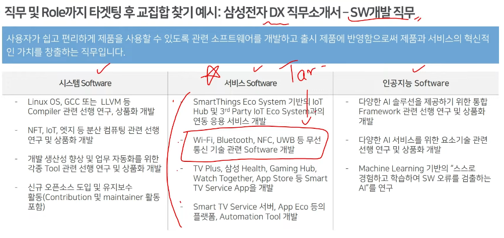
- 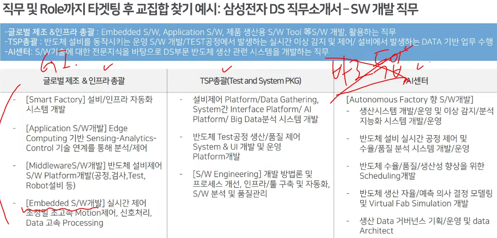
- 처음부터 잘한다 하지말고 잘할 수 있다는 기반(지식, 기술 등)을 가지고 있다는 어필 할 것
- 면접에서 말할 소재 정리
  - 자기소개서에 면접거리를 작성해놓음
  - 면접
    - 정보 기반의 설득(신뢰도)
  - 자기소개서 및 이력서
    - 가능성 설득(신뢰도)
  - 경험정리
    - 사람의 매력
  - 목표분석
    - 직무적 가능성
  - 자신감

- 자기소개서 작성에 필요한 요소
  - 진실성 최우선
  - 가동성
  - 정량 vs 정성
  - 근무영속성
    - 로열티, 스트레스 내구도, 타 산업_ 타 직업으로 전향 가능성
  - 퍼포먼스
    - 직무 수행 기초 역량, 일을 대하는 태도
  - 조직적응

- 챕터3.직무/조직 적합도 기반 작성
  - 채용은 결격사유 없는 사람을 찾는 과정
    - 잘할 사람
  - 정량적
    - 직무역량
  - 정성적
    - 사람의 매력을 보이기 편한 소재
    - 사람은 쉽게 변하지 않는다
    - 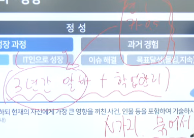
    - 비전공
      - sw_ai를 선택한 계기
      - 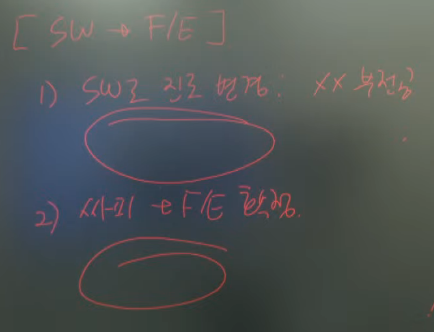
    - 세부내용
      - 성장과정
        - 개인의 성장
        - IT인으로 성장
      - 과거 경험
        - 이슈 해결
        - 목표달성(몰입, 지속)

    - 퍼포먼스
      - 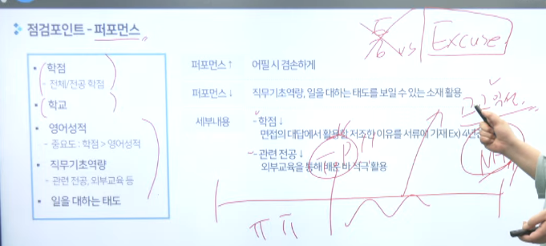

    - 이탈가능성
      - 타산업, 창업 너무 깊이 있으면 안좋게 보일 수 있음
      - 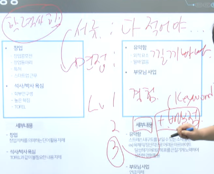
      - 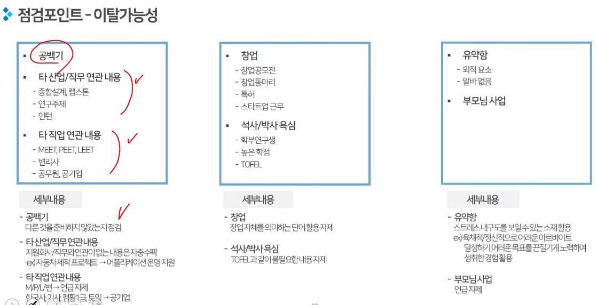

    - 점검포인트
      - 로열티
        - 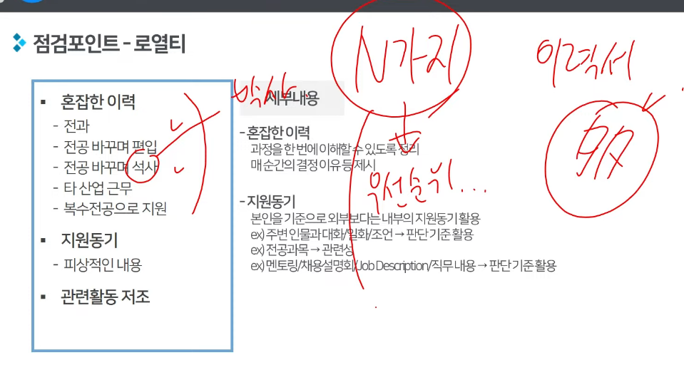
        - 전과가 많다면 우선순위에 따라 N가지 설명할 수 있어야 됨
      - 조직융화
        - 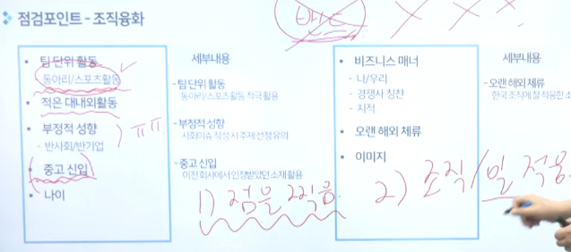
        - 중고 신입일경우 퇴사 이유 잘 말해야 됨(조직, 일 적응 못했다고 볼 수도 있으니)
      - 업무집중
        - 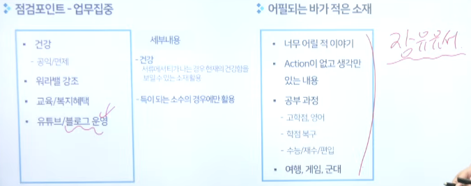

    - 작성형태
      - 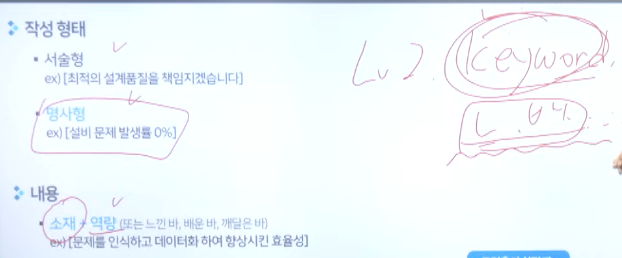
      - SPACE 기법
        - 첫 문단에 질문에 대한 답변 ACE 적용할 것
        - 
        - 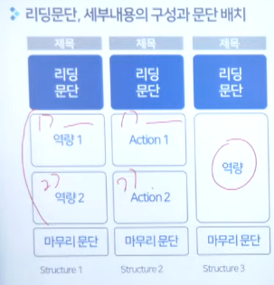
        - 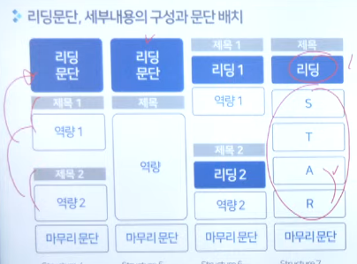
        - 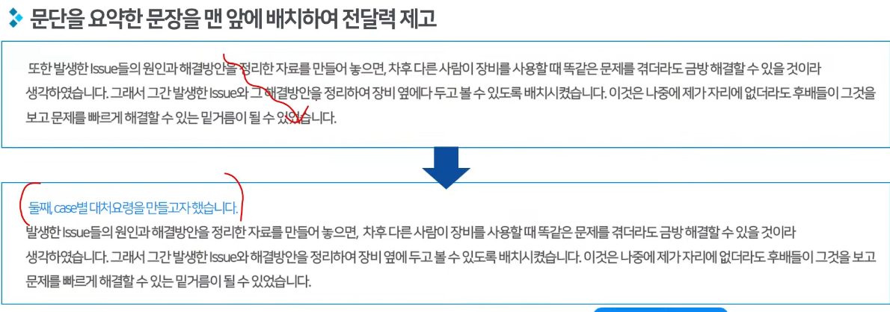
        - STAR
          - 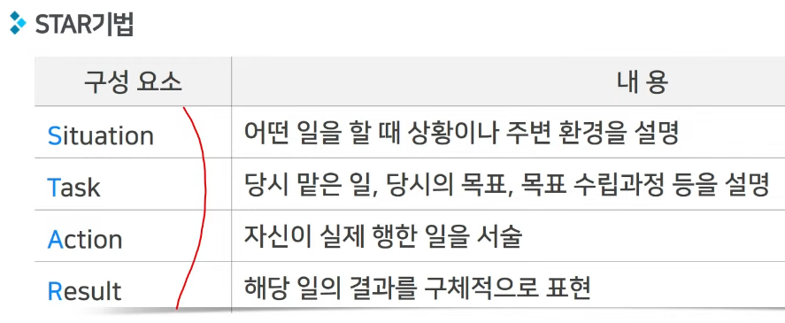
      - 저는 팀워크란 ~라고 생각합니다 -> 재정의하고 들어가도 됨(내 답변과 질문이 조금 다를 수 있다고 느끼는 경우)

  - 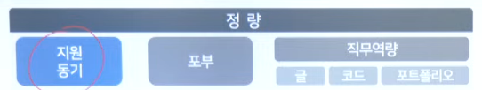
    - 지원동기(직무적합성, 지원동기가 가장 중요)
    - 
    - 
      - 갑자기 직무 선택했다 하지말고 차례대로 이어지도록 작성
    - 포부
      - 소설
      - 본인이 지닌 역량 기반의 Upgrade 활용
        - 연결성, 적합성
      - 직무가 현재 하는 일을 미래형으로 표현(너무 어려우면 이걸 선택)
    - 직무역량
      - 글
        - 타깃과 교집합이 가장 중요
          - 직무설명자료로 교집합 확인 가능
        - 1순위: 경험
        - 2순위: 지식
        - 3순위: 스킬
        - 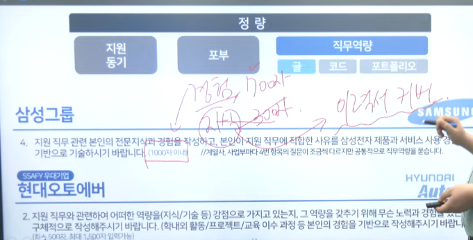
          - 경험 다 쓸수 있으면 경험으로
          - 다 못쓰면 경험 700, 지식 300
      - 코드
      - 포트폴리오
      - 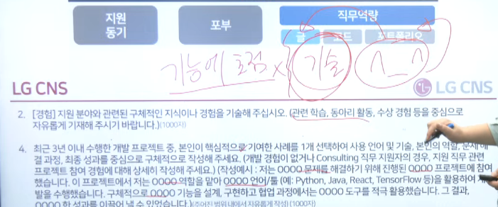
        - 기능에 초점 X, 기술에 초점 O

- 좋은 자기소개서
  - 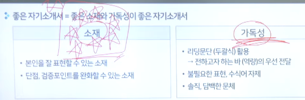
  - 직무역량
    - 보유 역량이 직무수행에 어떻게 도움이 되는지 구체화
  - 포부
    - 직무수행 자체와 산업의 방향성에 초점을 맞춘 포부
  - 성장과정
    - 일을 대하는 태도를 보이는 사례

1. 서류전형 및 평가 이해
2. 직무/조직 적합도