- 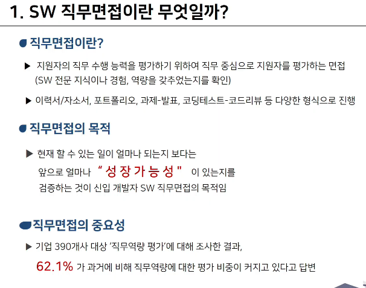

- 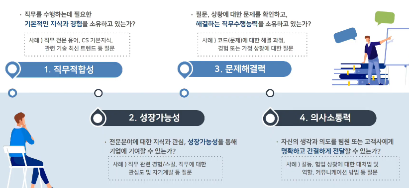

## 개발자가 생각하는 SSAFY 교육생들의 역량
- 우수한 역량
  - '이론'과 '실무'를 두루 겸비
- 보완이 필요한 역량
  - 구체적인 '목표' 와 '방향' 설정

## SW 직무면접 진행
- 실무 면접
  - 이력서/자소서/포트폴리오 기반 면접 진행
  - 기본적인 CS 전문용어, 개발자로의 태도 등 확인
  - 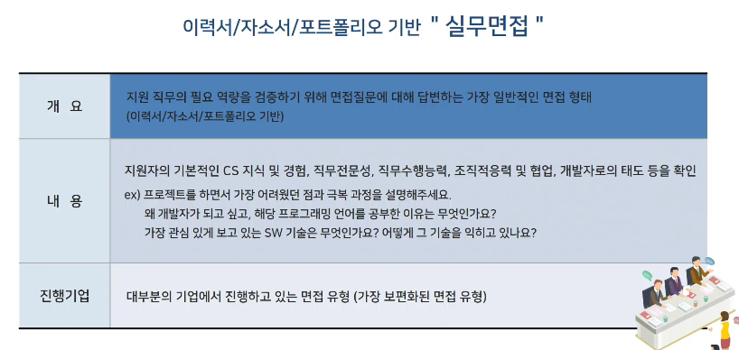
- 손코딩/코드리뷰
  - 문제에 대한 코드 작성 결과에 대한 리뷰 면접
  - 코딩역량, 기술적 의사소통 및 문제해결력 등 확인
  - 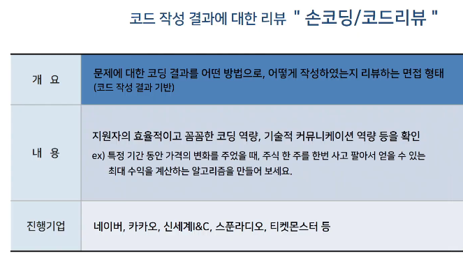
  - 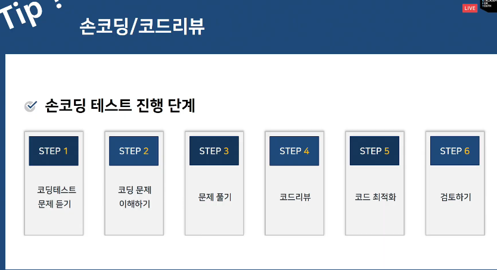
- PT 발표면접
  - 문제에 대한 해석/해결에 대한 발표 진행
  - 의사소통 및 논리력, 발표력, 문제해결력 등 확인
  - 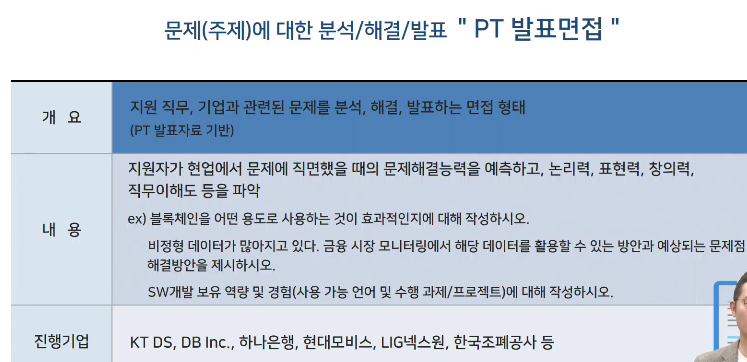
    - 새로운 기술, 본인 역량들 잘 알아가는 거 좋음
  - 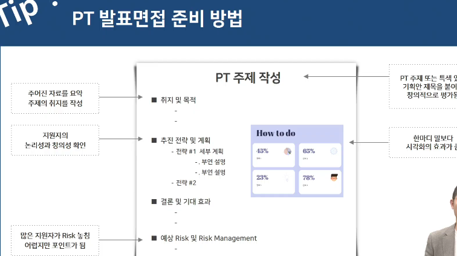
    - 빠른 시간내에 작성하는 법 아는 게 좋음
    - 면접관들은 피로도가 높기 때문에 관심 끄는 느낌이 좋음
    - 요약하기 위해 도트, 기호 하는 거 좋음
    - 결론부터 말하는 게 좋음
    - RISK 어떤게 있고 어떻게 보완할지 답변 중요
    - 본인이 아는 수치화 정보로 시각화 효과 좋음
      - 회사의 내부 자료를 분석하고 가는게 좋음
  - 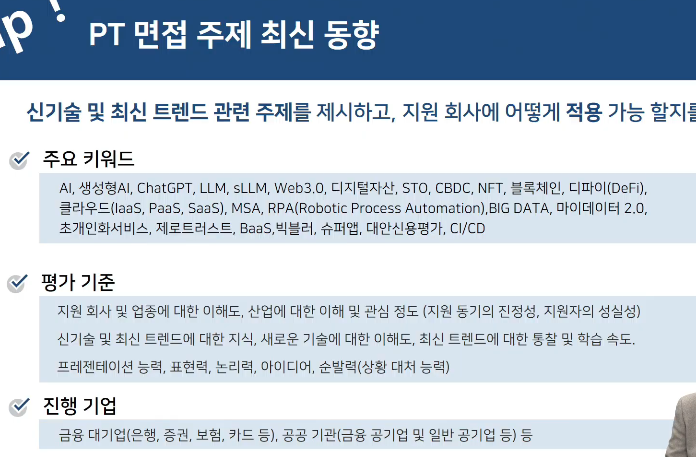
    - 회사가 관심있으면 이미 프로젝트 하고 있을 가능성 있으니 알아볼 것
- 본인 자소서, 이력서를 보고 왜? 라는 질문을 가질 것
  - 왜 그 프로젝트에 이 기술을 사용했는지?
- 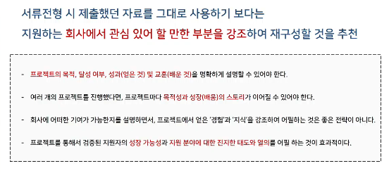
  - 현업 개발은 더 복잡하기 때문에 본인 프로젝트 경험이 회사내에서 큰 도움 될 거다라고 하지 말 것
  - 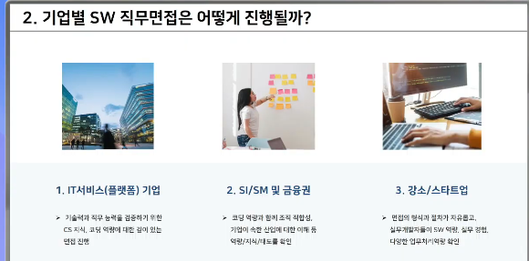
    - 본인 프로젝트할 때 태도를 어떻게 했는 지를 말하며, 성장 가능성을 보여줄 것
  - 기업별 SW 직무면접
    - 대기업은 CS, 기초지식 깊이 물어봄
    - 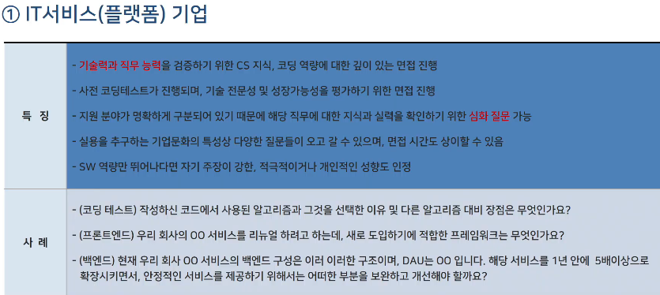
      - CS지식, 코딩역량 깊이 있는 면접
      - 사용된 알고리즘, 사용한 이유, 다른 알고리즘과 비교했을 때 좋은점
      - 서비스 리뉴얼하려는데 새로 도입하기에 적합한 프레임워크 말해보시오
    - 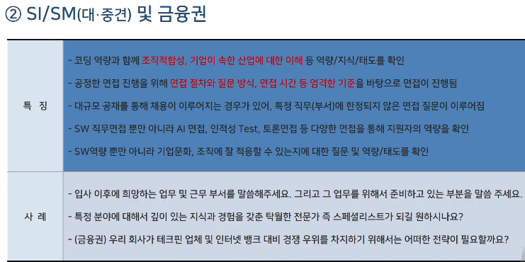
    - 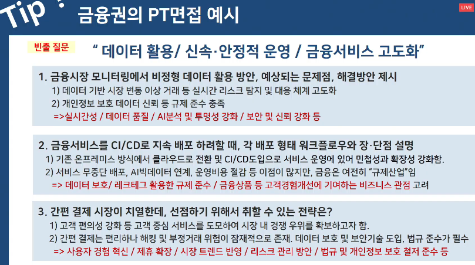
    - 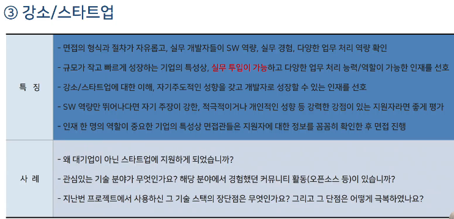
      - 주도적인 모습 보일 것
  - 면접 후기
    - 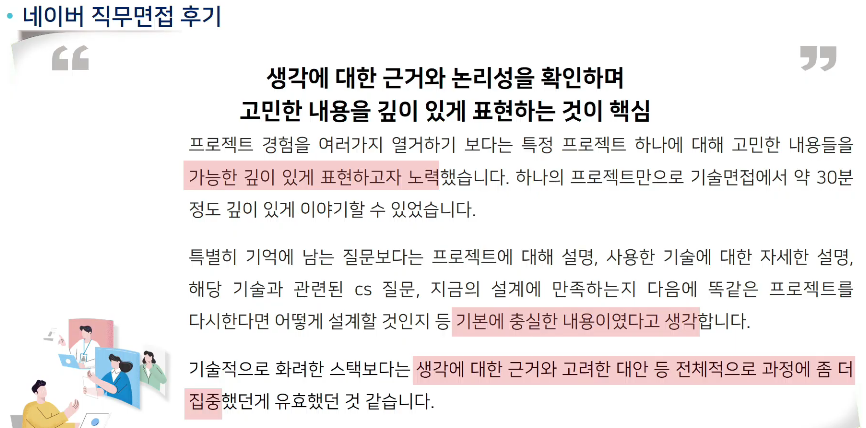
    - 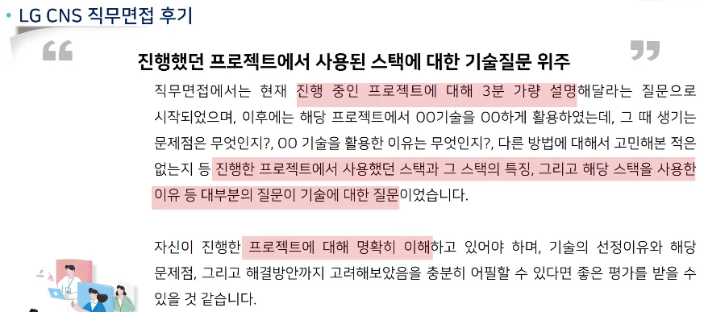
    - 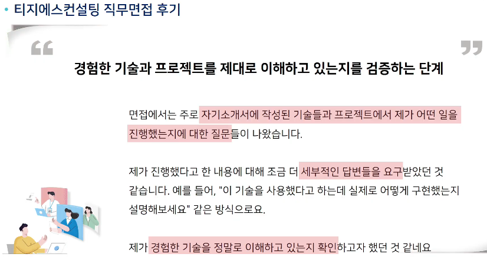

- SW 직무면접 시작 어떻게 하지
  1. 지원 기업의 직무, 기술 현황 분석
    - 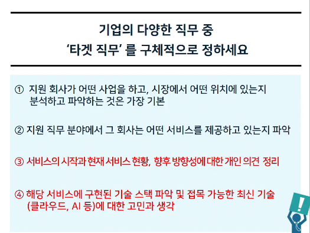
  2. 기업/직무 맞춤형 입사지원서 정리
    - 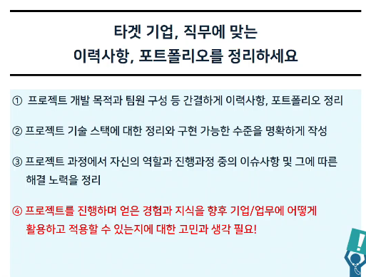
  3. CS 기초지식 / 기술용어 확인
    - 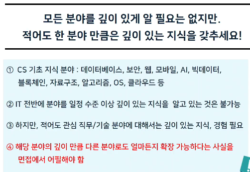
  5. 지원 직무 기술의 IT 트렌드 확인
    - 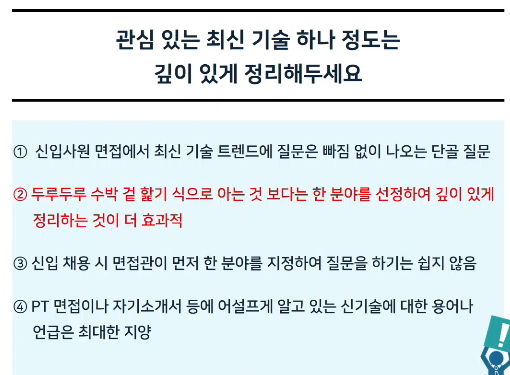
  7. 코드리뷰 연습
    - 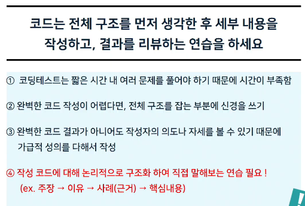
    - 코드 작성하고 리뷰하는 연습을 할 것
    - 구조화해서 코드 작성할 것(작성자의 의도, 자세)
    - 구조화해서 설명할 것

- SW 직무면접 준비, 실전 TIP
  - 직무 면접에서 나오는 단골 질문
    - 입사 이후 근무하고 싶은 부서나 업무가 있는지? 그 부서에서 그 일을 하기 위해서 준비된 것은?
    - 지원자가 실무에 활용해보고 싶은 그 기술이 이 회사에만 있는 것은 아닌데, 왜 여기를 선택했는지?
    - 프로젝트 경험 중에서 기술적으로 제일 힘들었던 것은 무엇이었고, 어떻게 해결했는지?
    - 지원자는 앞으로 10년 후에 어떤 모습으로 성장해 있을 것이라고 생각하는지?

  - SSAFY 보다 좀 더 차별화 된 전략도 필요하다
    - SSAFY 교육 자체만으로 SW 개발자로서 역량을 갖추었다고 확신하기 어려운 경우 많음
    - 지원하는 회사의 공모전에 꾸준히 참가해서 입상한 경력을 기재(입상 못한 경험도 빠짐 없이 기재)
    - 관심 있는 분야에 대해서 기술 블로그나 커뮤니티를 개설하여 꾸준히 활동하고 있음을 증명하는 지표
    - 개인 프로젝트를 파일럿으로 끝내지 않고, 실제 고객 서비스로 런칭하여 얻은 결과 - 사용자 지표 등
    - 이러한 경험을 통해서 본인이 얻은 것(기술 경험, 교훈 등)이 무엇이었고, 어떻게 활용 하려는지 설명

  - 자신이 관심있는 분야의 오픈소스 활동 추천
    - 사실 본인이 입사를 희망하는 회사의 선배들이 거기에 있을 수도 있다.
    - 해당 커뮤니티에서 컨트리뷰터로 기여를 하게 된다면, 그 사실 자체만으로도 큰 어필이 된다.
    - 입사를 희망하는 회사에서 제공하는 오픈API 등을 새로운 기술로 포팅하는 작업에 참여하는 것도 좋음
    - 이제 등장한 새로운 기술이나 프레임워크는 아직 유경험자가 없기 때문에, 먼저 진입해서 선점 가능
    - 해당 기술을 도입하기 위해서 검토하는 팀에서 지원자의 활동 내역을 보고 먼저 연락을 주기도 함
  
  - 좋은 책을 많이 봐야 좋은 것처럼 좋은 코드를 많이 봐야 좋다
    - 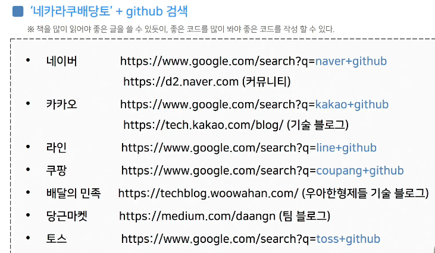
    - 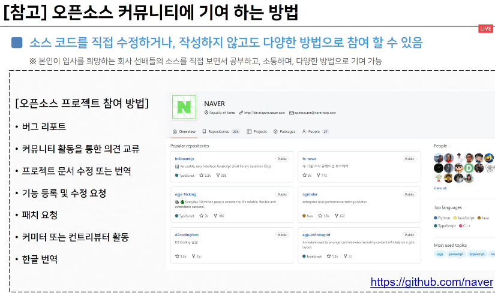
    - 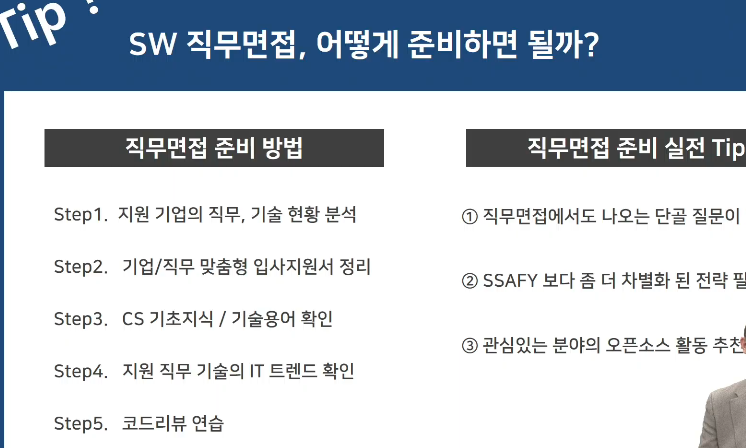
- SW 직무면접 질문 사례
  - 그 회사 CI 기준으로 작성하는 게 기본
  - LIG넥스원
    - 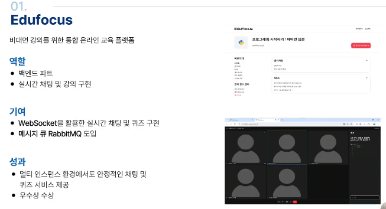
      - 깔끔한 건 좋았다.
      - 백엔드라고 햇지만, 이미지가 프론트 관련된거고 그렇다고 프론트가 적극적으로 어필 되진 않았다.
      - 성과 적은 건 좋은데 수치화된 정보로 신뢰감 주는 게 좋다.
    - 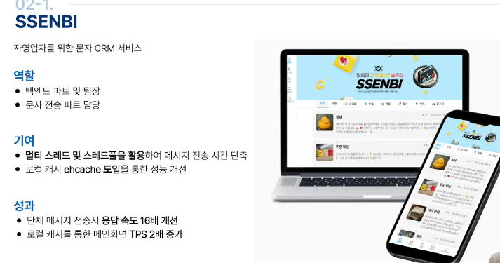
      - 성과 수치화 한거 좋다. 실제 몇에서 몇으로 개선됐는지까지 작성하면 더 좋다.
    - 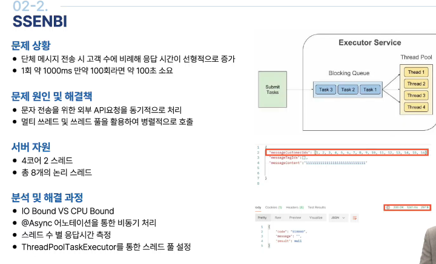
      - 문제 원인, 해결, 분석이 너무 기초라서 어필이 안되고 오히려 악영향(어필할 것을 잘 선택할 것)
      - 장표, 수치화한 거 잘함
    - 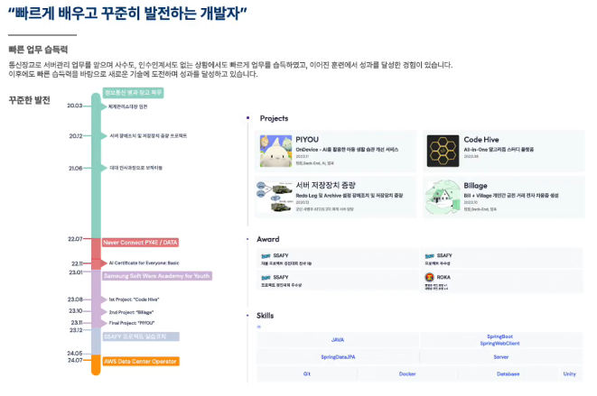
    - 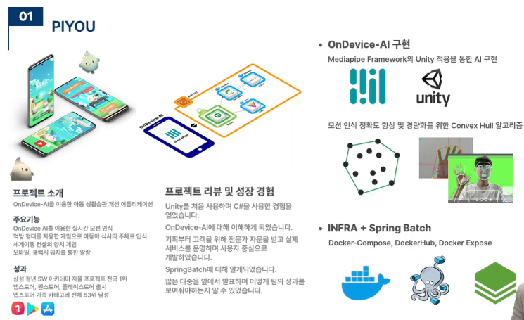
    - 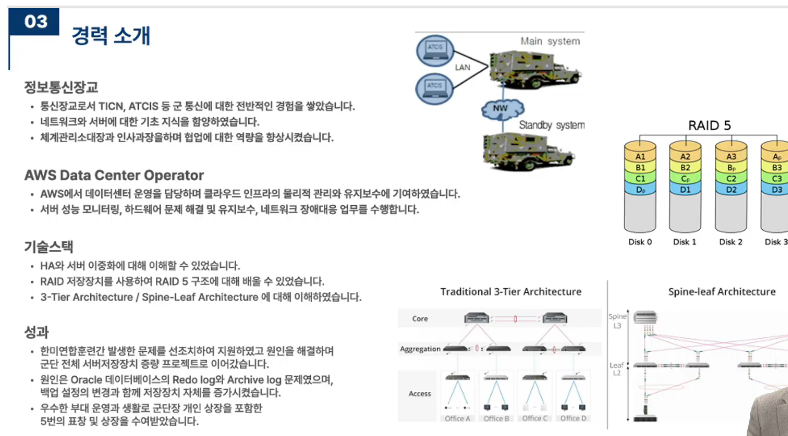
      - 기업 직무에 맞게 경력 소개 잘했다.(방산 기업)
      - 근데 프로젝트 소개 단계에서 뭘 말하고 싶은지 알기 쉽지않았다.(장황하여 오히려 핵심 놓침)
    - 에스엘(SL)
      - 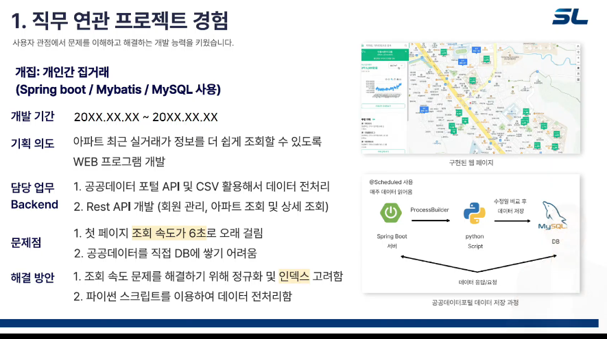
      - 깔끔하고 수치화도 잘함
      - 너무 여러 색으로 표현하면 악영향 줄 수 있는데 이정돈 괜찮다.
    - 한화오션디지털
      - 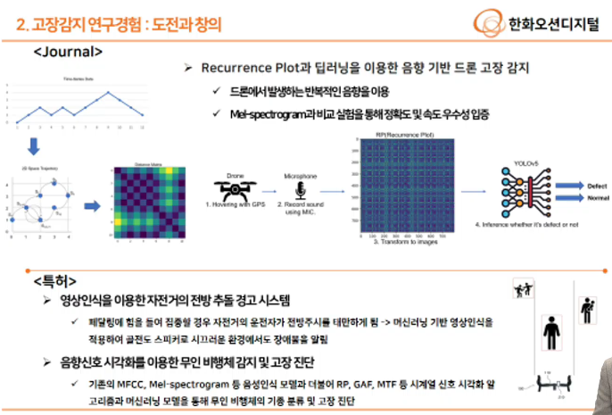
      - 한화 색상에 맞게 잘 씀
      - 프로젝트와 본인연결이 약함
      - 그렇게 되면 의심되면서 악영향 줄 수 있음
      - 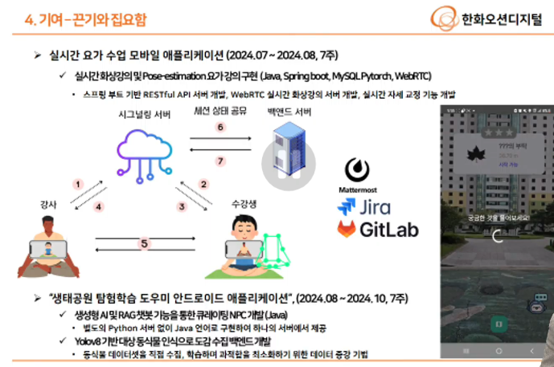
        - 본인이 얼마나 집요하고 끈기있는 지를 예시로 들 수 있으면 좋음
- 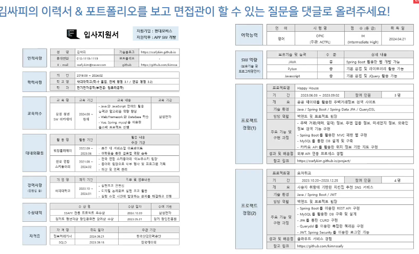
- 구두면접(예시)
  - 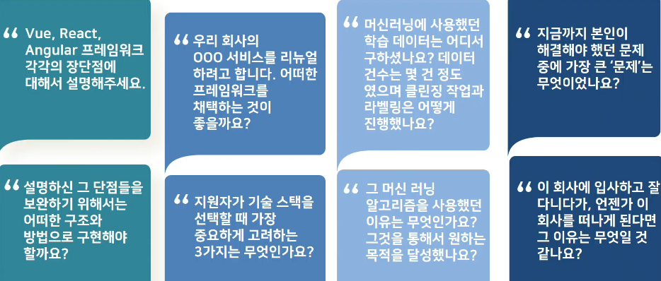
- 정제된 데이터로 모델을 돌리기만 한 경험은 아쉬움

- 구두면접(예시)
  - 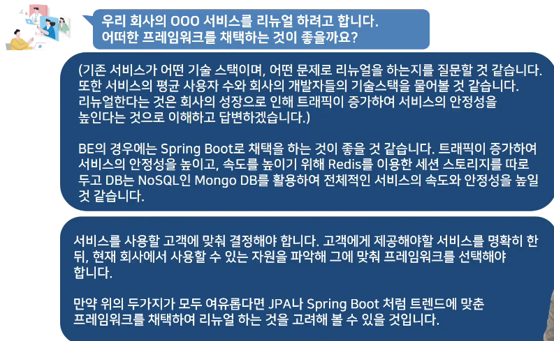
  - 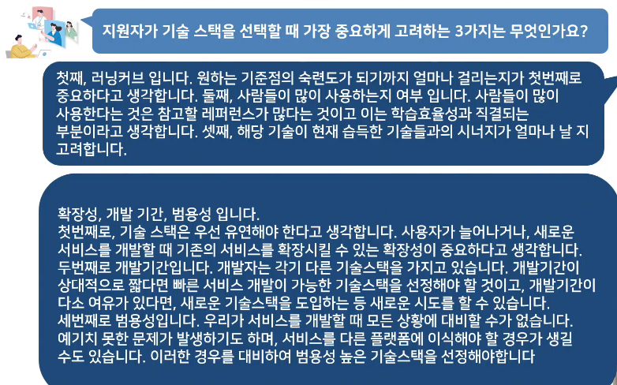
    - 첫번째 예시는 본인 학습 위주의 답변이라 안좋은 답변임