- 최소 20개 이상의 입사지원
- 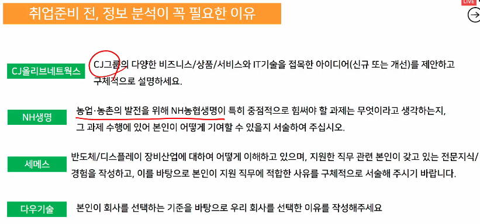
- 
- 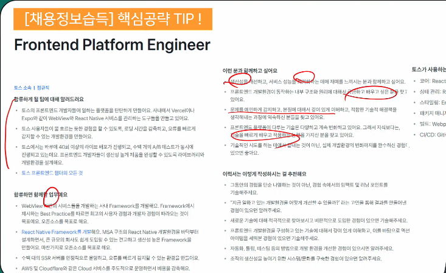
- 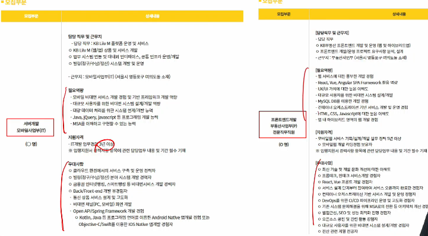
  - 지원 잘 볼 것
- 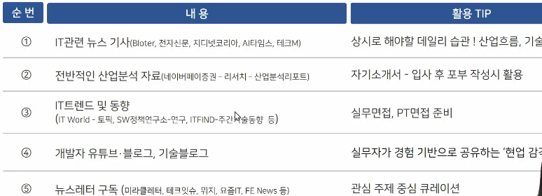
  - IT관련 뉴스 기사
    - 입사 후 포부같은 거에 이 산업이 앞으로 어떤 식으로 변할거기 때문에 그 변화를 얘기하며 그에 맞는 포부를 말할 것
  - 산업분석 리포트(해당 기업에 적혀 있는 거 확인, 산업 동향)
- 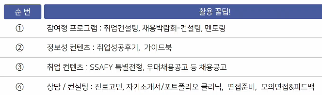
- 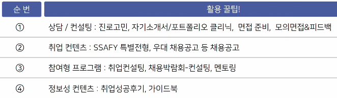
- 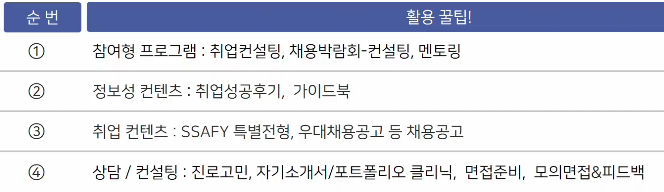
- 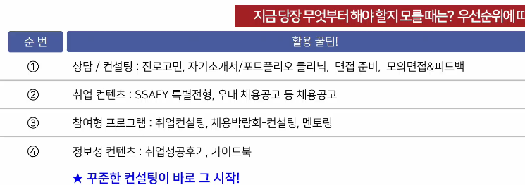
- 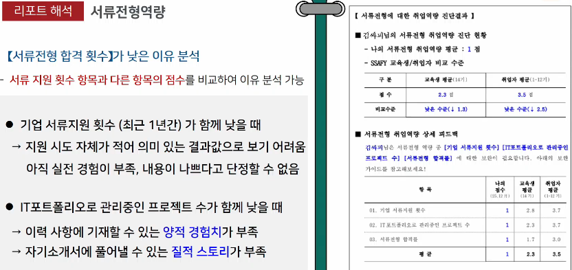
- 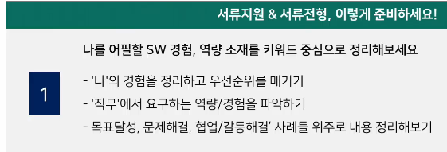
- 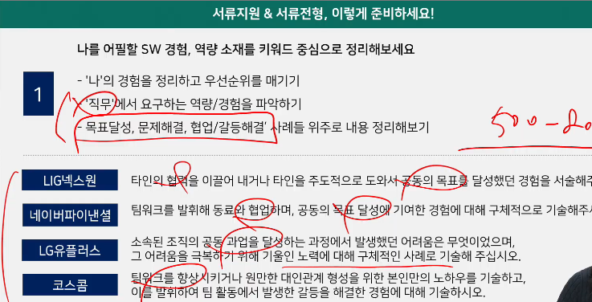
  - 500~800 자로 맞추자. 줄이는 건 쉽다
- 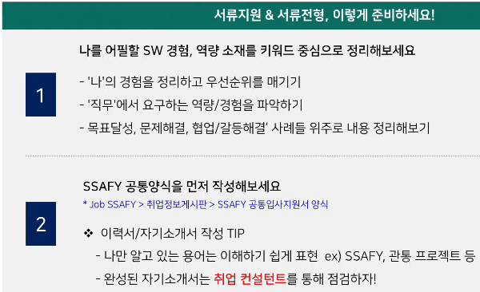
- 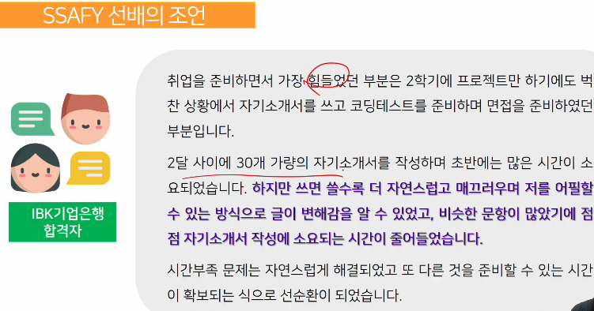
- 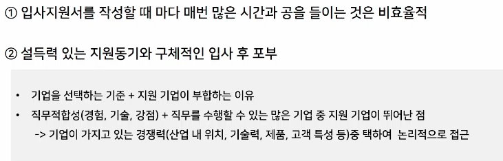
- 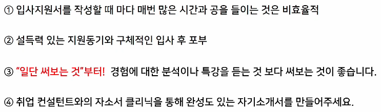
- 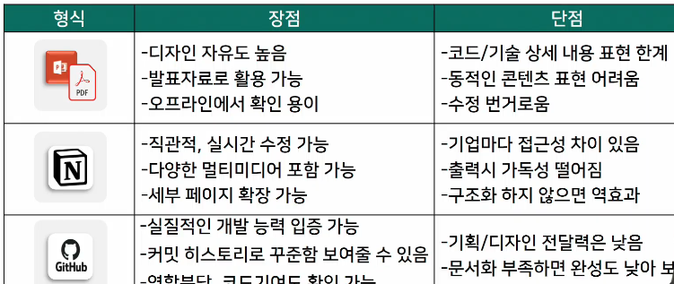
  - 노션: 정리용도로 사용할것, 구조화 하지 않으면 역효과
  - 깃허브: 노션으로 정리되면 깃허브로 추가 및 코드 관리, README 잘 작성 못하면 완성도 낮아보임
  - PPT, PDF: 제출용 느낌
- 
  - 나중에 정리할 생각말고 현재 바로 정리하면서 하자
  - 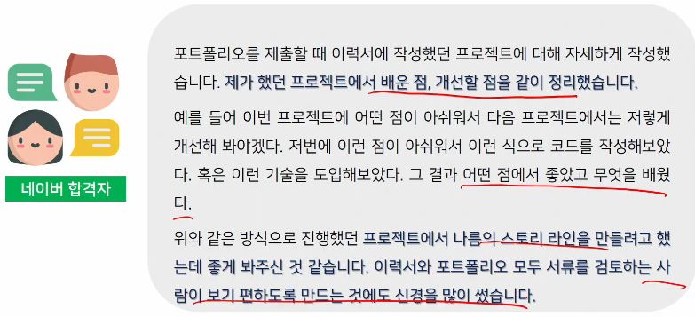
- 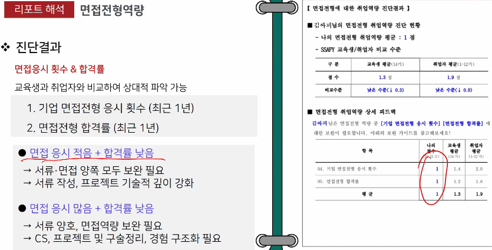
- 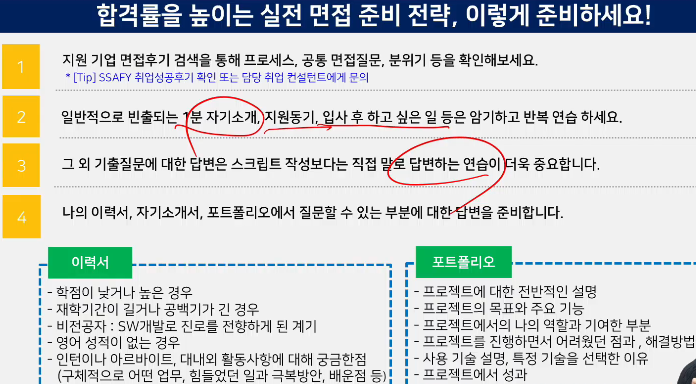
- 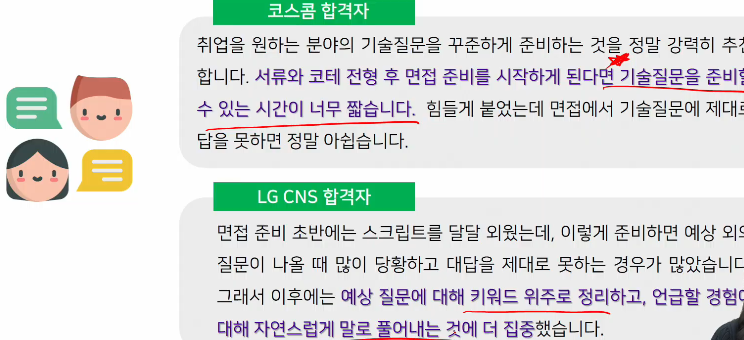
- 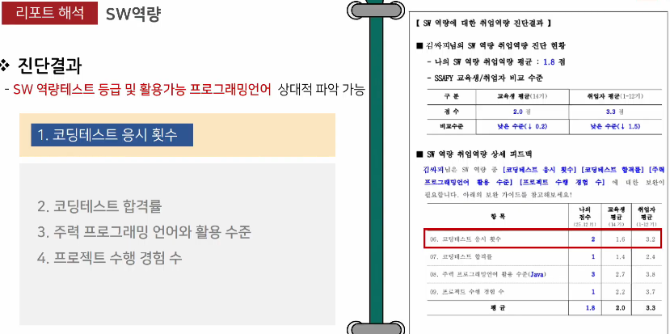
- 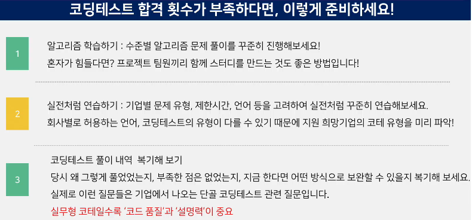
- 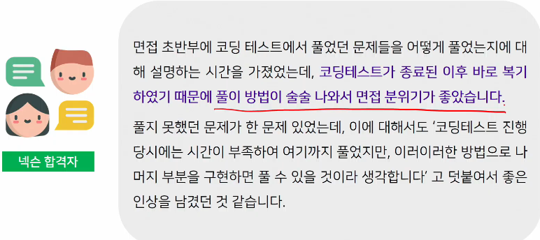
- 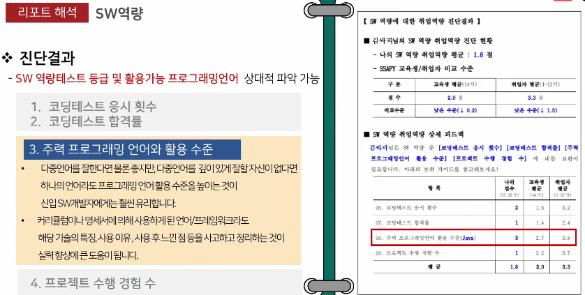
- 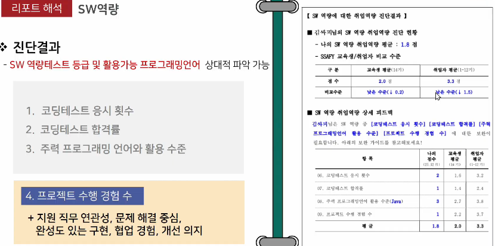
- 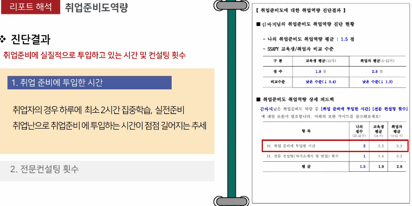
- 
- 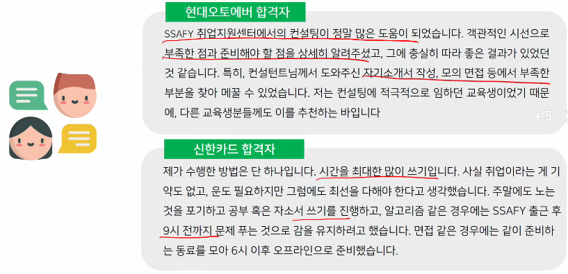
- 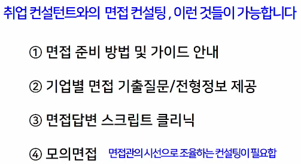
- 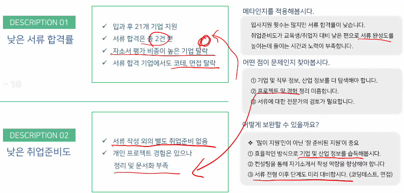
- 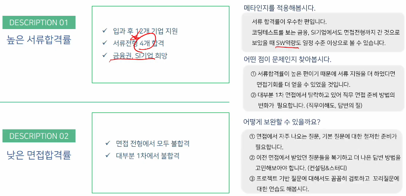
- 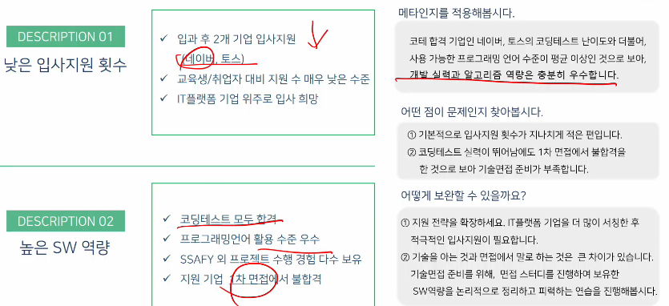
- 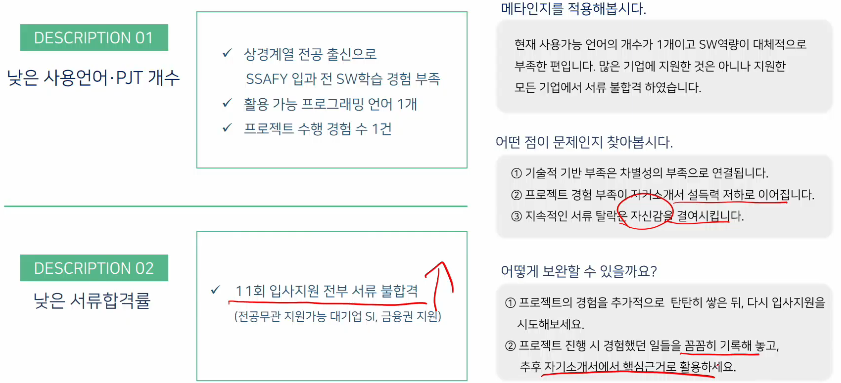
- 